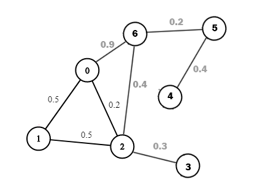

<!-----------------------------------------------------------
Author:  Craig Brown
Version: 1.0.2
Date:    May 6, 2025
Source:  https://github.com/saidake/simi-docs
------------------------------------------------------------->
# Table of Contents
[Back to Main Project README](../README.md)
- [Algorithm Problems](#algorithm-problems)
  - <a id="h-array">Array</a>
    - <a id="h-array-standard">Standard</a>
      - [1. Array Partition](#1-array-partition)
      - [31. Minimum Number Game](#31-minimum-number-game)
    - <a id="h-array-meaningful-index">Meaningful Index</a> (`Automatic Sorting`)
      - [34. Sort Array by Increasing Frequency](#34-sort-array-by-increasing-frequency)
      - [52. Maximum Number of Pairs in Array](#52-maximum-number-of-pairs-in-array)
  - <a id="h-backtracking">Backtracking</a>
    - [3. Amount of Time for Binary Tree to Be Infected](#3-amount-of-time-for-binary-tree-to-be-infected)
    - [29. Power Set LCCI](#29-power-set-lcci)
    - [50. Merge Sort](#50-merge-sort)
  - <a id="h-binarysearch">Binary Search</a>
    - [32. My Calendar II](#32-my-calendar-ii)
  - <a id="h-conditionallogic">Conditional Logic</a>
    - [2. Add Edges to Make Degrees of All Nodes Even](#2-add-edges-to-make-degrees-of-all-nodes-even)
  - <a id="h-dfs">Depth-first Search</a>
    - [29. Power Set LCCI](#29-power-set-lcci)
    - [46. Number of Paths with Max Score](#46-number-of-paths-with-max-score)
    - [51. Quick Sort](#51-quick-sort)
  - <a id="h-dichotomy">Dichotomy</a>
    - [4. Search in Rotated Sorted Array](#4-search-in-rotated-sorted-array)
  - <a id="h-difference-array">Difference Array</a>
    - [5. Jump Game VII](#5-jump-game-vii)
    - [37. Zero Array Transformation II](#37-zero-array-transformation-ii)
  - <a id="h-dynamic-programming">Dynamic Programming</a>
    - <a id="h-dynamic-programming-standard">Standard</a>
      - [6. Climbing Stairs](#6-climbing-stairs)
      - [7. Count All Valid Pickup and Delivery Options](#7-count-all-valid-pickup-and-delivery-options)
      - [8. Decode Ways II](#8-decode-ways-ii)
      - [9. Make the XOR of All Segments Equal to Zero](#9-make-the-xor-of-all-segments-equal-to-zero)
      - [10. Maximize Value of Function in a Ball Passing Game](#10-maximize-value-of-function-in-a-ball-passing-game)  
      - [11. Minimum Deletions to Make String Balanced](#11-minimum-deletions-to-make-string-balanced)
      - [12. Stone Game](#12-stone-game)
      - [13. Target Sum](#13-target-sum)
    - <a id="h-dynamic-programming-problem-breakdown">Problem Breakdown</a>
      - [35. Maximum Multiplication Score](#35-maximum-multiplication-score)
  - <a id="h-hashmap">HashMap</a>
    - [30. Count Common Words With One Occurrence](#30-count-common-words-with-one-occurrence)
    - [45. Intersection of Two Arrays II](#45-intersection-of-two-arrays-ii)
  - <a id="h-heap">Heap</a>
    - [39. Trapping Rain Water II](#39-trapping-rain-water-ii)
    - [43. Total Cost to Hire K Workers](#43-total-cost-to-hire-k-workers)
  - <a id="h-fenwick-tree">Fenwick Tree</a>
    - [14. Distribute Elements Into Two Arrays II](#14-distribute-elements-into-two-arrays-ii)
  - <a id="h-graph">Graph</a>
    - <a id="h-graph-dijkstra">Dijkstra</a>
      - [41. Path with Maximum Probability](#41-path-with-maximum-probability)
    - <a id="h-graph-bellman-ford">Bellman-Ford</a>
      - [41. Path with Maximum Probability](#41-path-with-maximum-probability)
  - <a id="h-greedy">Greedy</a>
    - [15. Max Difference You Can Get From Changing an Integer](#15-max-difference-you-can-get-from-changing-an-integer)
    - [16. Maximum Length of Subarray With Positive Product](#16-maximum-length-of-subarray-with-positive-product)
  - <a id="h-math">Math</a>
    - [17. Construct the Minimum Bitwise Array II](#17-construct-the-minimum-bitwise-array-ii)
    - [18. Egg Drop With 2 Eggs and N Floors](#18-egg-drop-with-2-eggs-and-n-floors)
    - [19. Find Number of Ways to Reach the K-th Stair](#19-find-number-of-ways-to-reach-the-k-th-stair)
    - [20. Minimum Moves to Capture The Queen](#20-minimum-moves-to-capture-the-queen)
  - <a id="h-pattern-rule">Pattern Rule</a>
    - [38. Transform to Chessboard](#38-transform-to-chessboard)
  - <a id="h-precomputation">Precomputation</a>
    - [21. Range Product Queries of Powers](#21-range-product-queries-of-powers)
  - <a id="h-segment-tree">Segment Tree</a>
    - [32. My Calendar II](#32-my-calendar-ii)
  - <a id="h-sliding-window">Sliding Window</a>
    - <a id="h-sliding-window-standard">Standard</a>
      - [22. Find the Longest Equal Subarray](#22-find-the-longest-equal-subarray)
    - <a id="h-sliding-window-subset-concatenation">Subset Concatenation</a>
      - [40. Count Subarrays Where Max Element Appears at Least K Times](#40-count-subarrays-where-max-element-appears-at-least-k-times)
    - <a id="h-sliding-window-fixed-size-window">Fixed-size Window</a>
      - [44. Find Indices With Index and Value Difference I](#44-find-indices-with-index-and-value-difference-i) 
  - <a id="h-sorting">Sorting</a>
    - [49. Bubble Sort](#49-bubble-sort)
    - [50. Merge Sort](#50-merge-sort)
    - [51. Quick Sort](#51-quick-sort)
  - <a id="h-stack">Stack</a>
    - <a id="h-stack-monotonic-stack">Monotonic Stack</a>
      - [47. Beautiful Towers II](#47-beautiful-towers-ii)
  - <a id="h-string">String</a>
    - [23. License Key Formatting](#23-license-key-formatting)
  - <a id="h-traversal">Traversal</a>
    - [24. Find the Number of Ways to Place People I](#24-find-the-number-of-ways-to-place-people-i)
    - [25. Maximum Number of Operations With the Same Score I](#25-maximum-number-of-operations-with-the-same-score-i)
    - [29. Power Set LCCI](#29-power-set-lcci)
    - [36. Find Triangular Sum of an Array](#36-find-triangular-sum-of-an-array)
    - [42. Count Prefix and Suffix Pairs I](#42-count-prefix-and-suffix-pairs-i)
    - [48. Longest Common Prefix](#48-longest-common-prefix)
    - [49. Bubble Sort](#49-bubble-sort)
  - <a id="h-two-pointer">Two Pointer</a>
    - [26. Boats to Save People](#26-boats-to-save-people)
    - [27. Find the Lexicographically Largest String From the Box I](#27-find-the-lexicographically-largest-string-from-the-box-i)
    - [28. Merge Sorted Array](#28-merge-sorted-array)
  - <a id="h-union-find">Union-Find</a>
    - [33. Graph Connectivity With Threshold](#33-graph-connectivity-with-threshold)
- <a id="h-sql-problems">SQL Problems</a>
    - [1. Odd and Even Transactions](#1-odd-and-even-transactions)
    - [2. Find Customer Referee](#2-find-customer-referee)
# Algorithm Problems
## 1. Array Partition
[Back to `Array / Standard`](#h-array-standard)  
### Source
https://leetcode.com/problems/array-partition/
### Array Solution
In each group, the larger integer will be omitted, and we need to maximize the `sum`.
Therefore, The omitted value must be smaller.
To ensure this, wen can sort the array, so that the smaller integer is omitted when calculating the minimal value from the group.

#### Implementation
```java
class Solution {
    public int arrayPairSum(int[] nums) {
        Arrays.sort(nums);
        int sum=0;
        for(int i=0; i< nums.length; i+=2){
            sum+=nums[i];
        }
        return sum;
    }
}
```
#### Complexity Analysis
* Time Complexity: $O(n \log n)$
    * `Arrays.sort` has a time complexity of $O(nlogn)$;
    * The loop iterates through the array with a step of 2, so it runs $n/2$ times, resulting a time complexity of $O(n)$.  
    
    Hence, The total time complexity is $O(n \log n)$.
* Space Complexity: $O(logn)$
    * `Arrays.sort` typically requires $O(logn)$ space for sorting a primitive array.  
    
    Therefore, the total space complexity is $O(logn)$.

Note that the space complexity of `Arrays.sort` is:
* $O(logn)$ for sorting primitive arrays.
* $O(n)$ for sorting object arrays.

## 2. Add Edges to Make Degrees of All Nodes Even
[Back to `Conditional Logic`](#h-conditionallogic)
### Source
https://leetcode.com/problems/add-edges-to-make-degrees-of-all-nodes-even/
### Conditional Logic Solution
To make all node degrees in the graph even by adding only two edges, the following conditions must be met:
* The number of nodes with odd degrees must be even and cannot exceed 4.
    * If there are 4 such nodes, two distinct pairs must exist that can be connected.
    * If there are 2 such nodes, they must either be unconnected, or a third node must exist that can connect to both.
#### Implementation
```java
class Solution {
    public boolean isPossible(int n, List<List<Integer>> edges) {
        Set[] connectedNodes = new Set[n + 1];
        Arrays.setAll(connectedNodes, item -> new HashSet<Integer>());

        // Record all nodes connected to each node
        for (List<Integer> edge : edges) {
            int node1 = edge.get(0), node2 = edge.get(1);
            connectedNodes[node1].add(node2);
            connectedNodes[node2].add(node1);
        }
        List<Integer> nodeWithOddEdges = new ArrayList<Integer>();

        // Identify all nodes with an odd degree
        for (int node = 1; node <= n; ++node){
            if(connectedNodes[node].size()%2>0){
                nodeWithOddEdges.add(node);
                if(nodeWithOddEdges.size()>4)return false;
            }
        }
        int len = nodeWithOddEdges.size();
        if (len == 0) return true;
        if (len == 2) {
            int node1 = nodeWithOddEdges.get(0), node2 = nodeWithOddEdges.get(1);
            // Verify if the two nodes are not connected
            if (!connectedNodes[node1].contains(node2)) return true;

            // Check if there is a third node that can conect to the two nodes
            for (int node = 1; node <= n; ++node){
                if (
                    node != node1 && node != node2 
                    && !connectedNodes[node].contains(node1) && !connectedNodes[node].contains(node2)){
                    return true;
                }
            }
            return false;
        }

        if (len == 4) {
            int a = nodeWithOddEdges.get(0), b = nodeWithOddEdges.get(1), c = nodeWithOddEdges.get(2), d = nodeWithOddEdges.get(3);
            return !connectedNodes[a].contains(b) && !connectedNodes[c].contains(d) ||
                    !connectedNodes[a].contains(c) && !connectedNodes[b].contains(d) ||
                    !connectedNodes[a].contains(d) && !connectedNodes[b].contains(c);
        }
    }
}
```
#### Complexity Analysis
* Time Complexity: $O(m+n)$  (`m` is the length of array `edges`)
    * `Arrays.setAll`   
    
        Method `Arrays.setAll` takes a time complexity of $O(n)$.
    * Record all nodes connected to each node

        The `for` loop has a time complexity of $O(m)$ where `m` is the length of `edges` array.
    * Identify all nodes with an odd degree
        
        The `for` loop takes a time complexity of $O(n)$.
    * Check if there is a third node that can connect to the two nodes
        
        The `for` loop takes a time complexity of $O(n)$.

    Therefore, the overall time complexity is $O(m+n)$.
* Space Complexity: $O(m+n)$
    * The `connectedNodes` Set array takes $O(m+n)$ space in the worst case, where each node is connected to almost every other node.
    * The `nodeWithOddEdges` array has a size of at most `4`, so its space complexity is constant and can be omitted.

    Thus, the total space complexity is $O(m+n)$.

## 3. Amount of Time for Binary Tree to Be Infected  <!-- 3 -->
[Back to `Backtracking`](#h-backtracking)
### Source
https://leetcode.com/problems/amount-of-time-for-binary-tree-to-be-infected/
### Backtracking Solution


Use a **positive** path length to represent the distance from a leaf node to the current node (red path in the image),  
and a **negative** path length to represent the distance from the node with the `start` value to the current node (green path).

Approach: 
1. Use backtracking to calculate the infection time starting from leaf nodes.
2. When the backtracking process reaches the node with the `start` value, compute the required infection time using the maximum path length at that node.  
   Then, reset the path length to a **negative value** to indicate the path now originates from the `start` node instead of a leaf.
3. In each parent node, if a negative path length is returned from either child, combine it with the height of the opposite subtree  
   to update the maximum infection time and continue propagating the negative path length upward.

#### Java Implementation
```java
/**
 * Author: Craig Brown
 * Date:   April 25, 2025
 * Source: https://github.com/saidake/simi-docs
 */ 
/**
 * Definition for a binary tree node.
 * public class TreeNode {
 *     int val;
 *     TreeNode left;
 *     TreeNode right;
 *     TreeNode() {}
 *     TreeNode(int val) { this.val = val; }
 *     TreeNode(int val, TreeNode left, TreeNode right) {
 *         this.val = val;
 *         this.left = left;
 *         this.right = right;
 *     }
 * }
 */
class Solution {
    public int amountOfTime(TreeNode root, int start) {
        backtracking(root, start);
        return this.maxTime;
    }

    private int maxTime=0;

    /**
     * Performs Backtracking to calculate the time to infect the entire tree.
     * 
     * @param root The current node
     * @param start The value where the infection starts
     * @return The path length (positive or negative) used to track infection spread.
     */
    private int backtracking(TreeNode root, int start) {
        if(root==null) {
            return 0;
        }
        int lLen=backtracking(root.left, start);
        int rLen=backtracking(root.right, start);
        int maxLen=Math.max(lLen, rLen);
        // Check if the current node has the value 'start'
        if(root.val==start){
            this.maxTime=maxLen;
            // This value starts at `-1` because the parent node is automatically counted in the calculation.
            return -1;
        }
        if(lLen<0 || rLen <0){
            int negLen=lLen<0?lLen:rLen;
            int posLen=lLen<0?rLen:lLen;
            // Combine path lengths from infected and uninfected branches
            this.maxTime=Math.max(maxTime, posLen-negLen);
            return negLen-1;
        }
        return maxLen+1;
    }
}
```
#### Python3 Implementation
```python
"""
Author: Craig Brown
Date:   April 25, 2025
Source: https://github.com/saidake/simi-docs
"""
# Definition for a binary tree node.
# class TreeNode:
#     def __init__(self, val=0, left=None, right=None):
#         self.val = val
#         self.left = left
#         self.right = right
class Solution:
    def __init__(self):
        self.maxTime=0
    def amountOfTime(self, root: Optional[TreeNode], start: int) -> int:
        self.backtracking(root, start)
        return self.maxTime

    def backtracking(self, root, start):
        """
        Performs Backtracking to calculate the time required to infect the entire tree.

        Args:
            root (Optional[TreeNode]): The current node.
            start (int): The value where the infection starts.

        Returns:
            int: The path length (positive or negative) used to track infection spread.
        """
        if root is None:
            return 0
        lLen = self.backtracking(root.left, start)
        rLen = self.backtracking(root.right, start)
        maxLen = max(lLen, rLen)
        # Check if the current node has the value 'start'
        if root.val == start:
            self.maxTime=maxLen
            # This value starts at `-1` because the parent node is automatically counted in the calculation.
            return -1
        # Combine path lengths from infected and uninfected branches
        if lLen<0 or rLen<0:
            negLen= lLen if lLen<0 else rLen
            posLen= rLen if lLen<0 else lLen
            self.maxTime=max(self.maxTime, posLen-negLen)
            return negLen-1
        return maxLen+1
```
#### Complexity Analysis
- Time Complexity: $O(n)$

    Every node in the binary tree is visited exactly once during the DFS traversal, resulting in a time complexity of $O(n)$,  where $n$ is the total number of nodes.

- Space Complexity: $O(\log n)$ (Best case), $O(n)$ (Worst Case)
    - Recursion Stack
        
        The maximum depth of the recursion stack is proportional to the height of the tree.  
        In the worst case (skewed tree), the height is $O(n)$. In the best case (balanced tree), it is $O(\log n)$.

    - Auxiliary Space
    
        All variables use constant extra space.

    Therefore, the overall space complexity is **$O(\log n)$ in the best case** and **$O(n)$ in the worst case**.

#### Consideration
* A single return value may not be sufficient for your solution.   
  You can define a value object to return multiple pieces of information.   
  In this problem, we use a single return value but distinguish between two scenarios by using negative and positive values.

## 4. Search in Rotated Sorted Array
[Back to `Dichotomy`](#h-dichotomy)
### Source
https://leetcode.com/problems/search-in-rotated-sorted-array/
### Analysis
Since the original array is sorted in ascending order, even if it is rotated, splitting the array into two parts around the central element ensures that one part will always be sorted.  
Define a central element `pivot`.  
In each division, the approach is as follows:

- If the left part is in ascending order:
  - If `target >= nums[left] && target <= nums[pivot]`, search for `target` in the left part.
  - Otherwise, search for `target` in the right part.

- If the right part is in ascending order:
  - If `target >= nums[pivot+1] && target <= nums[right]`, search for `target` in the right part.
  - Otherwise, search for `target` in the left part.

The key is leveraging the guaranteed existence of an ordered segment in each division.

#### Implementation
```java
class Solution {
    public int search(int[] nums, int target) {
        return findTarget(target, nums, 0, nums.length-1);
    }
    private int findTarget(int target, int[] nums, int left, int right){
        int pivot = (left+right)/2;
        if(nums[pivot]==target){
            return pivot;
        }else if(left==right){
            return -1;
        }
        if(nums[pivot] >= nums[left]){
            if(target >= nums[left] && target <= nums[pivot]){
                return findTarget(target, nums, left, pivot);
            }else{
                return findTarget(target, nums, pivot+1, right);
            }
        }else {
            if(target >= nums[pivot+1] && target <= nums[right]){
                return findTarget(target, nums, pivot+1, right);
            }else{
                return findTarget(target, nums, left, pivot);
            }
        }
    }
}
```
#### Complexity Analysis
* Time Complexity: $O(\log n)$

    In each recursive call, the array range is split into **two** approximately equal part, resulting in a total recursion time of $O(\log n)$.

* Space Complexity: $O(\log n)$

    Each recursive call adds a frame to the recursion stack, with a maximum depth of $O(\log n)$, leading to a space complexity of $O(\log n)$.

## 5. Jump Game VII
[Back to `Difference Array`](#h-difference-array)  
### Source
https://leetcode.com/problems/jump-game-vii/

### Analysis
The `minJump` and `maxJump` define the reachable range for each index `i` in the string `s`. 
Directly applying dynamic programming or depth-first search to traverse the entire range would result in high time complexity.

### Difference Array Solution
Instead of checking the entire reachable range, use a `diff` array to mark the start(`+1`) and the end(`-1`) of each reachable range.  
Utilize an accumulatable falg `acc` to track the reachable range:
* Increment `acc` by `1` (`acc += 1`) upon entering a range 
* Decrement `acc` by `1` (`acc -= 1`) upon leaving.

Example:
```text
Two non-overlapping reachable areas:
minJump = 3, maxJump = 4
s:      0 1 1 0 1 1 1 1 1 1
              a a   b b
acc:          + -   + -

Two overlapping reachable areas:
minJump = 2, maxJump = 5
s:      0 1 0 1 1 1 1 1 1 1
            a a a a  
                b b b b
acc:        +     -
                +     -
```
In both cases, the `diff` array enables distinguishing whether current index is within a reachable range, even when multiple ranges overlap.
#### Implementation
```java
class Solution {

    public boolean canReach(String s, int minJump, int maxJump) {
        int len = s.length();
        if ( s.charAt(len - 1) == '1' || minJump > len) {
            return false;
        }
        int[] diff = new int[len];
        diff[0] = 1;
        diff[1] = -1;
        int acc = 0;
        // Accumulated prefix sum to track reachability
        for (int i = 0; i < len; i++) {
            acc += diff[i];
            if (acc > 0 && s.charAt(i) == '0') {
                // Mark the start of the reachable range from i + minJump
                if (i + minJump < len) {
                    diff[i + minJump] += 1;
                } 
                // Mark the end of the reachable range after i + maxJump
                if (i + maxJump + 1 < len) {
                    diff[i + maxJump + 1] -= 1;
                }
            }
        }
        return acc > 0;
    }
}
```
#### Complexity Analysis
* Time Complexity: $O(n)$ 

    The `for` loop iterates over each character in the string `s`, resulting in a time complexity of $O(n)$.
* Space Complexity: $O(n)$

    The `diff` array, which has a size of `len` (the length of the string `s`), 
    contributes $O(n)$ to the space complexity. 
    
    Other variables require constant space, resulting in an overall space complexity of $O(n)$.

### Sliding Window Solution
Maintain a sliding window from `left` to `right` to track the count of indices `nbp` for a specific index `i` as the sliding window moves along the string `s`.  
if  `nbp > 0`, the index `i` is reachable from the sliding window range, otherwise, it is not.  
When the window's length exceeds `maxJump - minJump + 1`, remove the character at the left boundary and update `npb` accordingly.

Example: 
```text
minJump = 3, maxJump = 5

Step 1 (Initialization):
    index: 0 1 2 3 4 5 6 7 8 9 
    s:     0 0 1 1 0 1 0 0 0 0 
           L
           R     i
    nbp = 1
    dp[0] = true
    dp[1] = false (initialized to false by default)
    dp[2] = false (initialized to false by default)
    dp[3] = false

Step 2:
    index: 0 1 2 3 4 5 6 7 8 9 
    s:     0 0 1 1 0 1 0 0 0 0 
           L
             R     i
    nbp = 1
    dp[4] = true

Step 3:
    index: 0 1 2 3 4 5 6 7 8 9 
    s:     0 0 1 1 0 1 0 0 0 0 
           L
               R     i
    nbp = 1
    dp[5] = false

Step 4:
    index: 0 1 2 3 4 5 6 7 8 9 
    s:     0 0 1 1 0 1 0 0 0 0 
             L
                 R     i
    nbp = 0 (decremented by 1 as dp[0] is true and has been excluded)
    dp[6] = false

Step 5:
    index: 0 1 2 3 4 5 6 7 8 9 
    s:     0 0 1 1 0 1 0 0 0 0 
               L
                   R     i
    nbp = 1 (incremented by 1 as dp[4] is true and has been included)
    dp[7] = true

... 

Step n:
    index: 0 1 2 3 4 5 6 7 8 9 
    s:     0 0 1 1 0 1 0 0 0 0 
                   L
                       R     i
    Return dp[9]
```
#### Implementation
```java
class Solution {
    public boolean canReach(String s, int minJump, int maxJump) {
        int len=s.length();
        if (s.charAt(len - 1) == '1') return false;
        boolean[] dp = new boolean[len];
        dp[0] = true;

        int nbp = 1;
        int left = 0;
        int right = 0;
        // Check if indices are reachable from index minJump
        for (int i = minJump; i < len; i++) {
            if (s.charAt(i) == '0') {
                if (nbp > 0) {
                    dp[i] = true;
                }
            }
            // Move the left boundary of the sliding window rightward by 1 when its length reaches `maxJump - minJump + 1`.
            if (right - left + 1 == maxJump - minJump + 1) {
                if (dp[left]) {
                    nbp--;
                }
                left++;
            }
            // Move the right boundary of the sliding window rightward duiring the traversal
            right++;
            if (dp[right]) {
                nbp++;
            }
        }
        return dp[len - 1];
    }
}
```
#### Complexity Analysis
* Time Complexity: $O(n)$ 
    
    The `for` loop iterates from `minJump` to `len` (the length of the string s), resulting in a time complexity of $O(n)$.

* Space Complexity: $O(n)$

    The `dp` array has a size of len, contributing $O(n)$ to the space complexity.

## 6. Climbing Stairs
[Back to `Dynamic Programming / Standard`](#h-dynamic-programming-standard)  
### Source
https://leetcode.com/problems/climbing-stairs/
### Analysis
Here is a simple example when `n=5`:
```text
stair:            0 1 2 3 4 5 
ways:               1 2 3 5 8
```
Observe the above example, the number of ways to reach stair `n` is the sum of the number of ways to reach stairs `n-1` and `n-2`.
Thus, it follows the Fibonacci sequence.

### Dynamic Programming Solution
Fibonacci sequence formula:
$$F(n)=F(n-1)+F(n-2)$$
#### Initialization 
The number of ways to reach stair `1` is `1` and stair `2` is `2`, so:  
$$F(1) = 1,  F(2) = 2$$
#### Filling the DP Table
Since this process only depends on the previous two stairs, we can just define two variables to store the number of ways for the previous two stairs.
#### Implementation
```java
class Solution {
    public int climbStairs(int n) {
        if(n==1)return 1;
        if(n==2)return 2;
        int pre1=1;
        int pre2=2;
        int current=0;
        // Calculate the number of ways to reach a specific stair.
        for(int i=3;i<=n;i++){
            current=pre1+pre2;
            pre1=pre2;
            pre2=current;
        }
        return current;

    }
}
```
#### Complexity Analysis
* Time Complexity: $O(n)$

    The `for` loop iterate over the stairs starting from `3`, yielding a time complexity of $O(n)$.
* Space Complexity: $O(1)$
## 7. Count All Valid Pickup and Delivery Options
[Back to `Dynamic Programming / Standard`](#h-dynamic-programming-standard)  
### Source
https://leetcode.com/problems/count-all-valid-pickup-and-delivery-options/
### Analysis
When `n=2`, the following are all possible combinations:
```text
P1,P2,D1,D2
P1,P2,D2,D1
P2,P1,D1,D2
P2,P1,D2,D1

P1,D1,P2,D2
P2,D2,P1,D1
```

Adding a new `'P'` and `'D'`:
1. Insert `'PD'` Together:

    For example, using `'L'` represents a location and `'<>'` represents a gap location:
    ```text
    <> L <> L <> L <> L <>
    ```
    No matter whether it's `'P'` or `'D'` in the above `'L'` location, the number of valid gap positions (`'<>'`) that can be inserted for `'PD'` is: 
    $$C(5, 1)$$

2. Insert `'PD'` Separately:
    ```text
    <> L <> L <> L <> L <>
    ```
    Select two valid gap positions from 5 gap positions in a fixed order:
     $$C(5,2)$$

Define `F(n)` as the number of valid pickup/delivery possible sequences where `'n'` represents the total number of pickups (`'P'`).  
The formula is:
$$F(n)=F(n-1) \times ( C(2(n-1)+1, 1) + C(2(n-1)+1, 2) )$$

$$F(n)=F(n-1) \times ( 2n-1 + \frac{(2n-1) \times (2n-2)}{2} )$$

$$F(n)=F(n-1) \times ( n\times(2n-1) )$$

$$F(n)=F(n-1) \times ( 2n^2-n )$$

The initial condition is: 
$$F(1)=1$$

#### Implementation
```java
class Solution {
    private int MOD=1_000_000_007;
    public int countOrders(int n) {
        long res = 1;
        for (int i = 2; i <= n; i++) {
            res = res * (2*i*i-i) % MOD;
        }
        return (int) res;
    }
}
```
#### Complexity Analysis
* Time Complexity: $O(n)$

    The `for` loop runs in $O(n)$ time.

* Space Complexity: $O(1)$


## 8. Decode Ways II
[Back to `Dynamic Programming / Standard`](#h-dynamic-programming-standard)  
### Source
https://leetcode.com/problems/decode-ways-ii/
### Analysis
Here is a random example to demonstrate the decode process:
```text
indices: 0 1 2 3 4 5 6 7   
s:       3 2 9 * 8 1 4 2
```
First, The numbers `7, 8, 9` can only be decoded as a single number, 
and the numbers `1-6` can be decoded as a single number or when the previous number is `1` or `2`,
they can be decoded together with the previous number as a new number.
### Dynamic Programming Solution
When determining the number of ways to decode a sequence, we can break it down into two distinct parts for analysis.  

Here is an simple example:
```text
2392576 
```
Divide the number into `2392` and `576`, so the total number of decoding ways is the product of the decoding ways for `2392` and `576`.  

However, There is another case we need to consider:  

When the digit `2` on the left and the digit `5` on the right are decoded as a pair, 
the product of decoding ways for `2392` and `576` alone is insufficient to account for all possible decoding methods.  
Thus, the total number of decoding ways should also **include** the product of the decoding ways for `239` and `25` and `76`.

The DP process below traverses by index, checking one number at a time.  
For example, the process will consider `2392` and `5`. 
The total number of decoding ways should be the sum of the product of decoding ways for `239` and `5`, plus the product of decoding ways for `239` and `25`.

#### Initialization 
Define a one-dimensional array `dp`, where `dp[i]` represents the number of ways to decode the  the string `s` from index `0` to index `i-1`.
The length of the `dp` array is `s.length+1`, providing space to prevent missing the value of `dp[i-2]`.
####  Filling the DP Table  
The dynamic programming equation can be expressed as follows:

Single-digit decoding (current character only):
```text
d1 = 
    dp[i-1],    s[i] = 1-9
    dp[i-1]×9,  s[i] = * 
```
Two-digit decoding (current and previous character together):
```text
d2 = 
    dp[i-2],    s[i] = 7~9 and s[i-1]=1 or *
    0,          s[i] = 7~9 and s[i-1] = 3~9 or 0 or 2
    dp[i-2],    s[i] = 0~6 and s[i-1] = 1 or 2
    dp[i-2]×2,  s[i] = 0~6 and s[i-1] = *
    0,          s[i] = 0~6 and s[i-1] = 3~9 or 0
    dp[i-2]×9,  s[i] = * and s[i-1] = 1 
    dp[i-2]×6,  s[i] = * and s[i-1] = 2
    dp[1-2]*15, s[i] = * and s[i-1] = *
    0,          s[i] = * and s[i-1] = 3~9 or 0
```
```
dp[i] = d1 + d2
```
#### Result
The `dp[len]` is the number of ways to decode the string `s`.

#### Implementation
```java
class Solution {
    static final int MOD = 1000000007;
    public int numDecodings(String s) {
        int len=s.length();
        long[] dp=new long[len+1];
        dp[0]=1;
        // Initialize dp array
        dp[1] = (s.charAt(0) == '*') ? 9 : (s.charAt(0) != '0' ? 1 : 0);
        // Traverse array chars
        // indices:  0 1 2 3 4 5 6
        // dp:     0 1 2 3 4 5 6 7
        for(int i=2; i<len+1; i++){
            // Check the string s starting from index 1
            // Use characters instead of numeric value to prevent confusion
            char val=s.charAt(i-1);
            char pre=s.charAt(i-2);
            // Single-digit decoding (current character only)
            // '0' has no valid encoding as a single digit
            if (val >= '1' && val <= '9') {
                dp[i] += dp[i-1];
            } else if (val == '*') {
                dp[i] += dp[i-1] * 9;
                if(dp[i]>MOD)dp[i]%=MOD;
            }
            // Two-digit decoding (current and previous character together)
            if(val>='7'&&(pre=='1'|| pre=='*')){
                dp[i]+=dp[i-2];
            }else if(val>='0'&&val<='6'){
                if(pre=='1'||pre=='2'){
                    dp[i]+=dp[i-2];
                }else if(pre=='*'){
                    dp[i]+=dp[i-2]*2;
                }
            }else if(val=='*'){
                if(pre=='1'){
                    dp[i]+=dp[i-2]*9;
                }else if(pre=='2'){
                    dp[i]+=dp[i-2]*6;
                }else if(pre=='*'){
                    dp[i]+=dp[i-2]*15;
                }
            }
            if(dp[i]>MOD)dp[i]%=MOD;
        }
        return (int)dp[len];
    }
}
```
#### Complexity Analysis
* Time Complexity: $O(n)$

    The `for` loop runs from `i=2` to `i=len`, where `len` is the length of the string `s`, resulting in a time complexity of $O(n)$
* Space Complexity: $O(n)$

    The `dp` array is of size `n+1`, where `n` is the length of the string.
    Thus, the overall space complexity is $O(n)$.
#### Consideration
* Calculate the single-digit decoding cases first to avoid redundant calculations.
* The time complexity of `s.toCharArray()` is $O(n)$, while the `s.charAt()` has a time complexity of $O(1)$, making `charAt()` more efficient.
* The values in the `dp` array are taken modulo 10<sup>9</sup> + 7, which is still a very large value. long type is required to prevent integer overflow.
* Using `Character.getNumericValue()` to obtain the numeric value of `'*'` in string `s` will return `'-1'` and using the `-1` for checking purposes can lead to misleading readability.

## 9. Make the XOR of All Segments Equal to Zero
[Back to `Dynamic Programming / Standard`](#h-dynamic-programming-standard)  
### Source
https://leetcode.com/problems/make-the-xor-of-all-segments-equal-to-zero/
### Dynamic Programming Solution
Since the `XOR` result of any segments with a length `k` equals `0`, for index `i`, the following holds:
$$nums[i] \oplus nums[i+1] \oplus ... \oplus nums[i+k-1] =0$$
Additionally, another equation applies:
$$nums[i+1] \oplus nums[i+2] \oplus ... \oplus nums[i+k] =0$$

The symbol $\oplus$ represents the `XOR` operation. Based on the formula $a \oplus b \oplus b =a$ ,the `XOR` result of the two equations is:  
$$nums[i] \oplus nums[i+k]=0$$
The equation is equivalent to:
$$nums[i]=nums[i+k]$$
The `nums` array needs to satisfy:
$$\forall i \in [0, n-k), nums[i] = nums[i+k]$$
* $\forall$  

    This symbol represents "for all" and is rendered as the universal quantifier in LaTeX.
* $i \in [0, n-k)$

    This denotes that `'i'` is an element of the set of integers from `0` to `n-k` (inclusive of `0` but exclusive of `n-k`).  
    The symbol $\in$ in LaTeX represents "element of" or "belongs to".

Divide the array `nums` into `k` groups, the **m-th** group contains all elements where the index `i` satisfies `i % k = m`.
The elements in each group must be exactly identical after their values are modified.

Define a two-dimensional array `dp` where`dp[m][x]` represents maximum number of elements that can be kept **unchanged** in the first `m` groups to achieve a `XOR` result of `x`.

Assuming there is an element `x` in group `m` with a count of `count[m][x]`, and the `XOR` result of the retainted elements from the previous groups is `o`, then:
<!-- dp[m][o ^ x] = Math.max(dp[m][o ^ x], dp[m - 1][o] + count); -->
$$
dp[m][x] = 
\begin{cases} 
    count[0][x] & m = 0 \\
    \max(dp[m][o \oplus x], dp[m-1][o] + count[m][x]),   & m > 0
\end{cases}
$$
Below is a detailed explanation of the dynamic programming (DP) formula:
* If `m=0`, retain the current `x` without changes.
* If `m>0`, retain the current `x` and add its count, `count[m][x]`.

    However, if the current group `m` contains a greater number of another retained element matching the $o \oplus x$ result, skip the current `x` since the goal is to preserve as many elements as possible.
* A general solution for all scenarios is to retain the element with the highest frequency in each group while modifying only the element with the lowest frequency to match the `XOR` result of the other groups.   
    If this approach results in a greater number of retained elements, use it as the final solution.

Example: 

```text
nums =  [3,4,5,2,1,7,3,4,7]
indices: 0 1 2 3 4 5 6 7 8
k = 3

Elements in Group 0:
  3,2,3
Elements in Group 1:
  4,1,4
Elements in Group 2:
  5,7,7
```
Traverse all possible `XOR` results from the previous group, as each element might be retained.
```text
nums =  [3,4,5,2,1,7,3,4,7]
indices: 0 1 2 3 4 5 6 7 8
k = 3

Elements in Group 0:
  3,2,3
Elements in Group 1:
  4,1,4
Elements in Group 2:
  5,7,7

Step 1:
    dp[0][3] = 2 (keep 3 unchanged)
    dp[0][2] = 1 (keep 2 unchanged)
Step 2:
    dp[1][0^4] = Math.max( dp[1][0^4], dp[0][0]+2 )  (skip 4 or keep 4 unchanged)
    dp[1][1^4] = Math.max( dp[1][1^4], dp[0][1]+2 )  
    dp[1][2^4] = Math.max( dp[1][2^4], dp[0][2]+2 )
    dp[1][3^4] = Math.max( dp[1][3^4], dp[0][3]+2 )
    ...
    dp[1][1024^4] = Math.max( dp[1][1024^4], dp[0][1024]+2 )

    dp[1][0^1] = Math.max( dp[1][0^1], dp[0][0]+1 )  (skip 1 or keep 1 unchanged)
    dp[1][1^1] = Math.max( dp[1][1^1], dp[0][1]+1 )  
    dp[1][2^1] = Math.max( dp[1][2^1], dp[0][2]+1 )
    dp[1][3^1] = Math.max( dp[1][3^1], dp[0][3]+1 )
    ...
    dp[1][1024^4] = Math.max( dp[1][1024^4], dp[0][1024]+2 )
...
```
In the previous analysis , we defined `o` as the `XOR` result of the retained elements from the previous groups.  
For the example above, The final modified array is `[3,4,7,3,4,7,3,4,7]`, the valid `o` values across all possible `XOR` results at each step will be:
$$o_0 = 3 \\ o_1=3 \oplus 4 = 7 \\ o_2=3 \oplus 4 \oplus 7 =0$$

Assuming the approach of retaining the element with the highest frequency in each group while modifying only the element with the lowest frequency yields a retained element count of `rnum`.

The maximum number of elements retained in the array `nums` to satisfy the problem's requirements is:
$$nums.length - Math.max(rnum, dp[k - 1][0])$$

#### Implementation
```java
class Solution {
    public int minChanges(int[] nums, int k) {
        int maxVal = 1024;

        // Create a HashMap for each group to store the frequency of each element
        Map<Integer, Integer>[] maps = new Map[k];
        for (int i = 0; i < nums.length; i++) {
            int mod = i % k;
            if (maps[mod] == null) {
                maps[mod] = new HashMap<>();
            }
            maps[mod].put(nums[i], maps[mod].getOrDefault(nums[i], 0) + 1);
        }

        // The minimum frenquency of elements in each group
        int min = Integer.MAX_VALUE / 2;
        int rnum = 0;
        // Traverse the divided groups
        for (int m = 0; m < k; m++) {
            Map<Integer, Integer> map = maps[m];
            // The maximum frequency of elements in the current group
            int maxFreq = 0;
            // The number of distinct elements in the current group
            int count = 0;
            for (int freq : map.values()) {
                maxFreq = Math.max(freq, maxFreq);
                count += freq;
            }
            rnum += maxFreq;
            min = Math.min(min, maxFreq);
        }
        rnum -= min;
        int[][] dp = new int[k][maxVal];

        // Initialize the DP state
        for (Map.Entry<Integer, Integer> e : maps[0].entrySet()) {
            dp[0][e.getKey()] = e.getValue();
        }

        // Traverse the frequency of elements in each group, starting from group `1`
        for (int m = 1; m < k; m++) {
            for (Map.Entry<Integer, Integer> e : maps[m].entrySet()) {
                // The current element
                int x = e.getKey();
                // The frequency of the current element
                int count = e.getValue();
                // Traverse all possible values
                for (int o = 0; o < maxVal; o++) {
                    dp[m][o ^ x] = Math.max(dp[m][o ^ x], dp[m - 1][o] + count);
                }
            }
        }
        return nums.length - Math.max(rnum, dp[k - 1][0]);
    }
}
```
#### Complexity Analysis
* Time Complexity: $O(n)$

    * Create a HashMap for each group to store the frequency of each element  
    
        This loop iterates over all elements in array `nums` , resulting in a time complexity of $O(n)$ where `n` represents the length of array `nums`.
    * Traverse the divided groups  
    
        The outer loop iterates through the `k` groups, and the inner loop traverses all unique elements within each group.  
        Let $d_m$ denote the number of distinct elements in group `m`.
        The total cost for traversing across all groups is approximately:
        $$O(\sum_k^{m-1}{d_m})$$

        Given that $\sum{d_m} \approx n$, the time complexity for this loop simplifies to $O(n)$.
    * Initialize the DP state  
    
        This loop iterates over all unique elements in each group, in the worst case, it runs in a $O(n)$ time.
    * Traverse the frequency of elements in each group, starting from group `1`

        - The outer loop runs `k` times (for each group).  
        - The first inner loop iterates over the distinct elements in the current group.
        - The second inner loop iterates over all possible values (bounded by `maxVal` = 1024).
        
        The total time complexity is $O(\sum_k^{m-1}{d_m} \times 1024 )$, where $d_m$ denote the number of distinct elements in group `m`, simplifying to $O(n)$ since $\sum{d_m} \approx n$.

    Therefore, the overall time complexity is $O(n)$.
* Space Complexity: $O(n+k)$
    * `maps` array
        Stores `k` HashMaps, each with up to `n/k` entries on average where `n` represents the length of array `nums`,
        taking $O(n)$ space.
    * `dp` array
    
        A 2D array of size $k \times 1024$, requiring $O(k)$ space.
    * Other variables:
        Includes variables like sum, min, and loop variables. These require $O(1)$ space.

## 10. Maximize Value of Function in a Ball Passing Game
[Back to `Dynamic Programming / Standard`](#h-dynamic-programming-standard)  
 
### Source
https://leetcode.com/problems/maximize-value-of-function-in-a-ball-passing-game/
### Analysis
Using simple enumeration, we can calculate the sum at each index and compare them to determine the maximum sum.  
However, calculating for each index involves a significant amount of repeat computation, resulting in very low performance, we need to minimize the number of passes and avoid redundant calculations.
### Dynamic Programming Solution

Define a two-dimensional array `pa[i][x]` to store the receiver value `x` reached from the initial receiver after $2^i$ passes.
Initially, `pa[0][x]` is simply the direct receiver of `x`. 

Similarly, define a two-dimensional array `sum[i][x]` to store the cumulative sum of receiver values when making $2^i$ passes from receiver `x`.   
`sum[0][x]` is simply the receiver value at `receiver[x]`, as it represents a single passing.

We can pass the ball to a distant receiver by skipping $2^n$ passes, 
instead of passing to the next receiver, as we have stored the cumulative sums for each passing from each receiver.

#### Precomputation Process
Since each passing distance doubles the previous one,
the current receiver can be determined based on the previously calculated results for the current passing distance.
```text
[1, 2, 3, 4, 5, 6, 7, 8, 9, 10, 0]  
 1       ->  5    ->     9
 1                ->     9
```
We can determine the receiver as follows:  
Receiver `5` is reached after $2^2$ passes from receiver `1`.  
Receiver `9` is reached after $2^2$ passes from receiver `5`.  
Receiver `9` is also reached after $2^3$ passes from receiver `1`.

Here is a simple example to demonstrate the Precomputation process:
```text
receivers:  [1,2,3,4,5,6,7,8,9,10,0]  

Step 1:  
pa[0][1] = 2
pa[0][2] = 3
pa[0][3] = 4
pa[0][4] = 5
...

Step 2: 
pa[1][1] = pa[0][ pa[0][1] ]  = pa[0][2] = 3
pa[1][2] = pa[0][ pa[0][2] ]  = pa[0][3] = 4
pa[1][3] = pa[0][ pa[0][3] ]  = pa[0][4] = 5
...

Step 3: 
pa[2][1] = pa[1][ pa[1][1] ]  = pa[1][3] = 5
...
```
Since `pa[i][x]` represents the receiver after $2^i$ passes from receiver `x`, we can substitute this into the calculation for `pa[i+1][x]`:
$$pa[i+1][x]=pa[i][pa[i][x]]$$

This relation allows us to efficiently compute the receiver after $2^{i+1}$ passes using previously calculated results.

As initialization, we can directly determine the receiver for each element after $2^0$ pass, which represents the immediate next receiver in a single pass.
#### Passing Process
Using bitwise operations can significantly improve the efficiency of the passing process:
* `k & k -1`  

    The operation clears the rightmost set bit (1) in the binary representation of k.
    
    It can result in:
    * Clearing the rightmost set bit (1) in the binary representation of `k`.  

        The operation `k & k -1` is equivalent to subtracting $2^n$ from `k`, where $n$ is the position of the rightmost set bit.
        For example, when comparing `24` and `12`, the number subtracted from `24` is greater than the number subtracted from `12`, because the rightmost set bit in `24` is further to the left than in `12`.

    * Clearing all bits when `k` is a power of two (like `8`, `16`, `32`, etc.)  

        When `k` is a power of two, `k & k -1` will return `0`.
    
    Example 1:  
    * $k = 13$ (binary: `1101`)
    * $k-1=12$ (binary: `1100`) 
    * `k & k-1` = `1101 & 1100 = 1100 ` = `12`

    Example 2:  
    * $k = 24$ (binary: `11000`)  
    * $k-1=23$ (binary: `10111`)  
    * `k & k-1` = `11000 & 10011 = 10000 ` = `16`

   Example 3:  
    * $k = 12$ (binary: `1100`)
    * $k-1=11$ (binary: `1011`) 
    * `k & k-1` = `1100 & 1011 = 1000 ` = `8`

    Example 4:
    * $k = 8$ (binary: `1000`)
    * $k-1=7$ (binary: `0111`) 
    * `k & k-1` = `1000 & 0111 = 0000 ` = `0`

* `64 - Long.numberOfLeadingZeros(k)`

    Java `long` values are represented using `64` bits.
    By subtracting the number of leading zeros from `64`,
    we determine the number of bits required to represent `k` in binary (its bit length),
    which also serves as **the exponent** of the power of two closest to k.

* `Long.numberOfTrailingZeros(k)`

    Count the trailing zeros of `k`, which corresponds to the exponent of the number $2^n$  subtracted from `k` after the operations `k &= k-1`.

#### Implementation
```java
class Solution {
    public long getMaxFunctionValue(List<Integer> receiver, long K) {
        int len = receiver.size();
        // The number of passes, which corresponds to the exponent of the power of 2 closest to k.
        int passCount = 64 - Long.numberOfLeadingZeros(K); 
        var pa = new int[passCount][len];
        var sum = new long[passCount][len];
        // Populate the direct receivers
        for (int i = 0; i < len; i++) {
            pa[0][i] = receiver.get(i);
            sum[0][i] = receiver.get(i);
        }
        // Precompute the sum starting from each index incrementally, step by step.
        for (int i = 0; i < passCount - 1; i++) {
            // Traverse receivers
            for (int x = 0; x < len; x++) {
                //  Get the receiver reached after 2^i passes from receiver x
                int p = pa[i][x];
                //  Get the receiver reached after 2^i passes from receiver p
                pa[i + 1][x] = pa[i][p];
                sum[i + 1][x] = sum[i][x] + sum[i][p];
            }
        }
        long ans = 0;
        // Pass the ball
        for (int i = 0; i < len; i++) {
            long s = i;
            int x = i;
            for (long k = K; k > 0; k &= k - 1) {
                // Count trailing zero
                int ctz = Long.numberOfTrailingZeros(k);
                s += sum[ctz][x];
                x = pa[ctz][x];
            }
            ans = Math.max(ans, s);
        }
        return ans;
    }
}
```
#### Complexity Analysis
* Time Complexity: $O(n \log k)$
    * Precomputation

        The outer loop takes $O(log k)$ time, as it calculates the powers of 2 up to $k$.
        The inner loop iterates $O(n)$ times for each outer loop iteration, calculating the receiver and sum for each index, where `n` is the length of the receiver array.

        So, the precomputation step takes $O(n \times log k)$ time.
    * Pass the ball  
        The outer loop iterates $O(n)$ times to consider each starting index.

        The inner loop iterates at most $O(log k)$ times to calculate the final sum for each starting index, using the precomputed values.

    Therefore, the overall time complexity of the algorithm is $O(n \log k)$

* Space Complexity: $O(n \log k)$
    * `pa` and `sum` arrays 
        
        These two arrays store information for each power of `2` up to `k`, and each entry in the array corresponds to a receiver, So the space complexity of these arrays is $O(n \log k)$.

    * Other variables
        
        The other variables, such as `len`, `passCount`, `i`, `x`, `k`, `ctz`, `s`, and `ans`, require constant extra space.
## 11. Minimum Deletions to Make String Balanced
[Back to `Dynamic Programming / Standard`](#h-dynamic-programming-standard)  
### Source
https://leetcode.com/problems/minimum-deletions-to-make-string-balanced/

### Dynamic Programming Solution
Define `f[i]` to represent the minimum deletions required for the first `i` characters of the string `s`. As we traverse the string `s`, the logic is as follows:

- If the current character is `'b'`, there is no need to delete it.
- If the current character is `'a'`:
  - Deleting it results in `f[i] = f[i-1] + 1`, as the current character is removed.
  - Keeping it requires deleting all `'b'` before the current `'a'`.

Introduce a variable `countB` to represent the number of `'b'` characters encountered in the first `i` characters of the string `s`. 
The dynamic programming formula will be:
```text
f[i] = 
    f[i-1],                   if the current character is 'b'
    min(f[i-1] + 1, countB),  if the current character is 'a'
```
#### Implementation
```java
class Solution {
    public int minimumDeletions(String s) {
        int f = 0, countB = 0;
        for (char c: s.charArray())
            if (c == 'b'){
                ++countB; 
            } else {
                f = Math.min(f + 1, countB);
            }
        return f;
    }
}
```
#### Complexity Analysis
* Time Complexity: $O(n)$

    The `for` loop takes $O(n)$ time.
* Space Complexity: $O(1)$

## 12. Stone Game
[Back to `Dynamic Programming / Standard`](#h-dynamic-programming-standard)  
### Source
https://leetcode.com/problems/stone-game/
### Depth-first Search Solution
Recursively evaluate the `piles` array from both the start and end,
using a flag variable `isAliceTurn` to track whose turn it is and only calculate the sum for Alice.  
Since the game ends when one player takes more than half of the total stones,
the recursion can terminate early, ensuring only one player wins.
```java
class Solution {
  public boolean stoneGame(int[] piles) {
    int sum = Arrays.stream(piles).sum();
    return dfs(piles, (double)sum/2, 0, piles.length-1,0,true);
  }

  /**
   * Recursive DFS function to determine if Alice can win.
   * 
   * @param piles           The array of stone piles.
   * @param hsum            Half of the total sum of stones (the target for Alice to win).
   * @param left            The current left index of the pile range.    
   * @param right           The current right index of the pile range.
   * @param aliceSum        The current sum of stones collected by Alice.
   * @param isAliceTurn     A boolean indicating whether it is Alice's turn.
   * @return                True if Alice can win, otherwise false.
   */
  private boolean dfs(int[] piles, double hsum, int left, int right, int aliceSum, boolean isAliceTurn){
    // If Alice's current sum exceeds half of the total sum, she wins.
    if(aliceSum>hsum)return true;
    if(left >= right)return false;
    if(piles[left]>piles[right]){
      return dfs(piles, hsum, left+1, right, aliceSum+piles[left], !isAliceTurn);
    }else if(piles[left]<piles[right]){
      return dfs(piles, hsum, left, right-1, aliceSum+piles[right], !isAliceTurn);
    }else{
      return dfs(piles, hsum, left+1, right, aliceSum+piles[left], !isAliceTurn) || dfs(piles, hsum, left, right-1, aliceSum+piles[right], !isAliceTurn);
    }
  }
}
```
#### Complexity Analysis
* Time Complexity: $O(2^n)$

    Alice and Bob can make two possible choices at each step, and the total number of choices is `right-left`,
    Therefore, the overall time complexity is $O(2^n)$.
    
* Space Complexity: $O(n)$ 

    The depth of the recursive call stack is `right-left`, representing the number of choices for Alice and Bob,
    resulting in a total space complexity of $O(n)$.


### Dynamic Programming Solution
#### Initialization  
Define a two-dimensional array `dp`, where both the rows and columns correspond to the indices of the array `piles`.  
The `dp[i][j]` represents the difference between the number of stones Alice has and the number of stones Bob has, when considering the subarray from index `i` to `j` of the piles array.  
When `i` equals `j`, there is only a single pile of stones, which is `piles[i]`.
Since Alice goes first, she takes this pile, so `dp[i][j]=piles[i]`.
####  Filling the DP Table  
The dynamic programming equation can be expressed as follows:
```text
dp[i][j] = 
    piles[i] - dp[i+1][j],         If the current player picks the pile at index i.
    piles[j] - dp[i][j - 1],       If the current player picks the pile at index j.
```
The negative sign in `"- dp[i+1][j]"` and `"- dp[i][j - 1]"`  is used to reverse the difference in the number of stones between the players when the turn changes.  
Since both players play optimally, the current player will choose the pile with the most stones.  
The equation will be:
```text
dp[i][j] = Math.max(piles[i] - dp[i+1][j], piles[j] - dp[i][j - 1])
```
Fill the DP table in a bottom-up matter.
The current problem (i, j) depends on the results of (i + 1, j) and (i, j - 1).   
By filling the table from the smallest subproblems to larger subproblems (from the end towards the start for i), 
we ensure that `dp[i + 1][j]` and `dp[i][j - 1]` are already computed when needed.  
Here is a random example:
```text
piles = 1 4 5 2 3 8 7 9 2 3
sum = 44
```

```text
indices:  0 1 2 3 4 5 6 7 8 9 
piles:    1 4 5 2 3 8 7 9 2 3

Step 1:
dp[0][0] = 1 
dp[1][1] = 4
...
dp[9][9] = 3


Step 2: 
dp[8][9] = Math.max( 2 - dp[9][9], 3 - dp[8][8] )

Step 3:
dp[7][8] = Math.max( 9 - dp[8][8], 2 - dp[7][7] ) 
dp[7][9] = Math.max( 9 - dp[8][9], 3 - dp[7][8] )

Step 4:
dp[6][7] = Math.max( 7 - dp[7][7], 9 - dp[6][6] ) 
dp[6][8] = Math.max( 7 - dp[7][8], 2 - dp[6][7] ) 
dp[6][9] = Math.max( 7 - dp[7][9], 3 - dp[6][8] ) 
...
```
####  Result  
The result is determined based on whether the score difference for the entire array (`dp[0][length - 1]`) is positive, indicating that the first player Alice can secure a win.

Here is the solution:
```java
class Solution {
    public boolean stoneGame(int[] piles) {
        int length = piles.length;
        int[][] dp = new int[length][length];
        for (int i = 0; i < length; i++) {
            dp[i][i] = piles[i];
        }
        // Fill the DP table in a bottom-up matter. 
        for (int i = length - 2; i >= 0; i--) {
            for (int j = i + 1; j < length; j++) {
                dp[i][j] = Math.max(piles[i] - dp[i + 1][j], piles[j] - dp[i][j - 1]);
            }
        }
        return dp[0][length - 1] > 0;
    }
}
```
#### Complexity Analysis
* Time Complexity: $O(n^2)$ 

    The sum of iterations for both loop is:  
    $$1+2+3+...+(n-1) = \frac{(n-1) \times n}{2} =  O(n^2)$$
* Space Complexity: $O(n^2)$ 

    The algorithm uses a two-dimensional array `dp` of size `n×n`, where `n` is the length of the input array `piles`.
    The space required for this array is $O(n^2)$ .
### Optimized Dynamic Programming Solution
The computation of each cell `dp[i][j]` only depends on values from the current row `i` and the next row `i + 1`,
Thus, We can reuse values in a single one-dimensional array.
```java
class Solution {
    public boolean stoneGame(int[] piles) {
        int length = piles.length;
        int[] dp = new int[length];
        System.arraycopy(piles, 0, dp, 0, length);
        for (int i = length - 2; i >= 0; i--) {
            for (int j = i + 1; j < length; j++) {
                dp[j] = Math.max(piles[i] - dp[j], piles[j] - dp[j - 1]);
            }
        }
        return dp[length - 1] > 0;
    }
}
```
#### Complexity Analysis
* Time Complexity: $O(n^2)$ 

    The sum of iterations for both loop is:  
    $$1+2+3+...+(n-1) = \frac{(n-1) \times n}{2} =  O(n^2)$$
* Space Complexity: $O(n)$  

    The size of one-dimensional array `dp` is `n`, corresponding to the length of the input array.
    The space requried for this array is $O(n)$.

## 13. Target Sum
[Back to `Dynamic Programming / Standard`](#h-dynamic-programming-standard)  
### Source
https://leetcode.com/problems/target-sum/
### Depth-first Search Solution
Each element of the array nums can be added either a `+` or `-` sign, 
resulting in `2` choices per element and a total of $2^n$ combinations for `n` elements.  
Use depth-first search to iterate over each combination and maintain a counter `targetSum` shared in each search path 
to count the total number of valid paths that achieve the target sum.

```java
public class Solution {
    private int targetSum=0;
    public int findTargetSumWays(int[] nums, int target) {
        this.dfs(nums, target, 0, 0);
        return this.targetSum;
    }

    /**
     * Find a valid path in which the sum of numbers in the array nums equals the target value.
     *
     * @param nums     Source array
     * @param target   Target sum
     * @param index    Current index
     */
    public void dfs(int[] nums, int target, int index, int sum){
        if(index>=nums.length) {
            if(sum==target)this.targetSum++;
            return;
        }
        dfs(nums, target, index+1, sum+nums[index]);
        dfs(nums, target, index+1, sum-nums[index]);
    }
}
```
#### Complexity Analysis
* Time Complexity: $O(2^n)$ 

    The total number of recursive calls is proportional to $2^n$, 
    as each element can either contribute positively or negatively to the sum.
* Space Complexity: $O(n)$ (for the recursion stack)
### Optimized Depth-first Search Solution
Define the sum of the elements of the array `nums` as `sum`, the sum of the elements with a `-` sign is `neg`.  
According to the conditions, we can get the following expression:   
`(sum − neg) − neg = target`

Using the above expression, we can directly search for the sum of negative numbers, `neg`.
If the sum of numbers exceed `neg`, this case can be ignored,
unlike the initial solution, where each DFS path must be fully traversed.  

Here’s an example that uses the above expression:
```text
nums = 7 9 8 3 4 5 4 1 9 2 8 7  
sum = 67  
target =  67 + (- 8 - 4 -5 - 1 - 2 - 7)*2 = 13  
neg = (- 8 - 4 -5 - 1 - 2 - 7) = 27
```
The initial solution can be optimized as follows:
#### Implementation
```java
public class Solution {
    public int findTargetSumWays(int[] nums, int target) {
        // Calculate the sum of nums.
        int sum = 0;
        for (int num : nums) {
            sum += num;
        }
        // Check whether the sum can be greater than the target.
        int diff = sum - target;
        if (diff < 0 || diff % 2 != 0) {
            return 0;
        }
        int neg = diff / 2;
        // Calculate the sum of all negative numbers in the array nums (0 <= sum(nums[i]) <= 1000).
        // Use a map to store results for memoization
        Map<String, Integer> memo = new HashMap<>();

        // Start DFS with memoization
        return dfs(nums, neg, nums.length - 1, memo);
    }

    /**
     * Helper DFS method with memoization to count subsets summing to 'neg'.
     *
     * @param nums   The source array.
     * @param neg    The current target for the negative sum.
     * @param index  The current index in the array.
     * @param memo   The memoization map.
     * @return The number of ways to achieve the target neg sum.
     */
    private int dfs(int[] nums, int neg, int index, Map<String, Integer> memo) {
        // Base cases
        if (neg == 0 && index == -1) return 1; // Valid subset found
        if (index < 0) return 0; // No valid subset

        // Generate a unique key for memoization
        String key = index + "," + neg;

        // Check if result is already calculated
        if (memo.containsKey(key)) {
            return memo.get(key);
        }

        // Exclude current number or include it in the negative subset
        int exclude = dfs(nums, neg, index - 1, memo);
        int include = 0;
        if (neg >= nums[index]) {
            include = dfs(nums, neg - nums[index], index - 1, memo);
        }

        // Store the result in memo and return the sum of both choices
        int result = exclude + include;
        memo.put(key, result);
        return result;
    }
}
```
#### Complexity Analysis
* Time Complexity: $O(2^n)$  
    
    The worst-case time complexity remains the same, but it is faster than the original solution in general cases.
* Space Complexity: $O(n \times neg)$ 
    * Recursive call stack takes $O(n)$ space.
    * For the memoization map, the key takes `n` possible values (`0` to `n-1`).
     the value can range from `0` to the value of `neg`, which is `(sum-target)-2`.  
     Hence, the map `memo` takes a time complexity $O(n \times neg)$.

### Dynamic Programming Solution
Define a two-dimensional array `dp`, where `dp[i][j]` represents the number of **solutions** 
to select elements from the first `i` numbers of the array nums so that the sum of these elements is equal to `j`.  

When `i=0`, there are no elements to select.   
If `j=0`, The sum of elements can only be `0`, so the corresponding number of solutions is `1`.  
If `j>=1`, the corresponding number of solutions is `0`.  
So the boundary conditions is:
```text
d[0][j]=
    1,   j = 0
    0,   j > 0
```
Define the length of the array `nums` to be `n`, so the final condition is `dp[n][neg]`.

The dynamic programming equation can be expressed as follows:
```text
dp[i][j]=
    dp[i−1][j],                          j < nums[i]
    dp[i−1][j] + dp[i−1][j−nums[i]],     j >= nums[i] 
```
If `j < nums[i]`, the current element must not be selected, ensuring that the sum of the selected numbers 
in the array `nums` does not exceed `j`.  
if `j>=nums[i]` and the current element is selected, the remaining sum to find in the 
first `i-1` elements is `j-nums[i]`.  
if `j>=nums[i]` and the current element is not selected, the result remains the same as `d[i-1][j]`.

Let's use the original example to demonstrate the execution process:
```text
nums = 7 9 8 3 4 5 4 1 9 2 8 7  
sum = 67  
target =  67 + (- 8 - 4 -5 - 1 - 2 - 7)*2 = 13  
neg = (- 8 - 4 -5 - 1 - 2 - 7) = 27
```
```text
i:        1 2 3 4 5 6 7 8 9 10 11 12
nums:     7 9 8 3 4 5 4 1 9 2  8  7 

Step 1:
dp[12][27] = dp[11][27] + dp[11][20]

Step 2:
dp[11][27] = dp[10][27] + dp[10][19]
dp[11][20] = dp[10][20] + dp[10][12]

Step 3:
dp[10][27] = dp[10][27] + dp[10][25]
dp[10][19] = dp[10][19] + dp[10][17]
dp[10][20] = dp[10][20] + dp[10][18]
dp[10][12] = dp[10][12] + dp[10][10]
...

Step n:
dp[0][0]=1
dp[0][27]=0  (j>0)
```
The execution process described above, which starts from the end of the array `nums`, 
resembles the Depth-First Search solution. 
However, if we traverse `nums` in the usual left-to-right order, 
we should calculate and store the potential negative values for each element in the `dp` array in advance,
allowing the subsequent `dp` items to access them.

Below is the solution that traverse the array `nums` in the usual order:
```text
Constraints:
    1 <= nums.length <= 20
    0 <= nums[i] <= 1000
    0 <= sum(nums[i]) <= 1000
    -1000 <= target <= 1000
```
```text
i:        1 2 3 4 5 6 7 8 9 10 11 12
nums:     7 9 8 3 4 5 4 1 9 2  8  7 
dp[0][0] = 1

Step 1:
dp[1][0->27] = dp[0][0->27]   (The current element is not selected)
dp[1][7->27] += dp[0][0->20]  (The current element has been selected)

Step 2:
dp[2][0->27] = dp=[1][0->27]
dp[2][9->27] += dp=[1][0->18]

Step 3:
dp[3][0->27] = dp=[2][0->27]
dp[3][8->27] += dp=[2][0->19]

...

Step 3:
dp[n][neg]

```
Use a two-dimensional array to store DP results. The solution is as follows:
```java
class Solution {
    public int findTargetSumWays(int[] nums, int target) {
        // Calculate the sum of nums.
        int sum = 0;
        for (int num : nums) {
            sum += num;
        }
        // Check whether the sum can be greater than the target.
        int diff = sum - target;
        if (diff < 0 || diff % 2 != 0) {
            return 0;
        }
        // Iterate through the array 'nums' and compute all possible DP results for each index.
        int n = nums.length, neg = diff / 2;
        int[][] dp = new int[n + 1][neg + 1];
        dp[0][0] = 1;
        for (int i = 1; i <= n; i++) {
            int num = nums[i - 1];
            for (int j = 0; j <= neg; j++) {
                dp[i][j] = dp[i - 1][j];
                if (j >= num) {
                    dp[i][j] += dp[i - 1][j - num];
                }
            }
        }
        return dp[n][neg];
    }
}
```
#### Complexity Analysis
* Time Complexity: $O(n \times neg)$ 
    * Calculate the sum of nums.

        Traversing array `nums` takes $O(n)$ time.
    * Iterate through the array 'nums' and compute all possible DP results for each index.

        The combined time complexity for the outer and inner `for` loop is $O(n \times neg)$.

     Therefore, the total time complexity is $O(n \times neg)$.

* Space Complexity: $O(n \times neg)$

    The `dp` array requires $O(n \times neg)$ space.

### Optimized Dynamic Programming Solution

Since the current `dp` expression is only related to the previous one, 
the `dp` array can be simplified to a one-dimensional array:
```java
public class Solution {
    public int findTargetSumWays(int[] nums, int target) {
        // Calculate the sum of nums.
        int sum = 0;
        for (int num : nums) {
            sum += num;
        }
        // Check whether the sum can be greater than the target.
        int diff = sum - target;
        if (diff < 0 || diff % 2 != 0) {
            return 0;
        }
        int neg = diff / 2;
        // Calculate the sum of all negative numbers in the array nums (0 <= sum(nums[i]) <= 1000).
        int[] dp = new int[neg + 1];
        dp[0] = 1;
        for (int num : nums) {
            for (int j = neg; j >= num; j--) {
                dp[j] += dp[j - num];
            }
        }
        return dp[neg];
    }
}
```
#### Complexity Analysis
* Time Complexity: $O(n \times neg)$ 
    * Calculate the sum of nums.

        Traversing array `nums` takes $O(n)$ time.
    * Prepare DP results for subsequent traversal.

        The combined time complexity for the outer and inner `for` loop is $O(n \times neg)$.

     Therefore, the total time complexity is $O(n \times neg)$.
* Space Complexity: $O(neg)$

    The `dp` array requires $O(neg)$ space.


## 14. Distribute Elements Into Two Arrays II
[Back to `Fenwick Tree`](#h-fenwick-tree) 
### Source
https://leetcode.com/problems/distribute-elements-into-two-arrays-ii/
### Analysis
Follow the problem description, the key point is to find the number of elements in array `nums` that are strictly greater than val.


A Binary Indexed Tree (BIT), also known as a Fenwick Tree, is ideal for scenarios that require frequent updates to an array and efficient calculation of prefix sums or ranges, making it a suitable choice here.

To achieve this, define an array `tree` within a `FenwickTree` class and use bitwise operation to identify the indexes to update and compute the prefix sum.
* i += i & -i
    
    Isolate the least significant set bit (LSB) of `i` and add it to `i`.
    Example:
    ```text
    40 + (40 & -40) 
        = 0010 1000 + (0010 1000  & 1101 1000)
        = 0010 1000 + 0000 1000 
        = 48
    ```
* i &= i - 1

    The operation clears the rightmost set bit (1) in the binary representation of `i`, it is equivalent to `i -= i & -i`.

    Example:
    ```text
    11 & 10 
        = 1011 & 1010 
        = 1010 
        = 10
    48 & 47
        = 0011 0000 & 0010 1111
        = 0010 0000
        = 32
    11 & 10
        = 1011 & 1010
        = 1010
    ```
    
This `tree` corresponds to a sorted version of the array `nums`, called `sortedArr`, and stores prefix sums rather than actual values.

When inserting a new element at index `i` into the Binary Indexed Tree, increment the value at index `i` of array `tree` by `1`.  
This update allows the tree to maintain a count of elements before index `i` in the array `tree`, which represents the number of elements in `nums` that are less than `sortedArr[i]`.

#### Implementation
```java
class FenwickTree {
    private final int[] tree;

    public FenwickTree(int len) {
        tree = new int[len];
    }

    public void add(int i) {
        while (i < tree.length) {
            tree[i]++;
            i += i & -i;
        }
    }

    public int prefixSum(int i) {
        int res = 0;
        while (i > 0) {
            res += tree[i];
            i &= i - 1;
        }
        return res;
    }
}

class Solution {
    public int[] resultArray(int[] nums) {
        int[] sortedArr = nums.clone();
        Arrays.sort(sortedArr); 

        int len = nums.length;
        List<Integer> list1 = new ArrayList<>(len);
        List<Integer> list2 = new ArrayList<>();
        list1.add(nums[0]);
        list2.add(nums[1]);

        FenwickTree ft1 = new FenwickTree(len + 1);
        FenwickTree ft2 = new FenwickTree(len + 1);
        ft1.add(Arrays.binarySearch(sortedArr, nums[0]) + 1);
        ft2.add(Arrays.binarySearch(sortedArr, nums[1]) + 1);
        // Traverse array 'nums'
        for (int i = 2; i < nums.length; i++) {
            int cu = nums[i];
            // Search the index of value 'cu' in array 'sortedArr'.
            int sInd = Arrays.binarySearch(sortedArr, cu) + 1;
            int gc1 = list1.size() - ft1.prefixSum(sInd); 
            int gc2 = list2.size() - ft2.prefixSum(sInd); 
            if (gc1 > gc2 || gc1 == gc2 && list1.size() <= list2.size()) {
                list1.add(cu);
                ft1.add(sInd);
            } else {
                list2.add(cu);
                ft2.add(sInd);
            }
        }
        // Concatenate the two lists
        list1.addAll(list2);

        // Convert the list into a primitive array
        for (int i = 0; i < len; i++) {
            nums[i] = list1.get(i);
        }
        return nums;
    }
}
```
#### Complexity Analysis
* Time Complexity: $O(n\log n)$ 
    * Traverse array `nums`
    
        The `for` loop iterates over the array `nums`, taking $O(n)$ time.  
        The `binarySearch` and `prefixSum` methods each contribute $O(\log n)$ time complexity.

        Therefore, the overall time complexity for this part is $O(n\log n)$.
    * Convert the list into a primitive array

        Traversing the array `nums` takes $O(n)$ time.

    Thus, the overall time complexity is $O(n\log n)$.

* Space Complexity: $O(n)$

    The array `sortedArr`, lists `list1` and `list2`, and binary indexed tree `ft1` and `ft2` each contribute $O(n)$ to the space complexity.  
    Therefore, the total space complexity is $O(n)$.

## 15. Max Difference You Can Get From Changing an Integer
[Back to `Greedy`](#h-greedy)  
### Source
https://leetcode.com/problems/max-difference-you-can-get-from-changing-an-integer/

### Greedy Solution
To find the maximum difference between `a` and `b`, we need to determine the maximum value  (`max`) and minimum value (`min`), where `a` and `b` can be any of these values.

Consider the following cases:
* To obtain the maximum value, replace the first non-`9` digit with `9` starting from the highest posiiton.
* To obtain the minimum value, replace the first non-`0` digit with `0` starting from the highest position, except for the first digit, which cannot be `0`. If the first digit is not `1`, replace it with `1`.
### Implementation
```java
class Solution {
    public int maxDiff(int num) {
        String nStr=String.valueOf(num);
        int max=num;
        int min=num;
        for(int i=0; i< nStr.length(); i++){
            if(nStr.charAt(i)<'9' && max==num){
                max=Integer.parseInt(nStr.replace(nStr.charAt(i), '9'));
                if(min!=num)break;
            }
            if(i==0 && nStr.charAt(i)>'1' && min==num){
                min=Integer.parseInt(nStr.replace(nStr.charAt(i), '1'));
                if(max!=num)break;
            }else if(i>0 && nStr.charAt(i)>'0' && nStr.charAt(i)!=nStr.charAt(0) && min==num){
                min=Integer.parseInt(nStr.replace(nStr.charAt(i), '0'));
                if(max!=num)break;
            }
        }
        return Math.abs(max-min);
    }
}
```
#### Complexity Analysis
* Time Complexity: $O(n)$

    Since the `replace` method has a time complexity of $O(n)$ and is executed at most twice, while `charAt` and `Integer.parseInt` take $O(1)$ time, the overall time complexity of the `for` is $O(n)$.
* Space Complexity: $O(1)$

## 16. Maximum Length of Subarray With Positive Product
[Back to `Greedy`](#h-greedy)  
### Source
https://leetcode.com/problems/maximum-length-of-subarray-with-positive-product/

### Greedy Solution
Use two variables (`positiveLen` and `negativeLen`) to track the length of subarrays with positive and negative products:
* If `num[i]` is positive, extend the current subarray length by `1`.
    ```
    1, 2, 0, 36, -32, -10
       i 
    ```
* If `nums[i]` is `0`, begin a new sequence to determine the maximum subarray length.
    ```
    -39, -5, 0, 36, -32, -10
             i 
    ```
* If `nums[i]` is nagative, swap `positiveLen` and `negativeLen`.  
    Example: 
     * Step 1:   
        ```
        7, -10, -7, -34, 26, 2
        i 
        positveLen=1
        negativeLen=0
    * Step 2:   
        ```
        7, -10, -7, -34, 26, 2
             i 
        positveLen=0
        negativeLen=2
        ```
        Swap the lengths when encountering a negative number and reset `positiveLen` when encountering the first neagative number.
    * Step 3:   
        ```
        7, -10, -7, -34, 26, 2
                 i 
        positveLen=3
        negativeLen=1
        ```
        Swap the lengths when encountering a negative number.  
        Since `posiitonLen` was reset in the previous step, `negativeLen` will be recalculated duiring the swap process.  
        The first negative number is the key point when encountering a sequence like `-34, 26, 2` **at the end**.  
        In this case, we aim to remove the first negative number `-10` and its left part `7` to obtain the valid subarray `-7, -34, 26, 2`.  
    * Step 4:   
        ```
        7, -10, -7, -34, 26, 2
                      i 
        positveLen=2
        negativeLen=4
        ```
        Swap the lengths as before.
    * Step 5:   
        ```
        7, -10, -7, -34, 26, 2
                          i 
        positveLen=3
        negativeLen=5
        ```
    * Step 6:   
        ```
        7, -10, -7, -34, 26, 2
                             i 
        positveLen=4
        negativeLen=6
        ```
### Implementation
```java
class Solution {
    public int getMaxLen(int[] nums) {
        int len = nums.length;
        // Track the length of the subarray with a positive product
        int positiveLen = 0;
        // Track the length of the subarray with a negative product 
        int negativeLen = 0;
        int maxLen = positiveLen;
        for (int i = 0; i < len; i++) {
            if (nums[i] > 0) {
                positiveLen++;
                negativeLen = negativeLen > 0 ? negativeLen + 1 : 0;
            } else if (nums[i] < 0) {
                // Swap the lengths when encountering a negative number
                int temp = positiveLen;
                // Reset positiveLen when encountering the first negative number
                positiveLen = negativeLen > 0 ? negativeLen + 1 : 0;
                negativeLen = temp+1;
            } else {
                // Reset the lengths to zero when a zero is encountered.
                positiveLen = 0;
                negativeLen = 0;
            }
            maxLen = Math.max(maxLen, positiveLen);
        }
        return maxLen;
    }
}
```
#### Complexity Analysis
* Time Complexity: $O(n)$

    The `for` loop has time complexity $O(n)$, resulting in an overall time complexity of $O(n)$.

* Space Complexity: $O(1)$


## 17. Construct the Minimum Bitwise Array II
[Back to `Math`](#h-math)  
### Source
https://leetcode.com/problems/construct-the-minimum-bitwise-array-ii/
### Analysis
Here are several examples:
```text
0100 | 0101 = 0101          4 | 5 = 5     
0010 | 0011 = 0011          2 | 3 = 3     
10101 | 10110 = 10111       21 | 22 = 23  

0001 | 0010 = 0011          1 | 2 = 3   
1001 | 1010 = 1011          9 | 10 = 11   
0011 | 0100 = 0111          3 | 4 = 7    
0111 | 1000 = 1111          7 | 8 = 15   
100111 | 101000 = 101111    39 | 40 = 47 
```
This problem can be divided into two cases:
* `nums[i]` is an even number.

    It is impossible to find a value for `ans[i]` that satisfies the condition `ans[i] | (ans[i]+1) = nums[i]`.
    This is because for even numbers, the rightmost bit of `ans[i]` will always flip when adding `1`, resulting in an odd number.
    Therefore, no solution exists, and the result should be `-1`.

* `nums[i]` is an odd number.

    If `nums[i]` has a continuous sequence of rightmost `1` bits, a minimal value for `ans[i]` can be achieved by setting the highest bit in this sequence to `0`.
    
    The simplest case is when `ans[i] = nums[i]-1`. In this case, the condition is satisfied by flipping the rightmost bit of `ans[i]`.    
    
    When `1` is added to `ans[i]`, a carry propagates through the sequence, restoring the higher bit to `1` and satisfying the condition.  
    For example:
    ```text
    101110 | 101111 = 101111    46 | 47 = 47 
    100111 | 101000 = 101111    39 | 40 = 47 

    (47 + 1) & ~47 = 0011 0000 & 1101 0000 = 0001 0000
    0001 0000 >> 1 = 0000 1000
    0010 1111 ^ 0000 1000 = 0010 0111
    ```
    In these cases, the continuous rightmost sequence of `45` in `101111` is `1111`. 
    By manipulating the bits as described, the minimal value of `ans[i]` can be obtained.
        
### Implementation
```java
class Solution {
    public int[] minBitwiseArray(List<Integer> nums) {
        int[] ans=new int[nums.size()];
        for(int i=0; i<nums.size(); i++){
            int cu=nums.get(i);
            if(cu%2==0){
                ans[i]=-1;
            }else{
                // Set the highest bit in the continuous sequence of rightmost `1` bits to `0`
                // (47 + 1) & ~47 = 0011 0000 & 1101 0000 = 0001 0000
                // 0001 0000 >> 1 = 0000 1000
                // 0010 1111 ^ 0000 1000 = 0010 0111
                int hb = (cu + 1) & ~cu;
                ans[i] = cu ^ (hb >> 1);
            }
        }
        return ans;
    }
}
```
#### Complexity Analysis
* Time Complexity: $O(n)$  

    The `for` loop takes $O(n)$ time.
* Space Complexity: $O(n)$

    The array `ans` takes $O(n)$ space.

## 18. Egg Drop With 2 Eggs and N Floors
[Back to `Math`](#h-math)  
### Source
https://leetcode.com/problems/egg-drop-with-2-eggs-and-n-floors/
### Analysis
Dropping the egg from floor `1` to the top floor `n` is the simplest method, but with the second egg, we can narrow down the approximate range where the floor `f` is located.

* Case 1 

    Assuming there are `100` floors, If the egg is dropped from floor `1` with a gap of `4`, the drop sequence will be::
    ```text
    1, 4, 8, 12 ... 100.
    ```
    In the worst case, the first egg may require `25` drops, and the second egg `3` drops.
* Case 2
    
    If the egg is dropped with a gap of `10`, The first egg will be dropped `10` times and the second egg `9` times in the worst case, significantly reducing the total number of drops.
    ```text
    1, 10, 20, 30, ... 100.
    ```
    By analyzing the pattern of egg drops, we aim to minimize the worst-case number of drops.
    We can allocate drop chances to lower floors to ensure the worst-case number of drops remains consistent, regardless of when the first egg breaks.

    For example, If the first egg breaks at floor `10`, we drop the second egg from floor `1` to `9`, resulting in a maximum of `10` drops.  
    However, the wrost-case total drops would be `19`.
    We aim to keep the worst number of drops consistent across all first drop locations.

* Case 3

    If the drop gap decreases by `1` with each subsequent drop, the worst drop times will remain the same for each check floor.
    Therefore, we start with the highest possible floor `n` and gradually increase the gap by `1`, ensuring the worst drop times are consistent.

    If The remaining floors, which are fewer thant the last gap, result in fewer worst-case drops, they will still be treated as regular drops.

Assuming we need to drop the first egg `j` times, we get:

$$1+2+3+...+j = n$$
Based on the formula of geometric series:
$$\sum_{j=1}^j = 1+2+3+...+j = \frac{j \times (j+1)}{2}$$
we have:
$$j^2+j = 2n$$

Based on the formula for the sum of a geometric series:
$$ax^2+bx+c=0$$
$$x=\frac{-b \pm \sqrt{b^2-4ac}}{2a}$$
We have:
$$j=\frac{-1 \pm \sqrt{1+8n}}{2}$$ 

Because we expect a positive number, the formula will be:

$$j=\frac{-1 + \sqrt{1+8n}}{2}$$ 
This gives the smallest integer $j$, where the fractional part is treated as a full drop.

#### Implementation
```java
class Solution {
    public int twoEggDrop(int n) {
        double sqrt=Math.sqrt((double)(1+8*n));
        double j=(-1+sqrt)/2;
        return (int)Math.ceil(j);
    }
}
```
#### Complexity Analysis
* Time Complexity: $O(1)$
* Space Complexity: $O(1)$

## 19. Find Number of Ways to Reach the K-th Stair
[Back to `Math`](#h-math)
### Source
https://leetcode.com/problems/find-number-of-ways-to-reach-the-k-th-stair/

### Analysis
Based on the formula for the sum of a geometric series:
$$2^0 + 2^1 + 2^2 + ... + 2^n = 2^{n+1}-1$$
If Alice reaches the stair `k` after `e` upward jumps and `f` downward jumps, then:
$$2^0 + 2^1 + 2^2 + ... + 2^{e-1} = 2^e-1$$
Thus, the relationship is:
$$1 + ( 2^e-1 )- f = k$$
Rearranging gives:
$$f = 2^e - k$$ 
Since there are `e+1` positions where these downward jumps can occur, the result is:
$$C(e+1, 2^e - k)$$
Probability Formula:
* Order doesn't matter (Combinations):
    $$C(n,m)= \frac{n!}{m! \times (n-m)!}$$
* Order matters (Permutations)
    $$P(n,m)= \frac{n!}{(n-m)!}$$
    
    * **n**: Total number of elements in the set.  
    * **m**: Number of elements to choose.  
    * **!**: Factorial (e.g. $5!=5 \times 4 \times 3 \times 2 \times 1$)

Using `Integer.highestOneBit(k)` to determine the nearest lower power of two (`nlp`) for `k`, 
consider the following cases:
* If `k=0`, no jumps are required.
* If `nlp=k`, there is one valid case where all jumps are upward.
* If `nlp<k`, an additional upward jump is needed to pass stair `k`, followed by several downward jumps to return to `k`.
#### Precomputation for Combination Probability
Using the following combination formula, the results can be precomputed and stored in a two-dimensional array:
$$C(n,m)=C(n-1,m-1)+C(n-1,m)$$

#### Evaluating the Value Range of Combination Probability
Binomial Theorem:
$$(a + b)^n = \sum_{k=0}^n C(n, k) \times a^{n-k} \times b^k$$
For a=1, b=1, the result becomes:
$$(1 + 1)^n = \sum_{k=0}^n C(n, k) = C(n,0)+C(n,1)+C(n,2)+...+C(n,n)$$
Since $C(n,k)$ is one of these terms, it follows that: 
$$C(n,k)<2^n$$

Let the exponent of the nearest lower power of two for `k` be `ex`,  
Given the constraint $0 <= k <= 10^9$, 
even though an additional upward jump may need to be considered,
The combination probability result remains less than $2^{ex+1}$, which is equivalent to `2k`.  
Since integer value range is $-2,147,483,648$ to $2,147,483,647$,the result within $0 \sim 2\times10^9$ can be safely represented as an `int`.
#### Implementation
```java
class Solution {
    private static final int MX = 31;
    private static final int[][] c = new int[MX][MX];

    static {
        for (int n = 0; n < MX; n++) {
            c[n][0] = c[n][n] = 1;
            for (int m = 1; m < n; m++) {
                c[n][m] = c[n - 1][m - 1] + c[n - 1][m];
            }
        }
    }

    public int waysToReachStair(int k) {
        // The nearest power of two for k.
        int nlp=Integer.highestOneBit(k);
        // The exponent of the nearest power of two for k.
        int ex=32 - Integer.numberOfLeadingZeros(k);
        int result=0;
        if(k==1) result++;
        if(nlp==k) result++;
        if((nlp<<=1)-k <= ex+1){
            result+=c[ex+1][nlp-k];
        }
        return result;
    }
}
```
#### Complexity Analysis
* Time Complexity: $O(1)$
 
    The time and space used during the precomputation process are not factored into the solution.
* Space Complexity: $O(1)$
## 20. Minimum Moves to Capture The Queen
[Back to `Math`](#h-math)
### Source
https://leetcode.com/problems/minimum-moves-to-capture-the-queen/

### Analysis
Here are the coordinates of the pieces:
```text
Rook:   (a,b)
Bishop: (c,d)
Queen:  (e,f)
```
Cases where the rook can directly capture the queen:
* rook and queen in the same row (bishop is not in between):   

    `c != a`: The bishop is not in the same row as the rook.  
    `d <= Math.min(b, f)`: The bishop is to the left of both the rook and the queen.    
    `d >= Math.min(b, f)`: The bishop is to the right of both the rook and the queen.  
* rook and queen in the same column (bishop is not in between):  

    `d != b`:  The bishop is not in the same column as the rook.  
    `c <= Math.min(a, e)`: The bishop is below both the rook and the queen.  
    `c >= Math.min(a, e)`: The bishop is above both the rook and the queen.

Cases where the bishop can capture the queen:
* The bishop and queen on the same diagonal (rook is not in between).  

    Using the equation of a line $y = ax + b$ (where $a=1$ since the line is diagonal in this problem),
    two points $(x_1, y_1)$ and $(x_2, y_2)$ to lie on the same diagonal of a coordinate grid if one of the following conditions is met:

    * They lie on the main diagonal where $x_1 - x_2 = y_1-y_2$  (difference of coordinates is equal)
    * They lie on the anti-diagonal where $x_1 - x_2 = -(y_1-y_2)$  (sum of coordinates is constant)  

    Combining these two conditions into one equation:
        $$| x_1 - x_2 |  = | y_1-y_2 |$$

    To determine if the bishop, queen, and rook are collinear, compare the slopes of the lines formed by these points:
    $$\frac{y_3-y_1}{x_3-x_1}=\frac{y_2-y_1}{x_2-x_1}$$
    If this equation holds, the three pieces are collinear; otherwise, they are not. To avoid division, the equation can be rewritten as:
    $$(y_3-y_1)\times(x_2-x_1)=(y_2-y_1)\times(x_3-x_1)$$

Other cases:
* If a piece blocks the direct capture path, 
it can either be moved or an additional step can be taken to bypass the obstruction and approach the queen. 
In such situations, the maximum steps required are 2.
* If the rook or bishop cannot directly capture the queen, they can move an additional step to do so.
The maximum steps required are also 2.

#### Implementation
```java
class Solution {
    private int moves=0;
    public int minMovesToCaptureTheQueen(int a, int b, int c, int d, int e, int f) {
        // Rook:    (a,b)
        // Bishop:  (c,d)
        // Queen:   (e,f)

        // The rook and queen in the same row (bishop is not in between)
         if (a == e && (c != a || d <= Math.min(b, f) || d >= Math.max(b, f))) {
            return 1;
        }
        // The rook and queen in the same column (bishop is not in between)
        if (b == f && (d != b || c <= Math.min(a, e) || c >= Math.max(a, e))) {
            return 1;
        }
        // The bishop and queen on the same diagonal (rook is not in between)
       if (Math.abs(c - e) == Math.abs(d - f) 
            && ((c - e) * (b - f) != (a - e) * (d - f) 
            || a < Math.min(c, e) || a > Math.max(c, e))) {
            return 1;
        }
        return 2;
    }
}
```
#### Complexity Analysis
* Time Complexity: $O(1)$
* Space Complexity: $O(1)$
## 21. Range Product Queries of Powers
[Back to `Precomputation`](#h-precomputation)  
### Source
https://leetcode.com/problems/range-product-queries-of-powers/

### Analysis
In the problem description, "the minimum number of powers of 2 that sum to n" corresponds to the number of set bits in the binary representation of the integer `n`.

Example:
```text
40 = 0010 1000 (two's complement) = 32 + 8
```
The two set bits represent the desired result,
with each set bit's value added to the array `powers`.
Using a mask value of `0001` and shift it left to isolate the set bits.

Since the array `powers` is small (<32), precomputing all products for possible query ranges ensures efficiency with small time complexity.
#### Implementation
```java
class Solution {
    int MOD=1_000_000_007;
    public int[] productQueries(int n, int[][] queries) {
        int bc=Integer.bitCount(n);
        int[] powers=new int[bc];        
        // Populate these powers of two into array powers
        for(int i=1,j=0; j<bc; i<<=1){
            if((i&n)==i){
                powers[j]=i;
                j++;
            }
        }

        // Precompute the product results for all subarrays
        int[][] productRes = new int[bc][bc];
        for (int i = 0; i < bc; i++) {
            productRes[i][i] = powers[i]; 
            for (int j = i + 1; j < bc; j++) {
                productRes[i][j] = (int) ((long) productRes[i][j - 1] * powers[j] % MOD);
            }
        }

        // Answer each query
        int[] output=new int[queries.length];
        for(int i=0; i<queries.length; i++){
            int l = queries[i][0];
            int r = queries[i][1];
            output[i] = productRes[l][r];
        }
        return output;
    }
}
```
#### Complexity Analysis
* Time Complexity: $O(bc^2)$
    * Integer.bitCount(n)
    
        Counts the number of set bits in the binary representation of integer `n`. This runs in $O(1)$ time.

    * Populate these powers of two into array powers
        
        The `for` runs `bc` times, resulting a time complexity $O(bc)$.

    * Precompute the product results for all subarrays
        
        The outer `for` loop runs `bc` times, and the number of iterations times of the inner `for` loop depends on the outer loop, so the total number of runs is:
        $$\sum_{i=0}^{bc-1} (bc-1-i) = (bc-1) + (bc-2) + (bc-3) + ... + 1 = \frac{(bc-1)\times bc}{2}$$
        Therefore, the time complexity is $O(bc^2)$. 

    * Answer each query

        The `for` loop runs `queries.length` times, so the time complexity is $O(q)$ for `q` queries.

     Since $O(q)$ grows slower than O(bc^2) and can be omitted, the total time complexity is $O(bc^2)$

* Space Complexity: $O(bc^2)$
    * `powers` array takes $O(bc)$ space.  
    * `productRes ` array takes $O(bc^2)$ space.  
    * `output ` array takes $O(q)$ space.

    Because $O(q)$ grows slower than $O(bc^2)$ and can be omitted, the total space complexity is $O(bc^2)$.

## 22. Find the Longest Equal Subarray
[Back to `Sliding Window / Standard`](#h-sliding-window-standard)  
### Source
https://leetcode.com/problems/find-the-longest-equal-subarray/
### Analysis
Finding the longest possible equal subarray involves counting the number of identical numbers.   
Since we can delete at most `k` elements, 
we need to count the number of unequal numbers between the identical numbers to determine how many deletions are required.

Assuming an integer `m` exists at index `L` and within the range from `L` to `R`, it is used for comparision.
Move the range form left to right in the array `nums` as a sliding window.

During this process, the following operations are needed:
* If the count of the unequal numbers for `m` in this range is less than `k`, we can directly count the occurrences of `m` as a valid result if it is the maximum.
* Otherwise, the `m` at index `L` will be excluded from this range, as the count of unequal numbers exceeds the restriction `k`, even if additional integers with the value `m` exist beyond index `R`.
  Keep moving the sliding window to the right by increasing right boundary index `R`.

There are several different choices next:
* Group each value and store the indexes of integers with the same value, then repeat the above process for each index group.
* Continue excluding other integers after excluding the `m` at index `L` to directly shrink the sliding window,
  and check whether the occurrences of each excluded integer are the maximum in the current range.
  keeping the right boundary index `R` constant during the process, and resume moving the sliding window to the right by shifting right boundary `R`.   

  Below is an example for the exclusion process when the occurrences of unequal integer exceed the restriction `k`: 
  ```text
  nums: 1,3,4,1,2,9,6,7,2,3
  k: 3

  Step 1: 
  1,3,4,1,2,9,6,7,2,3
  L         R

  Step 2:
  1,3,4,1,2,9,6,7,2,3
    L       R
  
  Step 3: 
  1,3,4,1,2,9,6,7,2,3
      L     R
  ```
  Since there are 4 unequal integers in the range `L` to `R` for integer `1` at the left boundary, the execlusion process starts.
  
  The integer `1` and `3` are execluded, and the `4` becomes the new comparision number.
  Both `1` and `3` must be checked whether their occurrences are the maximum in the current range before the exclusion.

  By counting the occurrences of each value in the current range, we can ensure each number to be excluded is properly checked.  

Here, choose the second one as it uses less space.
#### Implementation
```java
class Solution {
  public int longestEqualSubarray(List<Integer> nums, int k) {
    // Define an array to store the quantity of equal values. If the values in the array nums are large, use HashMap.
    int[] frequency = new int[nums.size() + 1];
    int L = 0;
    // The final result
    int res = 0; 
    // The count of numbers not equals to the integer at index left within the range from left (inclusive) to index i (inclusive).
    int neq = 0; 
    // Traverse array nums
    for (int R = 0; R < nums.size(); R++) {
      // Count the number of times the current value occurs.
      ++frequency[nums.get(R)];
      // Count the number of interges not equals to the interger at index left.
      if (!Objects.equals(nums.get(R), nums.get(L))) {
        neq++;
      }
      // When the count of unequal numbers exceeds the restriction k, exclude numbers to shrink the sliding window. 
      while (neq > k) {
        frequency[nums.get(L)]--;
        L++;
        // The count of unqeual numbers equals to the total count minus the count of equal numbers.
        neq = R - L + 1 - frequency[nums.get(L)];
      }
      res = Math.max(res, R - L + 1 - neq);
    }

    // Traverse remaining integers
    while (L < nums.size() - 1) {
      frequency[nums.get(L)]--;
      L++;
      res = Math.max(res, frequency[nums.get(L)]);
    }
    return res;
  }
}
```
#### Complexity Analysis
* Time Complexity: $O(n)$  
    * Traverse array nums
    
        The outer `for` loop iterates over each element of the `nums` array once, making the time complexity $O(n)$.  

        While the inner while loop might seem to potentially iterate multiple times, its amortized time complexity is $O(1)$. This is because each element is only removed from the window once.
    * Traverse remaining integers

        This loop only traverses the remaining integers after the sliding window reaches the end of the nums array, with a time complexity of $O(1)$ corresponding to the size of the sliding window.

    Therefore, the overall time complexity of the algorithm is $O(n)$
* Space Complexity: $O(n)$
    * valCount Array
    
        The valCount array has a size of `nums.size() + 1`. In the worst case, where the values in nums are distinct and large, the space required for valCount would be proportional to the size of nums, i.e., $O(n)$.

    * Other Variables
    
        The rest of the variables (left, res, neq) are scalar integers, each taking constant space.
   
   Since the primary space usage comes from the `valCount` array, the space complexity is $O(n)$

## 23. License Key Formatting
[Back to `String`](#h-string)  
### Source
https://leetcode.com/problems/license-key-formatting/
### Analysis
First, capitalize the entire string and remove all `'-'` characters.
Determine the length of the first substring using `s.length % k`, then append the remaining substrings of length `k`.
```java
class Solution {
    public String licenseKeyFormatting(String s, int k) {
        // Capitalize the entire string directly.
        s=s.toUpperCase().replaceAll("-","");
        int firstLen=s.length()%k;
        char[] charArr=s.toCharArray();
        // Initialize the StringBuilder object with the first string whose length matches the remainder.
        StringBuilder sb=new StringBuilder(s.substring(0,firstLen));
        // Append other strings.
        for(int i=firstLen; i<s.length(); i+=k){
            if(i!=0)sb.append('-');
            sb.append(s.substring(i,i+k));
        }
        return sb.toString();
    }
}
```
#### Complexity Analysis
* Time Complexity: $O(n)$

    The time complexity of methods `toUpperCase, replaceAll, toCharArray` are all $O(n)$.  
    Additionally, the time complexity for `substring` is $O(m)$, where $m$ is the length of the substring (endIndex - startIndex).  
    Since each iteration takes $O(k)$ time where $k$ is the length of the sliced substring and there are `(n-firstLen)/k` iterations, the loop takes $O(n)$.
    Therefore, the total time complexity is $O(n)$.
* Space Complexity: $O(n)$
    
    `s.toCharArray()` creates a new character array of size $O(n)$,
    `StringBuilder sb` stores the result string, which can also be of size $O(n)$.  
    Therefore, the total space complexity is $O(n)$
## 24. Find the Number of Ways to Place People I
[Back to `Traversal`](#h-traversal)  
### Source
https://leetcode.com/problems/find-the-number-of-ways-to-place-people-i/

### Analysis
Sort the `points` array in ascending order by the `x` coordinate, and in descending order by the `y` coordinate when `x` coordinates are the same.

Traverse the points from left to right. 
For each point `points[i]`, attempt to find a point at the lower right (`points[j][1] <= points[i][1]`) through a child traversal:
- If `points[j][1]` is greater than any previously traversed point in the child traversal, no other points exist within the rectangle.
- If `points[j][1]` is smaller than a previously traversed point, other points exist in the rectangle, violating the requirements.

### Implementation
``` java
class Solution {
    public int numberOfPairs(int[][] points) {
        Arrays.sort(points, (p, q) -> p[0] != q[0] ? p[0] - q[0] : q[1] - p[1]);
        int ans = 0;
        for (int i = 0; i < points.length; i++) {
            int y0 = points[i][1];
            int maxY = Integer.MIN_VALUE;
            for (int j = i + 1; j < points.length; j++) {
                int y = points[j][1];
                if (y <= y0 && y > maxY) {
                    maxY = y;
                    ans++;
                }
            }
        }
        return ans;
    }
}
```
#### Complexity Analysis
* Time Complexity: $O(n^2)$
    * `Arrays.sort` has a time complexity of $O(nlogn)$.

    * The main loop
        The loop iterate over all remaining elements in the worst case, with a total execution time of $\sum_{j=1}^n j = \frac{n^2+n}{2}$, resulting a time complexity of $O(n^2)$.
    
    Thus, the overall time time complexity is $O(n^2)$
* Space Complexity: $O(logn)$
  
  `Arrays.sort` typically requires $O(logn)$ space for sorting a primitive array.
    
    The total time complexity is $O(logn)$.

Note that the space complexity of `Arrays.sort` is:
* $O(logn)$ for sorting primitive arrays.
* $O(n)$ for sorting object arrays.


## 25. Maximum Number of Operations With the Same Score I
[Back to `Traversal`](#h-traversal)
### Source
https://leetcode.com/problems/maximum-number-of-operations-with-the-same-score-i/

### Analysis
Since `2 <= nums.length <= 100`, the operation score can be determined using the first two elements of the array nums.   
Traverse the array `nums` to evaluate the maximum number of operations you can perform sequentially.
#### Implementation
```java
class Solution {
    public int maxOperations(int[] nums) {
        //2 <= nums.length <= 100
        int sum=nums[0]+nums[1];
        int nb=1;
        for(int i=2;i+1<nums.length; i+=2){
            if(nums[i]+nums[i+1]==sum)++nb;
            else break;
        }
        return nb;
    }
}
```
#### Complexity Analysis
* Time Complexity: $O(n)$

    The `for` loop iterates `nums.length/2 - 2` times, leading to a time complexity of $O(n)$.


* Space Complexity: $O(1)$

    Only a constant amount of additional space is used.
## 26. Boats to Save People
[Back to `Two Pointer`](#h-two-pointer)  
### Source
https://leetcode.com/problems/boats-to-save-people/

### Analysis
Since each boat can carry a maximum weight of `limit`, carry the heaviest person first.   
Then, look for another person whose weight is closest to the difference between `limit` and the weight of the heaviest person.

The lightest person is the person most likely to meet this condition for carrying two people at once.  
if not, only take the heaviest person.

### Implementation
```java
class Solution {
    public int numRescueBoats(int[] people, int limit) {
        Arrays.sort(people);
        int res=0;
        // Traverse the array `people`  using two pointers, left and right.
        // `left` and `right` refer to the lightest and heaviest person, respectively.
        for(int left=0, right = people.length - 1; left <= right; --right, ++res ){
            if(people[left] + people[right] <= limit){
                left++;
            }
        }
        return res;
    }
}
```
#### Complexity Analysis
* Time Complexity: $O(nlogn)$
    * `Arrays.sort` has a time complexity of $O(nlogn)$.
    * Traverse the array `people`  using two pointers, left and right.

        The loop traverses all elements in the `people` array using two pointers, resulting in a time complexity of $O(n)$.

    Therefore, the overall time complexity is $O(nlogn)$;
* Space Complexity: $O(logn)$
    * `Arrays.sort` typically requires $O(logn)$ space for sorting.

    The total time complexity is $O(logn)$.

Note that the space complexity of `Arrays.sort` is:
* $O(logn)$ for sorting primitive arrays.
* $O(n)$ for sorting object arrays.
## 27. Find the Lexicographically Largest String From the Box I
[Back to `Two Pointer`](#h-two-pointer)
### Source
https://leetcode.com/problems/find-the-lexicographically-largest-string-from-the-box-i/

### Two-Pointer Solution
Define a variable `k` used to find the length of the longest common prefix between the substrings starting at `i` and `j`.

Comparison and Updates:

* If the substring starting at `j` is lexicographically greater than the substring starting at `i` after the common prefix:
  
  Example 1:  
  ```
  indices:  0 1 2 3 4 5 6 7 8
  s:        d b c a a d e j q 
                  i j 
  k=1
  ```
    * Update `i` to `j` to consider the potentially better substring starting at `j`.
        ```
        indices:  0 1 2 3 4 5 6 7 8
        s:        d b c a a d e j q 
                          i 
        k=1
        ```
    * Update `j` to `j + k + 1` to avoid redundant comparisons, where `k` is the length of the common prefix. 
        ```
        indices:  0 1 2 3 4 5 6 7 8
        s:        d b c a a d e j q 
                          i   j
        k=1
        ```
* Otherwise:

  Example 2:  
  ```
  indices:  0 1 2 3 4 5 6 7 8
  s:        d f m n b m n a z
                i     j 
  k=2
  ```
    * Update `j` to `j + k + 1` to move to the position after the common prefix.
        ```
        indices:  0 1 2 3 4 5 6 7 8
        s:        d f m n b m n a z
                      i           j 
        k=2
        ```
Note:
* `len - numFriends + 1` represents the maximum length of the lexicographically smallest substring after splitting into `numFriends` parts.

#### Implementation
```java
class Solution {
    public String answerString(String s, int numFriends) {
        if (numFriends == 1) {
            return s;
        }
        int len = s.length();
        int i = 0;
        int j = 1;
        while (j < len) {
            int k = 0;
            // Find the length of the longest common prefix between the substrings starting at `i` and `j`.
            while (j + k < len && s.charAt(i + k) == s.charAt(j + k)) {
                k++;
            }
            // Compare substring starting at `i` and `j`
            if (j + k < len && s.charAt(i + k) < s.charAt(j + k)) {
                int t = i;
                i = j;
                j = Math.max(j + 1, t + k + 1);
            } else {
                j += k + 1;
            }
        }
        return s.substring(i, Math.min(i + len - numFriends + 1, len));
    }
}
```
#### Complexity Analysis
* Time Complexity: $O(n)$

    The `while` loop runs in $O(n)$ time, as index `j` skips over traversed elements in the inner loop, not affecting the total number of iterations.

* Space Complexity: $O(1)$

## 28. Merge Sorted Array
[Back to `Two Pointer`](#h-two-pointer)
### Source
https://leetcode.com/problems/merge-sorted-array/

### Two-Pointer Solution
Copy a new array `nums1Cp` from `nums1` as a comparing array, and merge elements from arrays 'nums1Cp' and 'nums2' into 'nums1':
Copy the array `nums1` into a new array `nums1Cp` for comparison, and merge elements from `nums1Cp` and `nums2` into `nums1` as follows:

* If both array `nums1Cp` and `nums2` have remaining elements and `nums1Cp[i] < nums2[k]`, insert the smaller value from `numsCp` into `nums1`.
* If `nums2` has no remaining elements, insert the current element from `nums1Cp` directly into `nums1`;
* If `nums1Cp` is empty or `nums2` contains the smaller value, insert the value from `nums2` into `nums1`.
### Implementation
```java
class Solution {
    public void merge(int[] nums1, int m, int[] nums2, int n) {
        int[] nums1Cp=Arrays.copyOf(nums1, m);
        // Merge elements from arrays 'nums1Cp' and 'nums2' into 'nums1'.
        for(int i=0, j=0, k=0; i<nums1.length; i++){ 
            if( j<m && k<n && nums1Cp[j]<nums2[k] || j<m  && k>=n  ){
                nums1[i]=nums1Cp[j];
                j++;
            }else {
                nums1[i]=nums2[k];
                k++;
            }
        }
    }
}
```
#### Complexity Analysis
* Time Complexity: $O(m + n)$

    The `Arrays.copyOf` method takes $O(m)$ time and the `for` loop takes $O(n)$ time, 
    resulting in an overall time complexity of $O(m + n)$.

* Space Complexity: $O(m)$

    The array `nums1Cp` occupies $O(m)$ space where `m` is the first `m` integers in array `nums1`.

## 29. Power Set LCCI
[Back to `Backtracking`](#h-backtracking)  
[Back to `Depth-first Search`](#h-dfs)  
[Back to `Traversal`](#h-traversal)
### Source
https://leetcode.com/problems/power-set-lcci/
### Backtracking Solution
Use two recursive calls within a method to find subsets for result array `ans`.
* Both the first and the second calls exhibit the same behavior, saving the `path` array upon reaching the end of the `nums` array.
* After the first call completes, the current element is added to the shared `path` array.
* After the second call completes, the current element is removed frome the shared `path` array.

let's use `nums = [1,2,3,4]` as an example (using '#' to indicate when the index is exceeded):
```
indices: 0    1    2    3    4
nums:    1    2    3    4  
Recursion: 
         1 -> 2 -> 3 -> 4 -> #     (Save `[]`)
                        4 <- # (Add `4`)
                        4 -> #     (Save `[4]`)
                   3 <- 4 <- # (Remove `4`, then Add `3`)
                   3 -> 4 -> #     (Save `[3]`)
                        4 <- # (Add `4`)  
                        4 -> #     (Save `[3,4]`)
              2 <- 3 <- 4 <- # (Remove `4` and `3`, then add `2`)
              2 -> 3 -> 4 -> #     (Save `[2]`)
                        4 <- # (Add `4`)
                        4 -> #     (Save `[2,4]`)
                   3 <- 4 <- # (Remove `4`, then Add `3`)
                   3 -> 4 -> #     (Save `[2,3]`)
                        4 <- # (Add `4`)  
                        4 -> #     (Save `[2,3,4]`)
         1 <- 2 <- 3 <- 4 <- # (Remove `4`,`3` and `2`, then add `1`)
         1 -> 2 -> 3 -> 4 -> #     (Save `[1]`)
                        4 <- # (Add `4`)
                        4 -> #     (Save `[1,4]`)
                   3 <- 4 <- # (Remove `4`, then Add `3`)
                   3 -> 4 -> #     (Save `[1,3]`)
                        4 <- # (Add `4`)  
                        4 -> #     (Save `[3,4]`)
              2 <- 3 <- 4 <- # (Remove `4` and `3`, then add `2`)
              2 -> 3 -> 4 -> #     (Save `[1,2]`)
                        4 <- # (Add `4`)
                        4 -> #     (Save `[1,2,4]`)
                   3 <- 4 <- # (Remove `4`, then Add `3`)
                   3 -> 4 -> #     (Save `[1,2,3]`)
                        4 <- # (Add `4`)  
                        4 -> #     (Save `[1,2,3,4]`)
         1 <- 2 <- 3 <- 4 <- # (Remove `4`,`3`, `2` and `1`)
```
The final `ans` for the array `nums=[1,2,3,4]` is:
```
[
    [],[4],
    [3],[3,4],
    [2],[2,4],[2,3],[2,3,4],
    [1],[1,4],[1,3],[1,3,4],[1,2],[1,2,4],[1,2,3],[1,2,3,4]
]
```

let's focus on these backtracking processes:
```
indices: 0    1    2    3    4
nums:    1    2    3    4  
Recursion:
         1 -> 2 -> 3 -> 4 -> #    
                        4 <- # (Add `4`)
                   3 <- 4 <- # (Remove `4`, then Add `3`)
                        4 <- # (Add `4`)  
              2 <- 3 <- 4 <- # (Remove `4` and `3`, then add `2`)
                        4 <- # (Add `4`)
                   3 <- 4 <- # (Remove `4`, then Add `3`)
                        4 <- # (Add `4`)  
         1 <- 2 <- 3 <- 4 <- # (Remove `4`,`3` and `2`, then add `1`)
                        4 <- # (Add `4`)
                   3 <- 4 <- # (Remove `4`, then Add `3`)
                        4 <- # (Add `4`)  
              2 <- 3 <- 4 <- # (Remove `4` and `3`, then add `2`)
                        4 <- # (Add `4`)
                   3 <- 4 <- # (Remove `4`, then Add `3`)
                        4 <- # (Add `4`)  
         1 <- 2 <- 3 <- 4 <- # (Remove `4`,`3`, `2` and `1`)
```
After the first recursive call completes and adds the current element to the `path` array, 
the second call follows the same process to generate all subsets.   
Finally, it removes the current element and backtracks to the previous index.

#### Implementation
```java
class Solution {
    private final List<List<Integer>> ans = new ArrayList<>();
    private final List<Integer> path = new ArrayList<>();
    private int[] nums;

    public List<List<Integer>> subsets(int[] nums) {
        this.nums = nums;
        dfs(0);
        return ans;
    }
    
    private void dfs(int i) {
        // End condition
        if (i == nums.length) { 
            ans.add(new ArrayList<>(path)); 
            return;
        }
        // Start the recursion at index `i`
        dfs(i + 1);
        path.add(nums[i]);
        // Restart the recursion at index `i`
        dfs(i + 1);
        path.remove(path.size() - 1); 
    }
}
```
#### Complexity Analysis
* Time Complexity: $O(n\times2^n)$

    let's use `nums = [1,2,3,4]` as an example:  
    At index `3`, only two calls are made, which return immediately as they match the end condition, then backtrack to the previous index `2`.  
    At index `2`, four calles are made since the recursion at index `3` repeated.  
    ...

    The number of calls doubles with each level of recursion, resulting in a time complexity of $O(2^n)$. 
    
    Since each recursive call copies the `path` array to `ans` using the constructor `public ArrayList(Collection<? extends E> c)`, which has a time complexity of $O(n)$, the overall time complexity is $O(n\times2^n)$.

* Space Complexity: $O(n\times2^n)$
    * Recursive Stack
    
        The recursion depth is at most `n` where `n` is the length of `nums`, leading to a stack space of $O(n)$.
    * `ans` array
  
        For a subset of length `m`, the array `nums` has $C(n,m)$ subsets of this size, where `n` is the length of `nums`.  
        Thus, the size of the `ans` array, which stores all subsets of `nums`, will be:
        $$1 \times C(n,1) + 2 \times C(n,2) + ... + n \times C(n,n)$$

        Use the Binomial Theorem to derive the result of the equation above: 
        $$(a + b)^n = \sum_{k=0}^n C(n, k) \times a^{n-k} \times b^k$$
        Setting `a=1` gives:
        $$(1 + b)^n = \sum_{k=0}^n C(n, k) \times b^k$$
        Differentiating both sides with respect to `x` and evaluating at `x=1` yields:
        $$\frac{d}{db}(1+b)^n = \frac{d}{db} \sum_{k=0}^n C(n, k) \times b^k$$
        Using the derivative rule $\frac{d}{dx}(x^n)=nx^{n-1}$, we get:
        $$n(1+b)^{n-1} = \sum_{k=0}^n C(n, k) \times kb^{k-1}$$
        Setting $b=1$ in both sides:
        $$n \times 2^{n-1} = \sum_{k=1}^n k \times C(n,k) = 1 \times C(n,1) + 2 \times C(n,2) + ... + n \times C(n,n)$$

        Thus, the final space complexity of `ans` is $O(n\times2^n)$

    * `path` array stores the current subset, which can contain up to `n` elements at any time, using $O(n)$ space.

   Therefore, the overall space complexity is $O(n\times2^n)$.

### Depth-first Search Solution
Save the `path` array at the start of each DFS call, 
recursively explore remaining indices, and remove the current element when backtracking.

Example: 
```
indices: 0    1    2    3    4
nums:    1    2    3    4  
Recursion:
         1 -> 2 -> 3 -> 4    [],[1],[1,2],[1,2,3],[1,2,3,4]
         1 -> 2      -> 4    [1,2,4]
         1      -> 3 -> 4    [1,3],[1,3,4]
         1           -> 4    [1,4]
              2 -> 3 -> 4    [2,3],[2,3,4]
              2      -> 4    [2,4]
                   3 -> 4    [3],[3,4]
                        4    [4]

```
The right arrays represent the subset added in the current recursive call.
#### Implementation
```java
class Solution {
    private final List<List<Integer>> ans = new ArrayList<>();
    private final List<Integer> path = new ArrayList<>();
    private int[] nums;

    public List<List<Integer>> subsets(int[] nums) {
        this.nums = nums;
        dfs(0);
        return ans;
    }

    private void dfs(int i) {
        ans.add(new ArrayList<>(path)); 
        for (int j = i; j < nums.length; j++) { 
            path.add(nums[j]);
            dfs(j + 1);
            path.remove(path.size() - 1); 
        }
    }
}

```
#### Complexity Analysis
* Time Complexity: $O(n\times2^n)$

    The recursive call decreases by `1` each time. 

    Since $\sum_{i=0}^n=\frac{n\times(n+1)}{2}$ and the constructor `public ArrayList(Collection<? extends E> c)` has a time complexity of $O(n)$, the overall time complexity is $O(n\times2^n)$ 

* Space Complexity: $O(n\times2^n)$
    * Recursive Stack
    
        The recursion depth is at most `n` where `n` is the length of `nums`, leading to a stack space of $O(n)$.
    * `ans` array has a space complexity of $O(n\times2^n)$, as explained in the previous Backtracking Solution.

    * `path` array stores the current subset, which can contain up to `n` elements at any time, using $O(n)$ space.

   Therefore, the overall space complexity is $O(n\times2^n)$.

### Traversal Solution
Let `n` be the length of the `nums` array.
Since each element might be included or excluded, the total number of subsets of `nums` array is $2^n$.

In the **binary representation** of subset indices from $0$ to $2^n$, each bit indicates whether an element is selected.

By iterating through all elements of `nums` and adding them to subsets at valid indices, 
every element is placed into the subsets that include it.

Example: 
```
nums:    1    2    3    4  

Subset indices: 0, 1, 2, 3, 4, 5, ..., 15.
Binary Representation: 
    0000, 
    0001, (`4` is selected)
    0010, (`3` is selected) 
    0011, (`3` and `4` are selected) 
    0100, (`2` is selected) 
    0101, (`2` and `4` are selected) 
    ..., 
    1111. (`1`,`2`,`3` and `4` are selected) 
```
#### Implementation
```java
class Solution {
    public List<List<Integer>> subsets(int[] nums) {
        int n = nums.length;
        // A list containing all subsets.
        List<List<Integer>> ans = new ArrayList<>(1 << n);
        // Traverse all subset indices, where `i` represents all combinations in binary.
        for (int i = 0; i < (1 << n); i++) { 
            // Add the current subset to the list.
            List<Integer> subset = new ArrayList<>();
            // Traverse the indices of `nums`
            for (int j = 0; j < n; j++) {
                // Extracts the bit at index `j` from `i`'s binary representation to check if it is `1`.
                if ((i >> j & 1) == 1) { 
                    subset.add(nums[j]);
                }
            }
            ans.add(subset);
        }
        return ans;
    }
}
```
#### Complexity Analysis
* Time Complexity: $O(n\times2^n)$

    The outer loop iterates over all subset indices, running in $O(2^n)$ time.
    The inner loop traverses the bit indices of the binary representation of $2^n$, with a time complexity of $O(n)$.

    Therefore, the overall time complexity is $O(n\times2^n)$.
* Space Complexity: $O(n\times2^n)$

    `ans` array has a space complexity of $O(n\times2^n)$, as explained in the previous Backtracking Solution.

    Thus, the overall space complexity is $O(n\times2^n)$.

## 30. Count Common Words With One Occurrence
[Back to `HashMap`](#h-hashmap)  
### Source
https://leetcode.com/problems/count-common-words-with-one-occurrence/

### HashMap Solution
Use two Hashmaps to count the word occurrences in both arrays and identify strings that appear exactly once in each.
#### Implementation
```java
class Solution {
    public int countWords(String[] words1, String[] words2) {
        // Count words for `words1` array
        Map<String, Integer> wordCount1 = new HashMap();
        for(String word : words1){
            wordCount1.compute(word, (key,val)-> val==null?1:++val);
        }
        // Count words for `words2` array
        Map<String, Integer> wordCount2 = new HashMap();
        for(String word : words2){
            wordCount2.compute(word, (key,val)-> val==null?1:++val);
        }
        // Find strings that appear exactly once in both arrays
        int ans=0;
        for(String word : wordCount1.keySet()){
            if(wordCount1.get(word)==1&&wordCount2.getOrDefault(word,0)==1)ans++;
        }
        return ans;
    }
}
```
#### Complexity Analysis
* Time Complexity: $O(m + n)$
    * Count words for `words1` array
    
        This loop runs in $O(m)$ time, where `m` is the length of `words1` array.
    * Count words for `words2` array
    
        This loop runs in $O(n)$ time, where `n` is the length of `words2` array.
    * Find strings that appear exactly once in both arrays
    
        This loop iterate over all unique elements in `words1` array, resulting in a time complexity of $O(m)$ in the worst case.
    Therefore, the overall time complexity is $O(m+n)$.
* Space Complexity: $O(m + n)$

    The maps `wordCount1` and `wordCount1` store keys from `words1` and `words2` respectively, with fixed-size values, resulting in a total space complexity of $O(m+n)$.

## 31. Minimum Number Game
[Back to `Array / Standard`](#h-array-standard)  
### Source
https://leetcode.com/problems/minimum-number-game/

### Array Solution
Sort the `nums` array, and swap every two elements.
#### Implementation
```java
class Solution {
    public int[] numberGame(int[] nums) {
        Arrays.sort(nums);
        for(int i=0; i+1<nums.length; i+=2){
            int temp=nums[i];
            nums[i]=nums[i+1];
            nums[i+1]=temp;
        }
        return nums;
    }
}
```
#### Complexity Analysis
* Time Complexity: $O(n \log n)$
    * `Arrays.sort` has a time complexity of $O(n \log n)$;
    * The loop traverse the `nums` array with a step size of 2.
    
    Hence, The total time complexity is $O(n \log n)$.
* Space Complexity: $O(\log n)$
    * `Arrays.sort` typically requires $O(\log n)$ space for sorting a primitive array.  
    
    Therefore, the total space complexity is $O(\log n)$.

## 32. My Calendar II
[Back to `Binary Search`](#h-binarysearch)  
[Back to `Segment Tree`](#h-segment-tree)
### Source
https://leetcode.com/problems/my-calendar-ii/

### Array Solution
Define an array `self.cal` to store inserted elements and `self.cnt` to track the overlap count at each `startTime` index.
 * The value in `self.cnt` at `startTime` represents the total overlap count at that moment.
 * The value in `self.cnt` at `endTime` indicates the number of events that cover the current event.

Approach: 
1. Insert `endTime`.
   * if it already exists, ignore it, as the number of events that cover the current event remain unchanged.
   * if it doesn't exist, directly copy `self.cnt[r-1]` to `self.cnt[r]`, as explained below:
      * If `self.cal[r-1]` is a `startTime`, the current event must overlap with the previous one.
        
        Copy `self.cnt[r-1]` to `self.cnt[r]` since there are now `self.cnt[r-1]` events now cover the current event.
      * If `self.cal[r-1]` is an `endTime`, the overlap situation with the previous one can't be determined but the current event must overlap with the events that cover the previous event.
    
        Similarly, copy `self.cnt[r-1]` to `self.cnt[r]` since `self.cnt[r-1]` events now cover the current event.

2. Increment the overlap count for the affected range.
3. Insert `startTime`.
    * If `startTime` already exists, increment its overlap count.
    * If `startTime` does not exist, directly copy `self.cnt[l-1]` to `self.cnt[l]` and increase it by `1`, explained as follows:

      * If `self.cal[l-1]` is a `startTime`, the current event must overlap with the previous one.

        Copy `self.cnt[l-1]` to `self.cnt[l]` and increment it by `1`, as `self.cnt[l-1] + 1` events now cover the current event.

      * If `self.cal[l-1]` is an `endTime`, the current event does not overlap with it but overlaps with the events that covers the previous event.

        Similarly, copy `self.cnt[l-1]` to `self.cnt[l]` and increment it by `1`, as `self.cnt[l-1] + 1` events cover the current event.

Example: 
```
Input:
["MyCalendarTwo","book","book","book","book","book"]
[[],[1,2],[1,3],[3,8],[2,3],[2,4]]

Step 1:
    Insert [1,2]
    Before: 
        self.cal: [0, inf]
        self.cnt: [0, 0]
        l: 1 r: 1
    After:
        self.cal: [0, 1, 2, inf]
        self.cnt: [0, 1, 0, 0]
Step 2:
    Insert [1,3]
    Before: 
        self.cal: [0, 1, 2, inf]
        self.cnt: [0, 1, 0, 0]
        l: 2 r: 3
    After:
        self.cal: [0, 1, 2, 3, inf]
        self.cnt: [0, 2, 1, 0, 0]
Step 3:
    Insert [3,8]
    Before: 
        self.cal: [0, 1, 2, 3, inf]
        self.cnt: [0, 2, 1, 0, 0]
        l: 4 r: 4
    After:
        self.cal: [0, 1, 2, 3, 8, inf]
        self.cnt: [0, 2, 1, 1, 0, 0]
Step 4:
    Insert [2,3]
    Before: 
        self.cal: [0, 1, 2, 3, 8, inf]
        self.cnt: [0, 2, 1, 1, 0, 0]
        l: 3 r: 3
    After:
        self.cal: [0, 1, 2, 3, 8, inf]
        self.cnt: [0, 2, 2, 1, 0, 0]
Step 5:
    Insert [2,4]
    Before: 
        self.cal: [0, 1, 2, 3, 8, inf]
        self.cnt: [0, 2, 2, 1, 0, 0]
        l: 3 r: 4
    Overlap check failed, return false.
```

Example usage of `bisect_right` and `bisect_left`:
```
a = [3, 8]
b = [3, 3, 8, 8]
c = [3, 3, 5, 8, 8]

L, R = bisect_right(a, val1), bisect_left(a, val2)

Case 1 (val2 <= 3):
[3, 8]
 L
 R
[3, 3, 8, 8]
 L
 R

Case 2 (val1 >= 3, val2 <=8):
[3, 8]
    L
    R
[3, 3, 8, 8]
       L
       R 
[3, 3, 5, 8, 8]
       L  R 

Case 3 (val1 >= 3 and val1 < 8, val2 >=8):
[3, 8]
    L
    R  
[3, 3, 8, 8]
       L
          R 
[3, 3, 5, 8, 8]
       L     R 


Case 4 (val1 >=8):
[3, 8]
    L
    R
[3, 3, 8, 8]
          L
          R 
```

#### Pyton3 Implementation
```python
class MyCalendarTwo:

    def __init__(self):
        self.cal, self.cnt = [0, inf], [0, 0]

    def book(self, startTime: int, endTime: int) -> bool:
        # Find insertion positions for startTime and endTime
        l, r = bisect_right(self.cal, startTime), bisect_left(self.cal, endTime)

        # print("------------------------------------------")
        # print(f"Insert [{startTime},{endTime}]") 
        # print(f"self.cal: {self.cal}") 
        # print(f"self.cnt: {self.cnt}") 
        # print(f"l: {l} r: {r}") 

        # Check if the new booking would cause a triple booking
        if 2 in self.cnt[l-1:r]: 
            return False

        # Insert `endTime` to `self.cal` and `self.cnt` if it not exists
        if endTime < self.cal[r]: 
            self.cal.insert(r, endTime)
            self.cnt.insert(r, self.cnt[r - 1])

        # Increment overlap count for the affected range
        for i in range(l, r): 
            self.cnt[i] += 1

        # Insert `startTime`
        if startTime == self.cal[l - 1]: 
            self.cnt[l - 1] += 1
        else:
            # If startTime doesn't exist, copy overlap count from index `l-1` and increase it.
            self.cal.insert(l, startTime)
            self.cnt.insert(l, self.cnt[l - 1] + 1)
        # print(f"self.cal: {self.cal}")
        # print(f"self.cnt: {self.cnt}")
        return True
```
#### Complexity Analysis
* Time Complexity: 
  * Find insertion positions for startTime and endTime
    
    Both `bisect_right` and `bisect_left` have a time complexity of $O(\log n)$.
  * Check if the new booking would cause a triple booking

    In the worst case, it traverses all elements in the `self.cnt` array, resulting in a time complexity of $O(n)$.
  * Insert `endTime` to `self.cal` and `self.cnt` if it not exists  

    If the condition is `true`, the `insert` method takes $O(n)$ time.
  * Increment overlap count for the affected range
  
    In the worst case, it traverses all elements in the `self.cnt` array, resulting in a time complexity of $O(n)$.

  * Insert `startTime`
  
    If `startTime` is not found, the `insert` method takes $O(n)$ time.
    
  For each booking, the time complexity is $O(n)$ in the worst case due to the insertion and potential shifting of elements in the list dominate the overall time.

  For `n` bookings, the total time complexity would be $O(n^2)$ in the worst case.

* Space Complexity: $O(n)$
  * Both `self.cal` and `sel.cnt` requires $O(n)$ space where `n` is the number of bookings.

  Thus, the space complexity is $O(n)$.

#### Java Implementation
```java
import java.util.ArrayList;

class MyCalendarTwo {
    private ArrayList<Integer> cal;  // List of event times
    private ArrayList<Integer> cnt;  // List of overlap counts

    public MyCalendarTwo() {
        cal = new ArrayList<>();
        cnt = new ArrayList<>();
        // Initialize with sentinel values
        cal.add(0);
        cal.add(Integer.MAX_VALUE);  // Using MAX_VALUE instead of Python's inf
        cnt.add(0);
        cnt.add(0);
    }

    public boolean book(int startTime, int endTime) {
        // Find insertion positions for startTime and endTime
        int l = bisectRight(cal, startTime);  // Position where startTime fits
        int r = bisectLeft(cal, endTime);     // Position where endTime fits

        // Check if the new booking would cause a triple booking
        for (int i = l - 1; i < r; i++) {
            if (cnt.get(i) >= 2) {
                return false;
            }
        }

        // Insert `endTime` to `self.cal` and `self.cnt` if it not exists  
        if (endTime < cal.get(r)) {
            cal.add(r, endTime);
            cnt.add(r, cnt.get(r - 1));
        }

        // Increment overlap count for the affected range
        for (int i = l; i < r; i++) {
            cnt.set(i, cnt.get(i) + 1);
        }

        // Insert `startTime`
        if (startTime == cal.get(l - 1)) {
            cnt.set(l - 1, cnt.get(l - 1) + 1);
        } else {
            cal.add(l, startTime);
            cnt.add(l, cnt.get(l - 1) + 1);
        }

        return true;
    }

    // Binary search to find the rightmost insertion point for target
    private int bisectRight(ArrayList<Integer> list, int target) {
        int left = 0;
        int right = list.size();
        while (left < right) {
            int mid = left + (right - left) / 2;
            if (list.get(mid) <= target) {
                left = mid + 1;
            } else {
                right = mid;
            }
        }
        return left;
    }

    // Binary search to find the leftmost insertion point for target
    private int bisectLeft(ArrayList<Integer> list, int target) {
        int left = 0;
        int right = list.size();
        while (left < right) {
            int mid = left + (right - left) / 2;
            if (list.get(mid) < target) {
                left = mid + 1;
            } else {
                right = mid;
            }
        }
        return left;
    }
}
```
#### Complexity Analysis
* Time Complexity: 
  * Find insertion positions for startTime and endTime
    
    Both `bisectRight` and `bisectLeft` have a time complexity of $O(\log n)$.
  * Check if the new booking would cause a triple booking

    In the worst case, it traverses all elements in the `cnt` array, resulting in a time complexity of $O(n)$.
  * Insert `endTime` to `cal` and `cnt` if it not exists  

    If the condition is `true`, the `insert` method takes $O(n)$ time.
  * Increment overlap count for the affected range
  
    In the worst case, it traverses all elements in the `cnt` array, resulting in a time complexity of $O(n)$.

  * Insert `startTime`
  
    If `startTime` is not found, the `insert` method takes $O(n)$ time.
    
  For each booking, the time complexity is $O(n)$ in the worst case due to the insertion and potential shifting of elements in the list dominate the overall time.

  For `n` bookings, the total time complexity would be $O(n^2)$ in the worst case.

* Space Complexity: $O(n)$
  * Both `cal` and `cnt` requires $O(n)$ space where `n` is the number of bookings.

  Thus, the space complexity is $O(n)$.

### Segment Tree Solution
Use a segment tree to efficiently store events. 

Define a fixed node `root` to represent the root event in the tree.
* Use `O` to denote the presence of a range to the left or right of the current node, 
`X` to denote the absence of such a range, 
* Use `start` for the start of a new range, and `end` for the end of the new range.

Approach:  

When a new booking event arrives, recursively check the left and right nodes from `root`.

  * If the new range does not overlap with the current node `node`, continue comparing it with `node.left` or `node.right` until a `null` location is found for insertion or further overlap occurs, requiring another split.  
    Example:   
    * If the new range is to the left of `node`, and `node.left` exits, continue comparing 
        ```
                        O [node.start, node.end] X   
        [start, end]  
        ```
    * If the new range is to the left of `node`, and `node.left` is `null`, insert `[start, end]` there.
        ```
                        X [node.start, node.end] O   
        [start, end]  
        ```
  * If the new range overlaps with `node`, split the two ranges into three parts, set the middle range as the new `node` and compare the left range with `node.left` and the right range with `node.right` until a `null` location is found for insertion or further overlap occurs, requiring another split.    

    Example: 
    ```
    [start, end]
       X [node.start, node.end] O
    ```
    Seperate the above two ranges into three ranges: `[start, node.start]`, `[node.start, end]`, and `[end, node.end]`.  
    If the `node.left` or `node.right` exits, compare `[start, node.start]` with `node.left` or `[end, node.end]` with `node.right` until a `null` location is found for insertion or another split is needed.


#### Pyton3 Implementation
```python
class SegmentTree:
    def __init__(self, startTime, endTime):
        self.left = None
        self.right = None
        self.overlap = False
        self.startTime = startTime
        self.endTime = endTime

class MyCalendarTwo:
    def __init__(self):
        self.root = None

    def book(self, startTime, endTime):
        # Check if the new event can be booked
        if not self.insertable(self.root, startTime, endTime):
            return False  
        # Insert the new event into the tree
        self.root = self.insert(self.root, startTime, endTime)
        return True

    def insertable(self, node, startTime, endTime):
        # If the range is invalid, it's always insertable
        if startTime >= endTime: 
            return True
        if node is None: 
            return True
        # Check if the new event is on the right side
        if startTime >= node.endTime:
            return self.insertable(node.right, startTime, endTime)
        # Check if the new event is on the left side
        elif endTime <= node.startTime:
            return self.insertable(node.left, startTime, endTime)
        # If there's an overlap, return False
        else:
            if node.overlap: 
                return False
            # Recursively check the left and right subtrees for insertability
            return (self.insertable(node.left, startTime, node.startTime) and 
                    self.insertable(node.right, node.endTime, endTime))

    def insert(self, node, startTime, endTime):
        # If the range is invalid, return the node as is
        if startTime >= endTime: 
            return node  
        # Create a new node if the current one is None
        if node is None: 
            return SegmentTree(startTime, endTime) 
        # If the new event is on the right side, insert it there
        if startTime >= node.endTime:
            node.right = self.insert(node.right, startTime, endTime)
        # If the new event is on the left side, insert it there
        elif endTime <= node.startTime:
            node.left = self.insert(node.left, startTime, endTime)
        # If there's an overlap, mark the current node and split the range
        else:
            node.overlap = True
            # Merge ranges if necessary
            a = min(startTime, node.startTime)
            b = max(startTime, node.startTime)
            c = min(endTime, node.endTime)
            d = max(endTime, node.endTime)
            node.left = self.insert(node.left, a, b)
            node.right = self.insert(node.right, c, d)
            node.startTime = b
            node.endTime = c
        return node  
```
#### Complexity Analysis
* Time Complexity: $O(n\log n)$ (Base Case) or $O(n^2)$ (Worst Case)
    * `insertable` method

        This method traverses the tree until a `null` location is found or range overlaps.
        * In the best case (when the tree is balanced), each recursive call halves the search space, leading to a logarithmic time complexity of $O(\log n)$.
        * In the worst case, the tree is like a linked list, resulting in a time complexity of $O(n)$.
    * `insert` method

        Similar to `insertable`, it has a time complexity of $O(\log n)$ or $O(n)$.

    The overall time complexity for `n` bookings is $O(n\log n)$ (Base Case) or $O(n^2)$ (Worst Case).

* Space Complexity: $O(\log n)$ (Best Case) or $O(n)$ (Worst Case)

    The stack depth depends on the segment tree's depth, requiring $(\log n)$ in the base case for a balanced tree, and $(n)$ space in the worst case when the tree degenerates into a linked list.

    Thus, the overall space complexity is $O(\log n)$ (Best Case) or $O(n)$ (Worst Case).
#### Java Implementation
```java
class MyCalendarTwo {
    class SegmentTree {
        int start, end;
        boolean overlap; 
        SegmentTree left, right; 
        SegmentTree(int start, int end) {
            this.start = start;
            this.end = end;
        }
    }

    SegmentTree root;

    public MyCalendarTwo() {
    }

    public boolean book(int start, int end) {
        if (!insertable(start, end, root)) 
            return false;
        
        root = insert(start, end, root);
        return true;
    }

    /**
     * Check the location of the current range relative to the `node`.
     */
    private boolean insertable(int start, int end, SegmentTree node) {
        if (start >= end) return true;
        if (node == null) return true;
        if (start >= node.end) { 
            // Check right side
            return insertable(start, end, node.right);
        } else if (end <= node.start) { 
            // check left side
            return insertable(start, end, node.left);
        } else { 
            // Ignore the current range if the `node` node is already overlapped
            if (node.overlap) { 
                return false;
            } else { 
                // The current range from `start` to `end` is within the `node` range
                if (start >= node.start && end <= node.end) { 
                    return true;
                } else { 
                    // Check left and right side
                    return insertable(start, node.start, node.left) && insertable(node.end, end, node.right);
                }
            }
        }
    }
    
    /**
     * Insert the current range to a `null` location or split it if overlapping.
     */
    private SegmentTree insert(int start, int end, SegmentTree node) {
        if (start >= end) 
            return node;
        if (node == null) 
            return new SegmentTree(start, end);
        
        if (start >= node.end) { 
            // The current range is positioned to right of the `node` node
            node.right = insert(start, end, node.right);
        } else if (end <= node.start) { 
            // The current range is positioned to left of the `node` node
            node.left = insert(start, end, node.left);
        } else {
            node.overlap = true;
            //    L1   R1        start, end
            //      L2    R2     node.start, node.end
            // [L1, L2] - [L2, R1] - [R1,R2]

            int a = Math.min(node.start, start);
            int b = Math.max(node.start, start);

            int c = Math.min(node.end, end);
            int d = Math.max(node.end, end);
            // Range1: [a,b] 
            // Range2: [b,c] 
            // Range3: [c,d] 

            // One of the ranges [a,b] or [c,d] must overlap with `node`.
            // and it will continue to be compared with a neighboring node of `node`.
            node.left = insert(a, b, node.left);
            node.right = insert(c, d, node.right);
            
            node.start = b;
            node.end = c;
        }
        
        return node;
    }
}
```
#### Complexity Analysis
* Time Complexity: $O(n\log n)$ (Base Case) or $O(n^2)$ (Worst Case)
    * `insertable` method

        This method traverses the tree until a `null` location is found or range overlaps.
        * In the best case (when the tree is balanced), each recursive call halves the search space, leading to a logarithmic time complexity of $O(\log n)$.
        * In the worst case, the tree is like a linked list, resulting in a time complexity of $O(n)$.
    * `insert` method

        Similar to `insertable`, it has a time complexity of $O(\log n)$ or $O(n)$.

    The overall time complexity for `n` bookings is $O(n\log n)$ (Base Case) or $O(n^2)$ (Worst Case).

* Space Complexity: $O(\log n)$ (Best Case) or $O(n)$ (Worst Case)

    The stack depth depends on the segment tree's depth, requiring $(\log n)$ in the base case for a balanced tree, and $(n)$ space in the worst case when the tree degenerates into a linked list.

    Thus, the overall space complexity is $O(\log n)$ (Best Case) or $O(n)$ (Worst Case).

## 33. Graph Connectivity With Threshold
[Back to `Union Find`](#h-union-find)  
### Source
https://leetcode.com/problems/graph-connectivity-with-threshold/

### Union-Find Solution
Use Union-Find to construct an index array `parent`, where each element initially satisfis `parent[i]=i`.  
Each value can be updated to reference another index, indicating a connection between the two indices.  

Define an array `isComposite` to indicate whether an element has a valid divisor greater than `threshold`.

Iterate through numbers from `threshold+1` to `n` as `i`, and for each `i`, traverse its multiples `j`.
Set `isComposite[j]=true`, as the `j` has a valid divisor `i`.

In the `parent` array, assigning `parent[j]` to `i` signifies that `i` and `j` are connected.

Example:
```
threshold = 2
parent:         1 2 3 4 5 6 7 8 9
indices:        1 2 3 4 5 6 7 8 9 

i=3:
    Step 1:
    parent:         1 2 3 4 5 6 7 8 9 (i=3, j=3, parent[3]=3)
    indices:        1 2 3 4 5 6 7 8 9 
    isComposite:        ✔             (isComposite[3]=true) 

    Step 2: 
    parent:         1 2 3 4 5 3 7 8 9 (i=3, j=6, parent[6]=3)
    indices:        1 2 3 4 5 6 7 8 9 
    isComposite:        ✔     ✔      (isComposite[6]=true) 

    Step 3:
    parent:         1 2 3 4 5 3 7 8 3 (i=3, j=9, parent[9]=3)
    indices:        1 2 3 4 5 6 7 8 9 
    isComposite:        ✔     ✔    ✔ (isComposite[9]=true) 

    ...
i=4:
    Step 1: 
    parent:         1 2 3 4 5 3 7 8 9 (i=4, j=4, parent[4]=4)
    indices:        1 2 3 4 5 6 7 8 9 
    isComposite:          ✔           (isComposite[4]=true) 

    Step 2:
    parent:         1 2 3 4 5 3 7 4 9 (i=4, j=8, parent[8]=4)
    indices:        1 2 3 4 5 6 7 8 9 
    isComposite:          ✔      ✔   (isComposite[8]=true) 

    ...
```
If `x` and `y` are connected, they must share a previously traversed valid divisor `i`.  
Example: 
```
x = 9, y = 6 
    Common divisor = 3  
x = 8, y = 4 
    Common divisor = 4  
```
For each query, determine if `x` and `y` share the same smallest valid divisor.
#### Implementation
```java
import java.util.*;

class Solution {
    private int[] parent; // City index - Parent city index
    private boolean[] isComposite; 

    /**
     * Relocate the root parent city of `y` to the root parent city of `x`.
     */
    public void merge(int x, int y) {
        parent[find(y)] = find(x);
    }

    /**
     * Find the root parent city where `parent[index]=index` in the `parent` array.
     */
    public int find(int index) {
        if (parent[index] != index) {
            parent[index] = find(parent[index]);
        }
        return index;
    }

    public List<Boolean> areConnected(int n, int threshold, int[][] queries) {
        // If `threshold = 0`, set all results to `true` and return.
        if (threshold == 0) {
            List<Boolean> res = new LinkedList<>();
            for (int[] qu : queries) {
                res.add(true);
            }
            return res;
        }

        // Initialize the `parent` array with city labels
        parent = new int[n + 1];
        for (int i = 1; i <= n; ++i) {
            parent[i] = i;
        }

        // Traverse valid divisors and their multiples.
        isComposite = new boolean[n + 1];
        for (int i = threshold + 1; i <= n; ++i) {
            if (!isComposite[i]) {
                // i*1, i*2, i*3, ...
                // Relocate the multiples of `i` to `i`.
                for (int j = i; j <= n; j += i) {
                    isComposite[j] = true;
                    merge(i, j);
                }
            }
        }

        // Populate `res` array as the result.
        List<Boolean> res = new LinkedList<>();
        for (int[] qu : queries) {
            res.add(find(qu[0]) == find(qu[1]));
        }
        return res;
    }
}
```
#### Complexity Analysis
* Time Complexity: $O(n \log n+m)$
    * If `threshold = 0`, set all results to `true` and return.  

        This loop runs in $O(m)$ time where `m` is the size of `queries` array.
    * Initialize the `parent` array with city labels  

        This loop traverses `parent` array, resulting in a time complexity of $O(n)$ where `n` is the number of cities.
    * Traverse valid divisors and their multiples.

        The total number of iterations of the inner loop is approximately:
        $$\sum_{i=threshold+1}^n \frac{n}{i}$$

        Based on the harmonic series:
        $$H_n=\sum_{i=1}^n \frac{1}{i} \approx ln(n) + \gamma$$
        We have:
        $$\sum_{i=threshold+1}^n \frac{n}{i} \approx n \times (ln(n)+ \gamma)$$

        Thus, the total time complexity of the nested loop is $O(n \log n)$.
        
    In summary, The overall time complexity is $O(n \log n+m)$

* Space Complexity: $O(n+m)$

    * Both `parent` and `isComposite` have the same size of `n+1`, taking $O(n)$ space.  
    * `res` array requires $O(m)$ space, where `m` is the size of the `queries` array.

    Thus the overall space complexity is $O(n+m)$.

## 34. Sort Array by Increasing Frequency
[Back to `Meaningful Index`](#h-array-meaningful-index)  
### Source
https://leetcode.com/problems/sort-array-by-increasing-frequency/

### Array Solution
Map elements in `nums` to indices of `freq`, where indices represent elements of `nums` and the values represent their frequency.
Since `-100 <= nums[i] <= 100`, shift indices by adding 100 to `num[i]`.

Example:
```text
nums:    [1,1,2,2,2,3]
indices:  0 1 2 3 4 5

freq:     0   2   3   1   0   0   ...  
indices:  100 101 102 103 104 105 ...
```

Filter out elements with `frequency>0` into `arr` and sort them by frequency.
Repeat each element in `arr` based on its frequency to form the final result.
#### Implementation
```java
class Solution {
    public int[] frequencySort(int[] nums) {
        // Map the elements in the `nums` array to the indices of the frequency array `freq`.
        // Since `-100 <= nums[i] <= 100`, add 100 to `num[i]` as a meaningful index.
        int[] freq = new int[201];
        for (int num : nums) {
            freq[num + 100]++;
        }

        // Filter out elements with a frenquency greater than 0 in descending order.
        int[] arr = new int[nums.length];
        int len = 0;
        for (int i = freq.length - 1; i >= 0; i--) {
            if (freq[i] > 0) {
                arr[len++] = i;
            }
        }

        // Sort the `arr` array with insertion sort.
        //             low
        //           i cmp
        //        i cmp 
        //     ...
        for (int low = 1; low < len; low++) {
            int inserted = arr[low];
            int i = low - 1;
            while (i >= 0 && freq[arr[i]] > freq[inserted]) {
                arr[i + 1] = arr[i];
                i--;
            }
            if (i != low - 1) {
                arr[i + 1] = inserted;
            }
        }

        // Repeat elements in the `arr` according to their frequency.
        int k = 0;
        for (int i = 0; i < len; i++) {
            int curFreq = freq[arr[i]];
            int num = arr[i] - 100;
            for (int j = 0; j < curFreq; j++) {
                nums[k++] = num;
            }
        }
        return nums;
    }
}
```
#### Complexity Analysis
* Time Complexity: $O(n^2)$
    * Map the elements in the `nums` array to the indices of the frequency array `freq`.
        
        Traversing the `nums` array takes $O(n)$ time.
    * Filter out elements with a frequency greater than 0 in descending order.
    
        Since `freq` has a fixed size of `201` regardless of the input parameter, this step runs in $O(1)$ time.
    * Sort the `arr` array with insertion sort.
        The outer loop iterates over `arr`, runing `len-1` time.  
        The inner loop traverses elements from `i` down to `0`.  
        The total time complexity is:
        $$\sum_{i=0}^{n} i=\frac{n\times(n+1)}{2}$$ 
        Thus, the time complexity of this step is $O(n^2)$.
    * Repeat elements in the `arr` according to their frequency.
        
        The number of elements to traverse in this step is equal to the size of `nums`, giving a time complexity of $O(n)$.

    Therefore, the overall time complexity is $O(n^2)$.
* Space Complexity: $O(n)$
    * The `freq` array has a fixed size, resulting in constant space complexity $O(1)$.
    * The `arr` array has the same size as `num`, leading to space complexity $O(n)$.
    Thus, the total space complexity is $O(n)$.
#### Consideration
* Each of `Arrays.stream(nums)`, `.boxed()` and `.collect(Collectors.toList())` has a time complexity of $O(n)$. 

    Manually copying values into a new list offers better performance compared to using Java Streams.

## 35. Maximum Multiplication Score
[Back to `Dynamic Programming / Problem Breakdown`](#h-dynamic-programming-problem-breakdown)  
### Source
https://leetcode.com/problems/maximum-multiplication-score/
### Dynamic Programming Solution
The score expression is:
```
a[0] * b[i0] + a[1] * b[i1] + a[2] * b[i2] + a[3] * b[i3]
```
Define $f(1,i)$ as the maximum sum of a single product `a[0] * b[i0]`, 
where `b[i0]` is an element in the array `b` from index `0` to `i`.

Similarly, $f(2,i)$ represents the maximum sum of the two products `a[0] * b[i0]` and `a[1] * b[i1]`, and this pattern continues for higher values.

At index `i` in the array `b`, the dynamic programming expression is:
$$
\begin{cases}
    f(1,i) = max( a[0] \times b[i] ) \\ 
    f(2,i) = max( f(2,i-1), f(1,i-1) + a[1] \times b[i] ) \\
    f(3,i) = max( f(3,i-1), f(2,i-1) + a[2] \times b[i] ) \\
    f(4,i) = max( f(4,i-1), f(3,i-1) + a[3] \times b[i] )
\end{cases}
$$

Since each DP state depends on the previous one, traverse the array `b` starting from the beginning.
The final result is $f(4,n)$ where `n` is the size of `b`.

```
Step 1:
    b: 2 -6 4 -5 -3 2 -7
    a: 3  2 5  6

    x = b[0] 
      = 2
    dp4 = max(dp4, b[0]*a[3] + dp3)  
        = max(MIN, 2*6 + MIN)
        = 2*6 + MIN

    dp3 = max(dp3, b[0]*a[2] + dp2)  
        = max(MIN, 2*5 + MIN) 
        = 2*5 + MIN

    dp2 = max(dp2, b[0]*a[1] + dp1)  
        = max(MIN, 2*2 + MIN) 
        = 2*2 + MIN

    dp1 = max(dp1, b[0]*a[0])  
        = max(MIN, 2*3) 
        = 2*3

Step 2:
    b: 2 -6 4 -5 -3 2 -7
    a: 3  2 5  6

    x = b[1] 
      = -6
    dp4 = max(dp4, b[1]*a[3] + dp3)  
        = max(2*6 + MIN, -6*6 + 2*5 + MIN)
        = 2*6 + MIN

    dp3 = max(dp3, b[1]*a[2] + dp2)  
        = max(2*5 + MIN, -6*5 + 2*2 + MIN)  
        = 2*5 + MIN

    dp2 = max(dp2, b[1]*a[1] + dp1)  
        = max(2*2 + MIN, -6*2 + 2*3)  
        = -6*2 + 2*3

    dp1 = max(dp1, b[1]*a[0])  
        = max(2*3, -6*3) 
        = 2*3

Step 3:
    b: 2 -6 4 -5 -3 2 -7
    a: 3  2 5  6

    x = b[1] 
      = 4
    dp4 = max(dp4, b[2]*a[3] + dp3)  
        = max(2*6 + MIN, 4*6 + 2*5 + MIN)
        = 2*6 + MIN

    dp3 = max(dp3, b[2]*a[2] + dp2)  
        = max(2*5 + MIN, 4*2 + -6*2 + 2*3)  
        = 4*2 + -6*2 + 2*3

    dp2 = max(dp2, b[2]*a[1] + dp1)  
        = max(-6*2 + 2*3, 4*2 + 2*3)  
        = 4*2 + 2*3

    dp1 = max(dp1, b[2]*a[0])  
        = max(2*3, 4*3) 
        = 4*3

...
```
#### Implementation
```java
class Solution {
    public long maxScore(int[] a, int[] b) {
        long dp1 = Long.MIN_VALUE/2, dp2 = dp1, dp3 = dp1, dp4 = dp1;
        for(long x: b){
            dp4 = Math.max(dp4, dp3 +  x * a[3]);
            dp3 = Math.max(dp3, dp2 + x * a[2]);
            dp2 = Math.max(dp2, dp1 + x * a[1]);
            dp1 = Math.max(dp1,  x * a[0]);
        }
        return dp4;        
    }
}
```
#### Complexity Analysis
* Time Complexity: $O(n)$ 

  The main loop iterates through the array `b`, resulting in a time complexity of $O(n)$.
* Space Complexity: $O(1)$

  The variables `dp1`, `dp2`, `dp3`, `dp4` each take constant time $O(1)$.

## 36. Find Triangular Sum of an Array
[Back to `Traversal`](#h-traversal) 
### Source
https://leetcode.com/problems/find-triangular-sum-of-an-array/

### Traversal Solution
Following the problem's steps to create child loops that compute values for `newNums`.
Since `nums` is no longer needed in next steps, reuse it as `newNums`.  

Return the result when only one element remains.

#### Implementation
```java
class Solution {
    public int triangularSum(int[] nums) {
        for (int n = nums.length - 1; n > 0; n--) {
            for (int i = 0; i < n; i++) {
                nums[i] = (nums[i] + nums[i + 1]) % 10;
            }
        }
        return nums[0];
    }
}
```
#### Complexity Analysis
* Time Complexity: $O(n^2)$ 

  The total number of iterations is $\sum_{i=0}^{n}i=\frac{n\times (n+1)}{2}$, resulting in a time complexity of $O(n^2)$

* Space Complexity: $O(1)$

  The loop index variables `n` and `i`  takes $O(1)$ constant space.

#### Consideration
 * Reusing `nums` is more efficient since its original elements are no longer required in the following steps.

## 37. Zero Array Transformation II
[Back to `Difference Array`](#h-difference-array)   
### Source
https://leetcode.com/problems/zero-array-transformation-ii/

### Difference Array Solution
Break the problem into a sub-problem:
* At index `i` in array `nums`, reduce `nums[i]` to `0` using the minimum number of queries within the first `k` queries.

Since only used queires are counted and must be rechecked for the next index, the following approach is used:

1. Traverse `nums`, and at each index `i`, iterate through all queries to reduct `nums[i]` to `0` within the first `k` queries, determining minimum required queries.
2. Using the `diff` array to track the previously traversed query ranges, allowing the decrement amount to be efficiently retrieved at index `i`.
#### Implementation
```java
class Solution {
    public int minZeroArray(int[] nums, int[][] queries) {
        int n = nums.length;
        int[] diff = new int[n + 1];
        int sumD = 0;
        // The minimum number of required queries.
        int k = 0;
        // Traverse array `nums`
        for (int i = 0; i < n; i++) {
            int num = nums[i];
            sumD += diff[i];
            // Count minimum queries required to reduce `nums[i]` to `0`.
            while (k < queries.length && sumD < num) { 
                int[] quer = queries[k];
                int start = quer[0], end = quer[1], subt = quer[2];
                diff[start] += subt;
                diff[end + 1] -= subt;
                // When `i` is in the current range `quer`. 
                if (start <= i && i <= end) { 
                    sumD += subt;
                }
                k++;
            }
            // Unable to reduce `nums[i]` to `0`
            if (sumD < num) { 
                return -1;
            }
        }
        return k;
    }
}
```
#### Complexity Analysis
* Time Complexity: $O(n+q)$ 
  * Since every element in `nums` must be traversed, and processed queries do not need to be revisited, the total time complexity is $O(n+q)$, where `n` and `q` are the length of `nums` and `queries` respectively.
* Space Complexity: $O(n)$
  * The `diff` array requires $O(n)$ space, where `n` is the length of `nums`.

## 38. Transform to Chessboard
[Back to `Pattern Rule`](#h-pattern-rule)  
### Source
https://leetcode.com/problems/transform-to-chessboard/
### Pattern Rule Solution 
To avoid adjacent `0` and `1`, each row and column must alternate between `0` and `1`, 
and the difference between the number of `1` and `0` must be less than or equal to `1`.

Given this constraint, each row and column have only two possible combinations, only the first row and first column need to be checked.

Use the above condition to determine whether to return `-1`.

Here's an example of a row arrangement, with `diff` representing the number of differing digits in the arrangment:
```
000111   
    -> 010101:  diff = 2, 1 swap
    -> 101010:  diff = 4, 2 swaps
0001101
       0001101    
    -> 0101010: diff = 4, 2 swaps
```
So if there are $diff$ different digits, $\frac{diff}{2}$ swaps are required.
If the number of digit `0` and `1` are equal, and additional same case must be considered.

Following this pattern, the minimum swaps for both rows and columns can be calculated.
#### Implementation
```java
class Solution {
    public int movesToChessboard(int[][] board) {
        int n = board.length;
        int[] firstRow = board[0];
        int[] firstCol = new int[n];
        int[] rowCnt = new int[2];
        int[] colCnt = new int[2];
        // Count the occurrences of `0` and `1` in the board
        for (int i = 0; i < n; i++) {
            rowCnt[firstRow[i]]++; 
            firstCol[i] = board[i][0];
            colCnt[firstCol[i]]++;
        }

        // Determine whether the rows or columns can be swapped.
        if (Math.abs(rowCnt[0] - rowCnt[1]) > 1 || Math.abs(colCnt[0] - colCnt[1]) > 1) {
            return -1;
        }

        // Ensure each row is either identical to or completely different from the first row.
        for (int[] row : board) {
            boolean same = row[0] == firstRow[0];
            for (int i = 0; i < n; i++) {
                if ((row[i] == firstRow[i]) != same) {
                    return -1;
                }
            }
        }

        // Determine the minimum swaps needed for both rows and columns.
        return minSwap(firstRow, rowCnt) + minSwap(firstCol, colCnt);
    }

    /**
     * 
     * @param s     A row or column array.
     * @param cnt   count array for `0`'s and `1`'s
     * @return  The final result
     */
    private int minSwap(int[] s, int[] cnt) {
        int n = s.length;
        int x0 = cnt[1] > cnt[0] ? 1 : 0; 
        int diff = 0;
        for (int i = 0; i < n; i++) {
            diff += s[i] ^ i % 2 ^ x0;
        }
        return n % 2 > 0 ? diff / 2 : Math.min(diff, n - diff) / 2;
    }
}
```
#### Complexity Analysis
* Time Complexity: $O(n^2)$
    * Count the occurrences of `0` and `1` in the board  

        The `n` iterations execute in $O(n)$ time.
    * Ensure each row is either identical to or completely different from the first row.
        
        Sine the lengths of rows and columns are the same, the two loops result in a time complexity of $O(n^2)$.

    * Determine the minimum swaps needed for both rows and columns.
    
        Both the row and colum checks have a time complexity of $O(n)$.

    Therefore, the total time complexity is $O(n^2)$.

* Space Complexity: $O(n)$
    * `firstRow` and `firstCol` require $O(n)$ space where `n` is the length of `board`.
    * `rowCnt` and `colCnt` use $O(1)$ space.

    Thus, the overall space complexity is $O(n)$.

## 39. Trapping Rain Water II
[Back to `Heap`](#h-heap)  
### Source
https://leetcode.com/problems/trapping-rain-water-ii/

### Heap Solution 
According to the above 2D elevation map, only units surrounded by higher units can trap rain.

To calculate the total volume of trapped water:
* Traverse units from the boundary. The trapped water area is determined by finding the minimum height in the boundary and gradually reducing its range.

Define a boundary queue `boundary` to store the boundary units and an array `visited` to mark visited units.
Use `totalVolume` for the total trapped water volume and `lhu` for the current lowest-height unit.

Use `[]` to indicate visited units.  
Example:
```
1  4  3  1  3  2
3  2  1  3  2  4
2  3  3  2  3  1
3  2  1  3  2  3

Step 1 (Initialize the boundary queue and mark all boundary units):
    [1][4][3][1][3][2]
    [3] 2  1  3  2 [4]
    [2] 3  3  2  3 [1]
    [3][2][1][3][2][3]

    lhu=1
    totalVolume=0
Step 2 (Reduce the boundary):
    [1][4][3][1][3][2]
    [3] 2  1 [3] 2 [4]
    [2] 3  3  2  3 [1]
    [3][2][1][3][2][3]

    lhu=1 (Poped unit `1` from the boundary queue, added `3` to `boundary`, and marked 1 and 3 as visited.)
    totalVolume=0 
Step 3:
    [1][4][3][1][3][2]
    [3] 2  1 [3] 2 [4]
    [2] 3 [3] 2  3 [1]
    [3][2][1][3][2][3]

    lhu=1
    totalVolume=0 
Step 4:
    [1][4][3][1][3][2]
    [3] 2  1 [3] 2 [4]
    [2] 3 [3] 2 [3][1]
    [3][2][1][3][2][3]

    lhu=2
    totalVolume=0 
Step 5:
    [1][4][3][1][3][2]
    [3] 2  1 [3] 2 [4]
    [2][3][3] 2 [3][1]
    [3][2][1][3][2][3]

    lhu=3
    totalVolume=0 
Step 6:
    [1][4][3][1][3][2]
    [3] 2 [1][3] 2 [4]
    [2][3][3] 2 [3][1]
    [3][2][1][3][2][3]

    lhu=3
    totalVolume=2
Step 7:
    [1][4][3][1][3][2]
    [3] 2 [1][3] 2 [4]
    [2][3][3][2][3][1]
    [3][2][1][3][2][3]

    lhu=3
    totalVolume=2+1=3

Step 8:
    [1][4][3][1][3][2]
    [3][2][1][3] 2 [4]
    [2][3][3][2][3][1]
    [3][2][1][3][2][3]

    lhu=3
    totalVolume=3+1=4


Step 9:
    [1][4][3][1][3][2]
    [3][2][1][3][2][4]
    [2][3][3][2][3][1]
    [3][2][1][3][2][3]

    lhu=3
    totalVolume=4+1=5

Total volume of trapped water: 5
```

#### Implementation
```java
class Solution {
    
    public class Cell{
    int row;
    int col;
    int height;
        public Cell(int row, int col, int height){
            this.row = row;
            this.col = col;
            this.height = height;
        }
    }

    Comparator<Cell> comp = new Comparator<>(){
        public int compare(Cell left, Cell right){
            return left.height - right.height;
        }
    };
    
    public int trapRainWater(int[][] heightMap) {
        
        if (heightMap == null || heightMap.length == 0 || heightMap[0].length == 0) return 0;
        
        int m = heightMap.length;
        int n = heightMap[0].length;
        
        PriorityQueue<Cell> boundary = new PriorityQueue<Cell>(m*n, comp);
        boolean[][] visited = new boolean[m][n];
        // Initialize the `boundary` and `visited` array with the first and last columns.
        for(int i = 0; i < heightMap.length; i++){
            boundary.offer(new Cell(i, 0, heightMap[i][0]));
            visited[i][0] = true;
            boundary.offer(new Cell(i, n-1, heightMap[i][n-1]));
            visited[i][n-1] = true;
        } 
        // Initialize the `boundary` and `visited` array with the first and last rows.
        for(int i = 0; i < heightMap[0].length; i++){
            boundary.offer(new Cell(0, i, heightMap[0][i]));
            visited[0][i] = true;
            boundary.offer(new Cell(m-1, i, heightMap[m-1][i]));
            visited[m-1][i] = true;
        }
        
        int totalVolume = 0;
        int[][] dirs = new int[][]{{-1, 0}, {1, 0}, {0, -1}, {0, 1}};
        // Iterate over `boundary`
        while(!boundary.isEmpty()){
            // Find the lowest-height unit in the `boundary` queue.
            Cell lhu = boundary.poll(); 
            int row = lhu.row;
            int col = lhu.col;
            // Check the surrounding units
            for(int i = 0; i < 4; i++){
                int rowPos = dirs[i][0] + row;
                int colPos = dirs[i][1] + col;
                // Check if the position is valid and unvisited
                if(rowPos >= 0 && rowPos < m 
                   && colPos >= 0 && colPos < n 
                   && !visited[rowPos][colPos] ) {
                    // Decrease 
                    totalVolume += Math.max(0, lhu.height - heightMap[rowPos][colPos]);
                    visited[rowPos][colPos] = true;
                    // The height added to the queue is the one trapped the water.
                    boundary.offer(new Cell(rowPos, colPos, Math.max(heightMap[rowPos][colPos], cell.height)));
                }
            }
        }
        return totalVolume;
    }
}
```
#### Complexity Analysis
* Time Complexity: 
  * Initialize the `boundary` and `visited` array with the first and last columns.
    
    Traversing the row indices of `heightMap` takes $O(m)$ time and the `offer` method of `PriorityQueue` takes $O(\log m\times n)$, 
     resulting in a total time complexity of $O(m\log m\times n)$, where `m` is the row length and `n` is the column length.

  * Initialize the `boundary` and `visited` array with the first and last rows.

    Similar to the previous step, this loop has a time complexity of $O(n \log m\times n)$.

  * Iterate over `boundary`
    
    Since visited units are not traversed while reducing the boundary, the outer loop iterates over all units, taking $O(m\times n)$ time.  
    The inner loop has a fixed `4` iterations, and the `offer` method of `PriorityQueue` takes $O(\log m \times n)$ time, 
     resulting in a total time complexity of $O(m\times n \log m \times n)$.

  Therefore, the total time complexity is $O(m\times n \log m \times n)$.

* Space Complexity: 
  * The priority queue `boundary` and array `visited` each take $O(m\times n)$ space.
  * `dirs` has a fixed size `4`, taking $O(1)$ space.
  
  Thus, the total space complexity is $O(m\times n)$.

## 40. Count Subarrays Where Max Element Appears at Least K Times
[Back to `Sliding Window / Subset Concatenation`](#h-sliding-window-subset-concatenation)  
### Source
https://leetcode.com/problems/count-subarrays-where-max-element-appears-at-least-k-times/

### Sliding Window Solution
With the sliding window approach, handle each of the k valid maximum elements step by step.

Example Symbols:
* `C`:          The current element being traversed.
* `L`:          A index mark.
* `cntMax`:     The number of maximum elements.
* `ans`         The the number of valid subarrays.

Example: 
```
nums = 1 3 2 3 3 1 2
k = 2 

Step 1:
    nums:    1 3 2 3 3 1 2
    indices: 0 1 2 3 4 5 6
             C
             L 
    cntMax: 0
    ans: 0
Step 2:
    nums:    1 3 2 3 3 1 2
    indices: 0 1 2 3 4 5 6
                 ->C         (Keep traversing until `cntMax = k`)
             L 
    cntMax: 2
    ans: 0   (Increase `ans` by `L` after both `C` and `L` move, or after a single `C` move)
Step 3:
    nums:    1 3 2 3 3 1 2
    indices: 0 1 2 3 4 5 6
                   C
               ->L           (Shift `L` right until `cntMax < k`)
    cntMax: 1  (Exclude a maxinum element)
    ans: 2     (Increase `ans` by `L`)
Step 4:
    nums:    1 3 2 3 3 1 2
    indices: 0 1 2 3 4 5 6
                   ->C       (Keep traversing until `cntMax = k`)
                 L       
    cntMax: 2
    ans: 2
Step 5:
    nums:    1 3 2 3 3 1 2
    indices: 0 1 2 3 4 5 6
                     C  
                   ->L       (Shift `L` right until `cntMax < k`)     
    cntMax: 1  (Exclude a maxinum element)
    ans: 6     (Increase `ans` by `L`)
Step 6:
    nums:    1 3 2 3 3 1 2
    indices: 0 1 2 3 4 5 6
                       ->C   (Keep traversing)
                     L     
    cntMax: 1
    ans: 6+4+4 = 14 (Increase `ans` by `L` for the two `C` moves)
```
In the last step, each added `L` indicates that the four previous added subsets `[3,3]`, `[2,3,3]`, `[3,2,3,3]` and `[1,3,2,3,3]` concatenate the current `C` to form four new valid subsets.

#### Implementation
```java
class Solution {
    public long countSubarrays(int[] nums, int k) {
        int max = 0;
        // Find the maximum element in `nums`.
        for (int num : nums) {
            max = Math.max(max, num);
        }

        long ans = 0;
        int cntMax = 0, left = 0;
        // Traverse `nums` and shift `left` right.
        for (int x : nums) {
            // If the current element is `max`, increase the `cntMax` by `1`.
            if (x == max) {
                cntMax++;
            }
            // Shift `left` right until `cntMax < k`
            while (cntMax == k) {
                if (nums[left++] == max) {
                    cntMax--;
                }
            }
            ans += left;
        }
        return ans;
    }
}
```
#### Complexity Analysis
* Time Complexity: $O(n)$
  * Find the maximum element in `nums`.
    
    Traversing `nums` runs in $O(n)$ time.
  * Traverse `nums` and shift `left` right.

    Since `left` can be moved at most `n` times, both outer and inner loop run in $O(n)$ time, resulting in a total time complexity of $O(n)$ for this step.

  Thus, the overall time complexity is $O(n)$.
* Space Complexity: $O(1)$

    `max`, `ans`, `cntMax` and `left` each take constant time $O(1)$.

## 41. Path with Maximum Probability
[Back to `Graph / Dijkstra`](#h-graph-dijkstra)  
[Back to `Bellman-Ford`](#h-graph-bellman-ford)  
### Source
https://leetcode.com/problems/path-with-maximum-probability/

### Dijkstra Solution
Dijkstra's Algorithm is a famous algorithm used for finding the shortest path between nodes in a graph.

Example:



Define an array `graph` to store the connected nodes to each graph node.

Initalizaition process for `graph`:
```
edges =    [[0,1],[1,2],[0,2],[2,3],[2,6][0,6],[6,5],[5,4]]
succProb  = [0.5, 0.5,  0.2,  0.3,  0.4, 0.9,  0.2,  0.4]
start = 0
end = 6

graph:
0 [Pair(0.5, 1), Pair(0.2, 2), Pair(0.9, 6)]
1 [Pair(0.5, 0), Pair(0.5, 2)] 
2 [Pair(0.5, 1), Pair(0.2, 0), Pair(0.3, 3), Pair(0.4, 6)]
3 [Pair(0.3, 2)] 
4 [Pair(0.4, 5)]
5 [Pair(0.2, 6), Pair(0.4, 5)]
6 [Pair(0.4, 2), Pair(0.9, 0), Pair(0.2, 5)]
...
```
Define a max heap `que` to retrieve the `Pair` with highest path probability.

1. Insert `Pair(1, 0)` into `que` to assign an initial path probability for the start node `0`.
2. Continuously poll nodes from `que`, traverse their connected nodes, and insert those with  hiegher path probatility into `que`.
3. In a circular graph, a node may appear more than once, skip such cases.

```java
class Solution {
    public double maxProbability(int n, int[][] edges, double[] succProb, int start, int end) {
        // Initialize the `graph` array
        List<List<Pair>> graph = new ArrayList<List<Pair>>();
        for (int i = 0; i < n; i++) {
            graph.add(new ArrayList<Pair>());
        }
        // Populate `graph` with connected nodes for each gragh node.
        for (int i = 0; i < edges.length; i++) {
            int[] e = edges[i];
            graph.get(e[0]).add(new Pair(succProb[i], e[1]));
            graph.get(e[1]).add(new Pair(succProb[i], e[0]));
        }

        // Max heap ordered by path probability of pairs
        PriorityQueue<Pair> que = new PriorityQueue<Pair>();
        double[] pathProb = new double[n];
        que.offer(new Pair(1, start));
        pathProb[start] = 1;
        // Iterate through all elements in the queue.
        while (!que.isEmpty()) {
            // The pair with highest path probatility.
            Pair maxPair = que.poll();
            double maxPathProb = maxPair.probability;
            int mxPPNode = maxPair.node;
            // In a circular graph, a node may appear more than once.
            if (maxPathProb < pathProb[mxPPNode]) {
                continue;
            }
            // Traverse all pairs connected to `mxPPNode`.
            for (Pair curPair : graph.get(mxPPNode)) {
                double curProb = curPair.probability;
                int curNode = curPair.node;
                // Update `curNode`' path probability if a larger one is found.
                if (pathProb[curNode] < pathProb[mxPPNode] * curProb) {
                    pathProb[curNode] = pathProb[mxPPNode] * curProb;
                    que.offer(new Pair(pathProb[curNode], curNode));
                }
            }
        }
        return pathProb[end];
    }
}

class Pair implements Comparable<Pair> {
    double probability;
    int node;

    public Pair(double probability, int node) {
        this.probability = probability;
        this.node = node;
    }

    public int compareTo(Pair pair2) {
        if (this.probability == pair2.probability) {
            return this.node - pair2.node;
        } else {
            return this.probability - pair2.probability > 0 ? -1 : 1;
        }
    }
}
```
#### Complexity Analysis
* Time Complexity: $O(m \log n)$
  * Initialize the `graph` array
  
    This step assigned a initial pair array for each graph node, resulting in a time complexity of $O(n)$ where `n` is the number of graph nodes.
  * Populate `graph` with connected nodes for each graph node.
  
    The population process needs to traverse all `edges`, it has $O(m)$ time complexity where `m` is the length of `edges`.

  * Iterate through all elements in the queue.
  
    The `poll` and `offer` methods have an approximately time complexity of $O(\log n)$, where `n` is the number of elements in the priority queue, even if some nodes may appear multiple times in a circular case.

    There are at most $O(m)$ `offer` operations, each costing $O(\log n)$, provided that each polled `maxPPNode` has a higher path probatility.

    Thus, this step has a time complexity of $O(m \log n)$.

  Therefore, the overall time complexity is $O(m \log n)$.

* Space Complexity: $O(m+n)$
  * `graph` stores all connected nodes for each graph node, requiring $O(m)$ space, where `m` is the length of `edges`.
  * `que` has a worst-case space complexity $O(n)$ when each polled `maxPPNode` has a higher path probability.
  * `pathProb` takes $O(n)$ space for each graph node to store path probability.
 
   Thus, the total space complexity is $O(m+n)$.

### Bellman-Ford Solution (Optimal performance)
The Bellman-Ford Algorithm is another algorithm used to find the shortest paths from a single source node to **all other nodes** in a weighted graph. Unlike Dijkstra's algorithm, Bellman-Ford can handle graphs with **negative weight edges** and can detect negative weight cycles.

In this problem, since the longest possible connected path length is `n`,
 where `n` is the number of graph nodes, 
 all edges need to be traversed `n` times to converge path probability at points with higher probability, starting from the `start_node`.


Define an array `pathProb` to store the total path probability for each graph node, starting from the `start_node`

The following example illustrates the convergence process in detail:


```
edges =    [[0,1],[1,2],[0,2],[2,3],[2,6][0,6],[6,5],[5,4]]
succProb  = [0.5, 0.5,  0.2,  0.3,  0.4, 0.9,  0.2,  0.4]
start = 0
end = 6

Edge [0,1]:
    pathProb[1]= max(pathProb[1], pathProb[0] x 0.5) = 0.5

Edge [1,2]:
    pathProb[2]= max(pathProb[2], pathProb[1] x 0.5) = 0.25

Edge [0,2]:
    pathProb[2]= max(pathProb[2], pathProb[0] x 0.5) = 0.5 (The smaller path probability `0.25` from the previous step is ignored)

Edge [2,3]:
    pathProb[3]= max(pathProb[3], pathProb[2] x 0.3) = 0.15
    
...
```
#### Implementation
```java
class Solution {
    public double maxProbability(int n, int[][] edges, double[] succProb, int start_node, int end_node) {
        double[] pathProb = new double[n];
        pathProb[start_node]=1;
        // Travserse all graph nodes
        for (int k = 0; k < n; k++) {
            boolean update =false;
            // Travserse `edges` array
            for (int i=0;i<edges.length;i++){
                int[] e = edges[i];
                double prob = succProb[i];
                if(pathProb[e[1]] < pathProb[e[0]] * prob){
                    pathProb[e[1]] = pathProb[e[0]] * prob;
                    update = true;
                }
                if(pathProb[e[0]] < pathProb[e[1]] * prob){
                    pathProb[e[0]] = pathProb[e[1]] * prob;
                    update = true;
                }
            }
            if(!update){
                break;
            }
        }
        return weight[end_node];
    }
}
```
#### Complexity Analysis
* Time Complexity: $O(n\times m)$
  * The outer loop iterates `n` times, and the inner loop iterates `m` times, where `n` is the number of graph nodes and `m` is the length of `edges` array.
  Therefore, the overall time complexity is $O(n\times m)$.

* Space Complexity: $O(n)$
  * `pathProb` has a space complexity of $O(n)$.

## 42. Count Prefix and Suffix Pairs I
[Back to `Traversal`](#h-traversal)
### Source
https://leetcode.com/problems/count-prefix-and-suffix-pairs-i/
### Traversal Solution
Iterate through all possible pairs in the `words` array and check `isPrefixAndSuffix(words[i], words[j])` for each.
#### Implementation
```java
class Solution {
    public int countPrefixSuffixPairs(String[] words) {
        int res=0;
        // Traverse words
        for(int i=0; i<words.length; i++){
            for(int j=i+1; j<words.length; j++){
                if(words[j].startsWith(words[i])&&words[j].endsWith(words[i]))++res;
            }
        }
        return res;
    }
}
```
#### Complexity Analysis
* Time Complexity: $O(n^2)$

  The number of iterations of the main loop is $\sum_{i=0}^{i=n}i=\frac{n\times(n+1)}{2}$, resulting in a time complexity of $O(n^2)$.

* Space Complexity: $O(1)$

## 43. Total Cost to Hire K Workers
[Back to `Heap`](#h-heap)  
### Source
https://leetcode.com/problems/total-cost-to-hire-k-workers/

### Heap Solution
Use two min-heaps, `leftQue` and `rightQue`, to store candidates from the left and right sides.

Since the heap maintains automatic sorting, each poll retrieves the lowest-cost candidate corresponding to each selection.

#### Implementation
```java
class Solution {
    public long totalCost(int[] costs, int k, int candidates) {
        int len = costs.length;
        long ans = 0;

        // Verify if all elements are the candidates
        if (candidates * 2 + k > len) {
            Arrays.sort(costs);
            for (int i = 0; i < k; i++) {
                ans += costs[i];
            }
            return ans;
        }

        PriorityQueue<Integer> leftQue = new PriorityQueue<>(candidates);
        PriorityQueue<Integer> rightQue = new PriorityQueue<>(candidates);
        // Initialize `leftQue` and `rightQue`
        for (int i = 0; i < candidates; i++) {
            leftQue.offer(costs[i]);
            rightQue.offer(costs[len-1-i]);
        }
        int left = candidates;
        int right = len - 1 - candidates;
        // Select lower-cost candidates from `leftQue` and `rightQue`
        while (k-- > 0) {
            if (leftQue.peek() <= rightQue.peek()) {
                ans += leftQue.poll();
                leftQue.offer(costs[left++]);
            } else {
                ans += rightQue.poll();
                rightQue.offer(costs[right--]);
            }
        }
        return ans;
    }
}
```
#### Complexity Analysis
* Time Complexity: $O(n\log n + m \log m + k \log m)$
    * Verify if all elements are the candidates    

        `Arrays.sort` has a time complexity of $O(n\log n)$ for primitive types, where `n` is the length of `costs`, and since the loop iterates over `k` elements, 
        the total time complexity of this step is $O(n\log n +k)$.

    * Initialize `leftQue` and `rightQue`  
        
        The `offer` method of `PriorityQueue` has a time complexity of $O(\log m)$, where `m` is the number of candidates, , which is also the length of the `PriorityQueue`.
        Since the loop traverses numbers from `0` to `candidates`, the total time complexity of this step is $O(m \log m)$, .

    * Select lower-cost candidates from `leftQue` and `rightQue`

        The `peek` and `poll` methods of `PriorityQueue` have a time complexity of $O(\log m)$, where `m` is the number of candidates, which is also the length of the `PriorityQueue`.
        Since the loop only selects the `k` lowest-cost candidates, the total time complexity of this step is $O(k \log m)$.

    Based on the above analysis, the total time complexity is $O(n\log n + k + m \log m + k \log m)$.  
    The $k+k \log m$ simplifies to $k \log m$ as $k \log m$ dominates $k$ due to the slower growth of $\log m$ compared to $k$.  
    Thus, the final time complexity is $O(n\log n + m \log m + k \log m)$.
* Space Complexity: $O(m)$

    The `leftQue` and `rightQue` each take $O(m)$ space where `m` is the number of candidates.

## 44. Find Indices With Index and Value Difference I
[Back to `Fixed-size Window`](#h-sliding-window-fixed-size-window)
### Source
https://leetcode.com/problems/find-indices-with-index-and-value-difference-i/

### Sliding Window Solution (Fixed-Size)
To satisfy `abs(i - j) >= indexDifference`, use a fixed-size sliding window of `indexDifference` and slide it to the right across `nums`, with `i` as the left index and `j` as the right index, so that indices from `0` to `i` remain valid for each move in `j`.

To meet the condition `abs(nums[i] - nums[j]) >= valueDifference`, compute the largest difference between `nums[j]` and `nums[0 ~ i]` at each step.  
This is equivalent to the absolute difference between `nums[j]` and either the **maximum value** or the **minimum value** in the range `nums[0 ~ i]`.

#### Implementation
```java
class Solution {
  public int[] findIndices(int[] nums, int indexDifference, int valueDifference) {
    int max = 0;
    int min = 0;
    // Iterate over `nums` starting form index `indexDifference`
    for (int j = indexDifference; j < nums.length; j++) {
      int i = j - indexDifference;
      if (nums[i] > nums[max]) {
        max = i;
      } else if (nums[i] < nums[min]) {
        min = i;
      }
      if (nums[max] - nums[j] >= valueDifference) {
        return new int[]{max, j};
      }
      if (nums[j] - nums[min] >= valueDifference) {
        return new int[]{min, j};
      }
    }
    return new int[]{-1, -1};
  }
}
```
#### Complexity Analysis
* Time Complexity: $O(n-indexDifference)$  

    The main loop runs in $O(n-indexDifference)$ where `n` is the length of `nums`.

* Space Complexity: $O(1)$

## 45. Intersection of Two Arrays II
[Back to `HashMap`](#h-hashmap)  
### Source
https://leetcode.com/problems/intersection-of-two-arrays-ii/

### HashMap Solution
1. Build a map `freq1` for elements in `nums1`.
2. Iterate through `nums2` to identify common elements with `nums1`.

#### Python3 implementation
```python
class Solution:
    def intersect(self, nums1: List[int], nums2: List[int]) -> List[int]:
        # Retrieve a frequency map of `nums1`
        freq1 = Counter(nums1)
        ans = []
        # Iterate through `nums2`
        for x in nums2:
            if freq1[x] > 0:
                freq1[x] -= 1
                ans.append(x)
        return ans
```
#### Complexity Analysis
* Time Complexity: $O(n+m)$
  * Retrieve a frequency map of `nums1`
    
    The `Counter` method has $O(n)$ time complexity where `n` is the length of `nums1`.
  * Iterate through `nums2`

    This loop traverses all elements of `nums2`, yielding in a time complexity of $O(m)$, where `m` is the length of `nums2`.
* Space Complexity: $O(n)$
  * The `cnt` stores element frequencies in `nums1`, requiring $O(n)$ space in the worst case when all elements are unique.

  * The size of `ans` depends on the smaller of `nums1` and `nums2`, leading to a space complexity of $O(min(m,n))$.

  If $m \le n$, the $min(m,n)=m$, so $n+min(m,n)=n+m$, which is still $O(n)$ since $m\le n$.  
  If $n<m$, then $min(m,n)=n$, so $n+min(m,n)=n+n=2n$, which is O(n).  
  Thus, the overall space complexity is $O(n)$.

#### Java Implementation
```java
class Solution {
    public int[] intersect(int[] nums1, int[] nums2) {
        Map<Integer, Integer> freq1 = new HashMap<>();
        // Traverse `nums1` to build the frequency map
        for(int num : nums1) {
            freq1.put(num, freq1.getOrDefault(num, 0) + 1);
        }
        int[] res = new int[nums1.length]; 
        int index = 0;
        // Iterate over `nums2`
        for(int num : nums2) {
            if(freq1.containsKey(num) && freq1.get(num) > 0) {
                res[index++] = num;
                freq1.put(num, freq1.get(num) - 1);
            }
        }
        // Split `res`
        return Arrays.copyOfRange(res, 0, index);
    }
}
```
#### Complexity Analysis
* Time Complexity: $O(m+n)$
  * Traverse `nums1` to build the frequency map
    
    The method `put` and `getOrDefault` of Map run in $O(1)$ time.
    Iterating through `nums1` resuls in an total time complexity of $O(n)$, where `n` is its length.

  * Iterate over `nums2`

    The method `put` and `containsKey` of Map run in $O(1)$ time.
    Similar to the previous step, the total time complexity of this step is $O(m)$, where `m` is the length of `nums2`.

  * Split `res`

    `Arrays.copyOfRange` has a time complexity of $O(min(m,n))$ as only the common elements need to be traversed.

  Therefore, the overall time complexity is $O(m+n)$.
* Space Complexity: $O(n)$

  * The `freq1` stores the frequency of elements in `nums1`, requiring $O(n)$ space in the worst case when all elements are unique.
  * The `Arrays.copyOfRange` takes $O(min(m,n))$ space to create a result array.

  If $m \le n$, the $min(m,n)=m$, so $n+min(m,n)=n+m$, which is still $O(n)$ since $m\le n$.  
  If $n<m$, then $min(m,n)=n$, so $n+min(m,n)=n+n=2n$, which is O(n). 

  Thus, the overall space complexity is $O(n)$.

## 46. Number of Paths with Max Score
[Back to `Depth-first Search`](#h-dfs)
### Source
https://leetcode.com/problems/number-of-paths-with-max-score/

### Depth-first Search Solution
Example: 
```
board: ["E11345","X452XX","3X43X4","44X312","23452X","1342XS"]
output: [27,1]

[E]1 1 3 4 5
 X 4 5 2 X X
 3 X 4 3 X 4
 4 4 X 3 1 2
 2 3 4 5 2 X
 1 3 4 2 X[S]
```

1. Define a two-dimensional array `dpScore` to store the maximum score from `'E'` to the each grid in `board`.
    
    * Use backtracking to calculate the cumulative score for each path and track the maximum score for each grid.
2. Define a two-dimensional array `dpRoad` to store the number of paths with the maximum score starting from `'S'`.
   
   * Compare `dpScore[r][c] - curScore` with adjacent grids like `dpScore[r-1][c]`, `dpScore[r-1][c-1]` and `dpScore[r][c-1]`. If any match, the grid is part of a valid path with the maximum score.

#### Java Implementation
```java
class Solution {
    public int[] pathsWithMaxScore(List<String> board) {
        int rLen = board.size(), cLen = board.get(0).length();
        dpScore = new int[rLen][cLen];
        dpRoad = new int[rLen][cLen];

        // Fill `dpRoad` with `-1`
        for (int i = 0; i < rLen; i++) {
            Arrays.fill(dpRoad[i], -1);
        }
        
        // Fill each grid with its maximum score starting from `board[rLen-1][cLen-1]`
        int maxScore = dfsScore(board, rLen - 1, cLen - 1);

        maxScore = maxScore == Integer.MIN_VALUE ? 0 : maxScore;
        // Calculate the number of valid paths with the maximum score
        int roadNum = dfsRoad(board, rLen - 1, cLen - 1);
        return new int[] { maxScore, roadNum };
    }

    public int mod = 1_000_000_007;
    public int[][] dpScore;

    /**
     * Calculate the score for the grid at position `board[r][c]` 
     * , starting from 'S'.
     * 
     * @param board The game board
     * @param r The row index of the grid
     * @param c The column index of the grid
     * @return The score of the grid at `board[r][c]`
     */
    public int dfsScore(List<String> board, int r, int c) {
        // End conditions
        if (r == 0 && c == 0) {
            return 0;
        }
        if (r < 0 || c < 0) {
            return Integer.MIN_VALUE;
        }
        char C = board.get(r).charAt(c);
        if (C == 'X') {
            return Integer.MIN_VALUE;
        }
        if (dpScore[r][c] != 0) {
            return dpScore[r][c];
        }

        // Find the maximum score from the each backtracking path in the current grid.
        int backScore = 
            Math.max(
                dfsScore(board, r - 1, c - 1), // go up-left
                Math.max(
                    dfsScore(board, r - 1, c), // go left
                    dfsScore(board, r, c - 1)) // go up
                );
        
        int curScore = C == 'S' ? 0 : C - '0';
        int allScore = backScore == Integer.MIN_VALUE ? backScore : curScore + backScore;
        dpScore[r][c] = allScore;
        return allScore; 
    }
    
    public int[][] dpRoad;
    public int result = 0;
    public int dfsRoad(List<String> board, int r, int c) {
        if (r == 0 && c == 0) {
            return 1;
        }
        if (dpRoad[r][c] != -1) {
            return dpRoad[r][c];
        }
        int ways = 0;
        char C = board.get(r).charAt(c);
        int curScore = C == 'S' ? 0 : C - '0';
        // Find grids that excatly matches the current maximum score in `dpScore[r][c] - curScore`.
        if (r > 0 && dpScore[r][c] - curScore == dpScore[r - 1][c]) {
            ways = (ways + dfsRoad(board, r - 1, c)) % mod;
        }
        if (c > 0 && dpScore[r][c] - curScore == dpScore[r][c - 1]) {
            ways = (ways + dfsRoad(board, r, c - 1)) % mod;
        }
        if (r > 0 && c > 0 && dpScore[r][c] - curScore == dpScore[r - 1][c - 1]) {
            ways = (ways + dfsRoad(board, r - 1, c - 1)) % mod;
        }
        dpRoad[r][c] = ways;
        return ways;
    }
}
```
#### Complexity Analysis
* Time Complexity: $O(rLen \times cLen)$
  * Fill `dpRoad` with `-1`

    The loop iterates over the rows in `board` in $O(rLen)$ time, and `Arrays.fill` runs in $O(cLen)$ time.
    Thus, the total time compleixty of this step is $O(rLen\times cLen)$.

  * Fill each grid with its maximum score starting from `board[rLen-1][cLen-1]`
  
    Since each grid is visited at most once and the score culculation takes constant time during backtracking, this step runs in $O(rLen\times cLen)$ time.

  * Calculate the number of valid paths with the maximum score

    Similar to the previous step, all grids are visited at most once, resulting in a time complexity of $O(rLen\times cLen)$.

  Therefore, the overall time complexity is $O(rLen\times cLen)$.
* Space Complexity: $O(rLen\times cLen)$

    * Both `dpScore` and `dpRoad` require $O(rLen\times cLen)$ space.
    * The maximum stack depth for `dfsScore` and `dfsRoad` is $O(rLen+cLen)$ as at most three grids in up, left and up-left direction are checked in each call.
   
   Therefore, the total space complexity is $O(rLen\times cLen)$.

## 47. Beautiful Towers II
[Back to `Monotonic Stack`](#h-stack-monotonic-stack)  

### Source
https://leetcode.cn/problems/beautiful-towers-ii/

### Monotonic Stack Solution
Define a monotonically increasing stack `stack` to compute the maximum sum of an increasing subarray `incList1` from the beginning of `maxHeights` or `incList2` from the end.
* Since the previous larger values must be excluded and the relative order must be preserved, a monotonic stack is well-suited for this task.
* The goal is to find the maximum possible sum of heights in a valid configuration, which is achieved by combining prefix and suffix contributions.
$$res=max(sum(incList1[i])+sum(incList2[i]))$$  
    
  * `incList1[i]` represents the sum of the first `i` elements in the increasing sequence from the start. 
  The current element should be excluded from `incList1` to avoid double-counting it in both sums.  
  For `i=0`, the `incList1[0]=0`.  
  * The `incList2[i]` represent the sum of first `i+1` elements of `incList2`.

Approach: 
1. Traverse `maxHeights` from left to right to compute `incList1`, storing the maximum prefix sum at each index.
2. Traverse `maxHeights` from right to left to compute `incList2`, storing the maximum suffix sum.
    * At each index, calculate the total height sum as `incList1[i] + incList[2]`, and update `res` with the maximum value found.
#### Java Implementation
```java
/**
 * @author Craig Brown
 * @date April 4, 2025
 */
class Solution {
    public long maximumSumOfHeights(List<Integer> maxHeights) {
        // Convert `maxHeights` to `arr`
        int[] arr = new int[maxHeights.size()];  
        for(int i=0; i<maxHeights.size(); i++){
            arr[i]=maxHeights.get(i);
        }
        // Common data
        ArrayDeque<Integer> stack=new ArrayDeque<>();
        int len = arr.length;
        long[] incList1=new long[len+1];
        incList1[0]=0;
        stack.push(-1);
        long sum1=0;
        // Traverse `arr` from the beginning
        for(int i=0; i<len; i++){
            int cur=arr[i];
            // Deduct earlier larger values from `sum1`
            while(stack.size()>1 && cur <= arr[stack.peek()]){
                int preInd=stack.pop();
                sum1-=(long) arr[preInd]*(preInd-stack.peek());
            }
            // Push the current index to the `stack`
            sum1+=(long) cur*(i-stack.peek());
            stack.push(i);
            incList1[i+1]=sum1;
        }

        stack.clear();
        stack.push(len);
        // There's no need to define `incList2`, simply use `sum2` directly at each index i.
        long sum2=0; 
        long res=sum1;
        // Traverse `arr` from the end
        for(int i=len-1; i>=0; i--){
            int cur=arr[i];
            while(stack.size()>1 && cur<=arr[stack.peek()]){
                int preInd=stack.pop();
                sum2-=(long) arr[preInd]*(stack.peek()-preInd);
            }
            sum2+=(long) cur*(stack.peek()-i);
            stack.push(i);
            res = Math.max(res,incList1[i]+sum2);
        }
        return res;
    }
}
```
#### Complexity Analysis
* Time Complexity: $O(n)$
  * Convert `maxHeights` to `arr`
    
    This loop runs in $O(n)$ time, where `n` is the length of `maxHeights`, as it iterates through each element once.
  * Traverse `arr` from the beginning
    
    The operations `stack.push`, `stack.pop` and `stack.peek` all have constant time complexity.
    The outer loop runs in $O(n)$ time to traverse `arr`,
    The inner loop deducts up to `n` values.
    
    The total time complexity of this step is $O(2n)$，which simplifies to $O(n)$.
  * Traverse `arr` from the end
  
    Similiar to the previous step, this step also has a time complexity of $O(n)$.

  Therefore, the overall time complexity is $O(n^2)$.
* Space Complexity: $O(n)$
  * `arr` and `sum1List` each use $O(n)$ space, where `n` is the length of `maxHeights`.
  * `stack` takes $O(n)$ space in the worst case when all values increase from either the beginning or the end.

  Thus, the overall space complexity is $O(n)$
#### Consideration
* Use a primitive array instead of `java.util.List` to avoid unnecessary type boxing and array resizing.
* `java.util.ArrayDeque` offers better performance than `java.util.Stack` as `Stack` is synchronized and incurs additional locking overhead.
* When the result may exceed the limits of the data type, relying on automatic type conversion can lead to precision loss.  
  In such cases, explicit type casting should be used to prevent overflow:  `sum1 -= (long) arr[preInd] * (preInd - stack.peek());`


## 48. Longest Common Prefix
[Back to `Traversal`](#h-traversal)  
### Source
https://leetcode.com/problems/longest-common-prefix/
### Traversal Solution
The length of the longest common prefix cannot exceed the length of the shortest string in the array `strs`.

Solution:
1. Identify the shortest string in `strs`.
2. Compare each string with the shortest one, updating the minimium length of the common prefix.
3. Return the common prefix by extracting the corresponding substring from the shortest string.
#### Java Implementation
```java
/**
 * @author Craig Brown
 * @date April 10, 2025
 **/ 
class Solution {

    public String longestCommonPrefix(String[] strs) {
        int len=strs.length;
        String res=strs[0];

        // Identify the shortest string
        for(String str: strs){
            if(str.length()<res.length())res=str;
        }

        // Compare each string to find the longest common prefix
        int resInd=res.length();
        for(int i=0; i<len; i++){
            for(int j=0; j<strs[i].length() && j<res.length(); j++){
                if(strs[i].charAt(j)!=res.charAt(j)){
                    resInd=Math.min(resInd, j);
                }
            }
        }
        return res.substring(0,resInd);
    }
}
```
#### Complexity Analysis
* Time Complexity: $O(nm)$
  * Identify the shortest string
    * Traversing `strs` has a time complexity of $O(n)$ where `n` is the length of array `strs`.
  * Compare each string to find the longest common prefix
    * In the worst case, each string in `strs` contains the entire shortest string, requiring a full traversal.   
    This results in a total time complexity of $O(nm)$, where `n` is the length of array `strs` and `m` is the length of the shortest string.
* Space Complexity: $O(1)$
  * All variables occupy constant space.

## 49. Bubble Sort
[Back to `Sorting`](#h-sorting)  
[Back to `Traversal`](#h-traversal)  
### Description
Given an integer array `arr`, sort it in ascending order.

#### Constraints:
* `1 <= arr.length <= 10^4`
* `-10^4 <= arr[i] <= 10^4`
### Traversal Solution
1. Compare each element with the elements that come after it.  
2. Swap elements to arrange them in ascending or descending order.

Example (Ascending Order):

```
arr = [64, 34, 25, 12, 22, 11, 90];

Step 1:
    [64, 34, 25, 12, 22, 11, 90]  
         64                       (Compare `64` with `34` and swap since `34` is smaller.)

Step 2:
    [34, 64, 25, 12, 22, 11, 90]
             34                   (Compare `64` with `25` and swap.)

Step 3:
    [25, 64, 34, 12, 22, 11, 90]
                 25               (Compare `64` with `12` and swap.)

Step 4:
    [12, 64, 34, 25, 22, 11, 90]
                     12           (Compare `12` with `22`, no swap needed.)

Step 5:
    [12, 64, 34, 25, 22, 11, 90]
                         12       (Compare `12` with `11`, and swap.)

Step 6:
    [11, 64, 34, 25, 22, 12, 90]
                             11   (Compare `11` with `90`, no swap needed.)

Step 7:
    [11, 64, 34, 25, 22, 12, 90]
             64                   (Compare `64` with `34`, and swap.)

Step 8:
    [11, 34, 64, 25, 22, 12, 90]
                 34               (Compare `34` with `25`, and swap.)

Step 9:
    [11, 25, 64, 34, 22, 12, 90]
                     25           (Compare `25` with `22`, and swap.)

...
```
#### Java Implementation
```java
/**
 * @author Craig Brown
 * @date April 11, 2025
 **/
public class BubbleSort {
    /**
     * Sorts the given array in ascending order.
     * 
     * @param arr The array to be sorted
     **/
    public static void bubbleSort(int[] arr) {
        int len = arr.length;
        for (int i = 0; i < len; i++) {
            for (int j = i; j < len; j++) {
                if (arr[i] > arr[j]) {
                    int temp = arr[i];
                    arr[i] = arr[j];
                    arr[j] = temp;
                }
            }
        }
    }

    /**
     * Test the 'bubbleSort' method and print the sorted result.
     **/
    public static void main(String[] args) {
        int[] arr = {64, 34, 25, 12, 22, 11, 90};
        bubbleSort(arr);
        System.out.print("Sorted array: ");
        for (int i : arr) {
            System.out.print(i + " ");
        }
    }
}
```
#### Complexity Analysis
* Time Complexity: $O(n^2)$
  * Since each element is compared with the elements that come after it, the total time complexity is:  
    $$\sum_{i=0}^{n}i=\frac{(n+1)\times n}{2}$$
    This simplifies to $O(n^2)$.
* Space Complexity: $O(1)$
    * All variables occupy constant space.

## 50. Merge Sort
[Back to `Backtracking`](#h-backtracking)  
[Back to `Sorting`](#h-sorting)  
### Description
Given an integer array `arr`, sort it in ascending order.

#### Constraints:
* `1 <= arr.length <= 10^4`
* `-10^4 <= arr[i] <= 10^4`
### Backtracking Solution
Sort each pair of elements based on backtracking paths, then repeatedly double the group size and sort until the entire array is sorted.

Note that the comparison process begins at the bottom of the tree when the recursive calls reach their base case and the backtracking starts.

Example:
```
arr:
    38, 27, 43, 3, 9, 82, 10

Step-by-step Splits:
                            [38, 27, 43, 3, 9, 82, 10]
                         /                              \
                [38, 27, 43, 3]                        [9, 82, 10]
               /               \                     /           \
          [38, 27]           [43, 3]              [9, 82]         [10]
          /     \            /     \             /     \
       [38]   [27]        [43]   [3]         [9]     [82]
```
### Java Implementation
```java
/**
 * @author Craig Brown
 * @date April 17, 2025
 **/
public class MergeSort {
    public static void mergeSort(int[] arr, int left, int right) {
        // Check whether the range is valid.
        if (left < right) {
            // Calculate the middle index (left <= middle < right)
            //   2 3 			left=2  right=3  middle=2
            //   2 3 4 			left=2  right=4  middle=3
            //   2 3 4 5		left=2  right=5  middle=3
            int middle = (left + right) / 2;
            // Partition the array to ranges [left, middle] and (middle, right].
            mergeSort(arr, left, middle);
            mergeSort(arr, middle+1, right);

            int lLen=middle-left+1;
            int rLen=right-middle;
            int[] lArr=new int[lLen]; // [left, middle]
            int[] rArr=new int[rLen]; // (middle, right]
            // Split elements from arr to 'lArr' and 'rArr'.
            for(int i=0; i<lLen; i++){
                lArr[i]=arr[left+i];
            }
            for(int i=0; i<rLen; i++){
                rArr[i]=arr[middle+1+i];
            }
            // Simply merge the sorted left and right partitions.
            int i=0,j=0,k=left;
            for(;i<lLen&&j<rLen; k++){
                if(lArr[i]<rArr[j]){
                    arr[k]=lArr[i];
                    i++;
                }else{
                    arr[k]=rArr[j];
                    j++;
                }
            }
            // Handle the remaining elements
            for(;i<lLen; i++,k++){
                arr[k]=lArr[i];
            }
            for(;j<rLen; j++,k++){
                arr[k]=rArr[j];
            }
        }
    }

    public static void main(String[] args) {
        int[] arr = {38, 27, 43, 3, 9, 82, 10};
        mergeSort(arr, 0, arr.length - 1);
        for (int num : arr) {
            System.out.print(num + " ");
        }
    }
}
```
#### Complexity Analysis
* Time Complexity: $O(n\log n)$
    * For a complete binary tree corresponding to the recursion path, the total number of elements `N` and the depth `D` satisfy $N=2^D-1$.
      so the recursion depth is approximately $\log n$, where `n` is the size of `arr`.

      At every level `D`, all `n` elements in `arr` are traversed for merging, even though they are divided into subarrays, resulting a time complexity of $O(n)$ per level.

  Therefore, the overall time complexity is $O(n\log n)$.

* Space Complexity: $O(n)$
  * The depth of the recursive stack is $\log n$, requiring $O(\log n)$ space.
  * At each level `D`, `arr` is partitioned into `lArr` and `rArr` at each node, but the total number of elements stored across all nodes at that level remains `n`, leading in a space complexity of $O(n)$.
    
    As recursive calls complete, the temporary arrays used in each call are released, so the total auxiliary space used by these subarrays at any point in time remains $O(n)$..


  The overall space complexity is therefore $O(n)$, as the additional $O(\log n)$ recursion stack space is negligible in comparison.
#### Consideration
* The `middle` element should be included in the left range rather than the right, because with `int middle = (left + right) / 2` and `left <= middle < right`, the split may result in the left range having `0` elements and the right range having `2`, potentially leading the right range unsorted. 
* At each step, the array is split at the `middle`, forming a binary recursion tree.
* Sorting begins from the bottom of the recursion tree via backtracking.
  Each recursive call focuses on merging two already sorted partitions into a larger sorted array.

## 51. Quick Sort
[Back to `Depth-first Search`](#h-dfs)  
[Back to `Sorting`](#h-sorting)  
### Description
Given an integer array `arr`, sort it in ascending order.

#### Constraints:
* `1 <= arr.length <= 10^4`
* `-10^4 <= arr[i] <= 10^4`

### Depth-first Search Solution
1. Partition the array using Lomuto’s partition scheme so that elements to the left of the `pivot` are less than it, and elements to the right are greater.
2. Recursively partition the left and right subarrays until each contains at most two elements.
   * Note that the `pivot` is excluded, as its final position is already determined.

```
arr:
    38, 27, 43, 3, 9, 82, 10

Step-by-step partitions:
                            [38, 27, 43, 3, 9, 82, 10] 
                           /             |            \ 
                    [27, 3, 9]          10        [43, 82, 38] 
                   /    |     \                   /    |     \
                [3]     9    [27]              [38]    43     [82]

```
#### Java Implementation
```java
/**
 * @author Craig Brown
 * @date April 18, 2025
 **/
public class QuickSort {
    public static void quickSort(int[] arr, int left, int right) {
        if (left < right) {
            // Select the rightmost value as the pivot.
            int pivot=arr[right];
            int i=left-1, j=left;  // left -1 <= i < right, i < j < right
            // Maintain elements less than the pivot at or before index i (Lomuto Partition)
            for(;j<right;j++){
                if(arr[j]<pivot){
                    i++;
                    int temp=arr[j];
                    arr[j]=arr[i];
                    arr[i]=temp;
                }
            }
            // Place pivot after the last smaller element
            int temp=arr[i+1];
            arr[i+1]=arr[right];
            arr[right]=temp;
            // Recursively sort left and right partitions (excluding pivot)
            int pivotIndex = i + 1;  // left <= pivotIndex <= right

            quickSort(arr, left, pivotIndex-1);
            quickSort(arr, pivotIndex+1, right);
        }
    }

    public static void main(String[] args) {
        int[] arr = {38, 27, 43, 3, 9, 82, 10};
        quickSort(arr, 0, arr.length - 1);
        for (int num : arr) {
            System.out.print(num + " ");
        }
    }
}
```
#### Complexity Analysis
* Time Complexity: $O(n\log n)$(Averge Case), $O(n^2)$ (Worst Case) 
  * For a complete recursion binary tree, the total number of elements `n` and the depth `D` satisfy $n=2^D-1$.
    so the recursion depth is approximately $\log n$, where `n` is the size of `arr`.

    At every level `D`, all `n` elements in `arr` are traversed for partitioning, despite being split into subarrays. This results in a time complexity of $O(n)$ per level.
  * In the worst case (e.g., when the pivot is always the smallest or largest element), the recursion tree degenerates into a linked list, leading to a time complexity of $O(n^2)$.  
  
  Therefore, the average time complexity is $O(n\log n)$, and the worst-case is $O(n)$.  
  Since each partition step excludes the `pivot`, quick sort tends to outperform merge sort in practice.

* Space Complexity: $O(\log n)$ (Averge Case), $O(n)$ (Worst Case) 
  * The recursion depth is approximately $\log n$, requiring only constant space at each level.
  
  * In the worst case (e.g., when the pivot is always the smallest or largest element), the recursion depth becomes $n$, leading to $O(n)$ space complexity. 

  Thus, the average space complexity is $O(\log n)$, and the worst-case is $O(n)$.
#### Consideration
* The `if (left < right)` check ensures no out-of-bounds access, even if the indices exceed valid ranges.
## 52. Maximum Number of Pairs in Array
### Source
https://leetcode.com/problems/maximum-number-of-pairs-in-array/
### Array Solution
Define a frequency array `freqArr` to count the occuerences of elements in `nums`.

Approach:  
1. Count the occurences of unique elements in `nums`.
2. Calculate the number of pairs and the leftover elements by traversing `freqArr`.
#### Java Implementation
```java
/**
 * @author Craig Brown
 * @date April 29, 2025
 **/
class Solution {
    public int[] numberOfPairs(int[] nums) {
        int[] freqArr=new int[101];
        // Compute the frequency of elements in `nums`
        for(int i=0;i<nums.length; i++){
            freqArr[nums[i]]++;
        }
        // Calculate the result
        int pair=0, leftover=0;
        for(int i=0;i<freqArr.length; i++){
            pair+=freqArr[i]/2;
            leftover+=freqArr[i]%2;;
        }
        return new int[]{pair, leftover};
    }
}
```
#### Python Implementation
```python
"""
Author: Craig Brown
Date:   April 29, 2025
"""
class Solution:
    def numberOfPairs(self, nums: List[int]) -> List[int]:
        # Compute the frequency of elements in `nums`
        freqArr=Counter(nums)
        # Calculate the result
        pair=0
        leftover=0
        for val in freqArr.values():
            pair+=val//2
            leftover+=val%2
        return [pair, leftover]
```
#### Complexity Analysis
* Time Complexity: $O(n)$
  * Traversing `nums` and `freqArr` results in a time complexity of $O(n)$.
* Space Complexity: $O(1)$
    * `freqArr` and the result array take constant space.
* Consideration
  * Using `freqArr[i]/2` is more efficient for counting pairs than checking `freqArr[i]>0 && freqArr[i]%2==0`.
## 53. Can I Win
### Source
https://leetcode.com/problems/can-i-win/
### Depth-first Search Solution
Define a bitmask `permutation` to represent the current selection state of integers for both players.   
Use a Boolean array `memo` to cache computed results and avoid repeated work.

Approach:  

Try all available integers during each player's turn:
- If selecting an integer directly meets or exceeds `desiredTotal`, the current player wins — return `true`.
- Otherwise, recursively simulate the opponent's turn:
  - If all possible opponent responses return `false`, then the current move guarantees a win — return `true`.
  - If any opponent response returns `true`, continue checking other options.
- If no option leads to a win, return `false`.

#### Java Implementation
```java
/**
 * Author: Craig Brown
 * Date:   May 3, 2025
 * Source: https://github.com/saidake/simi-docs
 */ 
class Solution {
    public boolean canIWin(int maxChoosableInteger, int desiredTotal) {
        // If the largest integer is enough to reach or exceed the `desiredTotal`, first player wins immediately
        if(maxChoosableInteger>=desiredTotal)return true;
        // If the total sum of all numbers is less than the target, no one can win
        int maxSum=maxChoosableInteger*(maxChoosableInteger+1)/2;
        if(desiredTotal>maxSum)return false;
        // Memoization array to store results of all possible permutations represented by bitmask
        Boolean[] memo=new Boolean[1 << maxChoosableInteger];
        return dfs(memo, maxChoosableInteger, desiredTotal, 0);
    }

    private boolean dfs(Boolean[] memo, int maxChoosableInteger, int desiredTotal, int permutation){
        if(memo[permutation]!=null)return memo[permutation];
        // Try every unused number from 1 to `maxChoosableInteger`
        for(int i=0; i<maxChoosableInteger; i++){
            int cur = 1 << i;
            // Skip if the current integer (i+1) has already been chosen
            if((permutation & cur) != 0)continue;  
            // If choosing (i + 1) reaches or exceeds the target, or forces the opponent into a losing state
            if (desiredTotal <= i+1 || !dfs(memo, maxChoosableInteger, desiredTotal - (i + 1), permutation | cur)) {
                return memo[permutation] = true;
            }
        }
        return memo[permutation] = false;
    }
}
```
#### Python3 Implementation
```python
"""
Author: Craig Brown
Date:   May 4, 2025
Source: https://github.com/saidake/simi-docs
"""
class Solution:
    def canIWin(self, maxChoosableInteger: int, desiredTotal: int) -> bool:
        # If the largest integer is enough to reach or exceed the `desiredTotal`, first player wins immediately
        if maxChoosableInteger>=desiredTotal: 
            return True
        # If the total sum of all numbers is less than the target, no one can win
        maxSum = maxChoosableInteger*(maxChoosableInteger+1) // 2
        if desiredTotal>maxSum:
            return False
        # Memoization directionary to store results of all possible permutations represented by bitmask
        memo = {}
        return self.dfs(memo, maxChoosableInteger, desiredTotal, 0)
    def dfs(self, memo, maxChoosableInteger, desiredTotal, permutation):
        if permutation in memo:
            return memo[permutation]
        # Try every unused number from 1 to `maxChoosableInteger`
        for i in range(maxChoosableInteger): 
            cur = 1 << i
            # Skip if the current integer (i+1) has already been chosen
            if (permutation & cur) != 0:
                continue
            # If choosing (i + 1) reaches or exceeds the target, or forces the opponent into a losing state
            if i+1 >= desiredTotal or not self.dfs(memo, maxChoosableInteger, desiredTotal-(i+1), permutation | cur):
                memo[permutation]=True
                return True
        memo[permutation]=False
        return False
```
#### Complexity Analysis
* Time Complexity: $O(2^n \cdot n)$
  * There are $2^n$ possible states (bitmask combinations), and for each state we try up to $n$ options (`n` is `maxChoosableInteger`).
* Space Complexity: $O(2^n)$
  * $O(2^n)$ for the memoization array, where each bitmask state consumes a Boolean entry (`n` is `maxChoosableInteger`).
#### Consideration
* To analyze the time complexity of the depth-first algorithm, focus on **the total number of recursive calls** and **all possible combinations traversed**, rather than just the recursion depth.
# SQL Problems
## 1. Odd and Even Transactions
[Back to `Sql Problems`](#h-sql-problems)  
### Source
https://leetcode.com/problems/odd-and-even-transactions/
### Analysis
Group the data by the `transaction_date` field (using `GROUP BY` or `PARTITION BY`), and calculate the total amounts for odd and even transactions on each transaction_date.

Oracle Functions:
* NVL(expression, replacement_value)

    The NVL function is used to replace NULL values with a specified replacement value.   
    If the first argument is NULL, it returns the second argument. Otherwise, it returns the first argument.
* BITAND(x, y)				

    The BITAND function performs a bitwise AND operation between two integer values. 

### MySQL Implementation
```sql
SELECT DISTINCT transaction_date, 
SUM(CASE WHEN amount % 2=0 THEN 0 ELSE amount END) OVER( PARTITION BY transaction_date  ) AS odd_sum,
SUM(CASE WHEN amount % 2=0 THEN amount ELSE 0 END) OVER( PARTITION BY transaction_date  ) AS even_sum
FROM transactions;
```
### Oracle Implementation
```sql
SELECT TO_CHAR(transaction_date,'yyyy-MM-dd') AS transaction_date,
       NVL(SUM(CASE WHEN BITAND(amount,1)=1 THEN amount END),0) AS odd_sum,
       NVL(SUM(CASE WHEN BITAND(amount,1)=0 THEN amount END),0) AS even_sum
FROM transactions
GROUP BY transaction_date
ORDER BY transaction_date ASC;
```

## 2. Find Customer Referee
[Back to `Sql Problems`](#h-sql-problems) 
### Source
https://leetcode.com/problems/find-customer-referee/

### Analysis
1. Use of Common Table Expressions (CTEs)

    Define two CTEs: one for storing the salary categories and another for counting the number of employees in each category.

2. Direct Query with `UNION ALL`

    Directly select and combine the results for each salary category in a single query using `UNION ALL`. 

### MySQL Implementation
```sql
WITH category AS(
    SELECT 'Low Salary' AS category
    union
    SELECT 'Average Salary'
    union 
    SELECT 'High Salary'
), cnt AS (
    SELECT
        CASE 
        WHEN income<20000 THEN 'Low Salary'
        WHEN income>=20000 AND income<=50000 THEN 'Average Salary'
        WHEN income>50000 THEN 'High Salary '
        END AS category,
        count(1) AS accounts_count
    FROM
        accounts
    GROUP BY 1
) 

SELECT
    category.category,
    IFNULL(accounts_count,0) AS accounts_count
FROM category
LEFT JOIN cnt
ON category.category=cnt.category;
```

### Oracle Implementation
```sql
SELECT  'Low Salary' AS category, NVL(count(account_id),0) accounts_count 
    FROM accounts  
    WHERE income <20000
UNION ALL 
    SELECT  'Average Salary' AS category, NVL(count(account_id),0) ct 
        FROM accounts  
        WHERE income  between  20000 and 50000 
UNION ALL 
    SELECT 'High Salary'  AS category, NVL( count(account_id),0) ct
        FROM accounts 
        WHERE income > 50000; 
```
