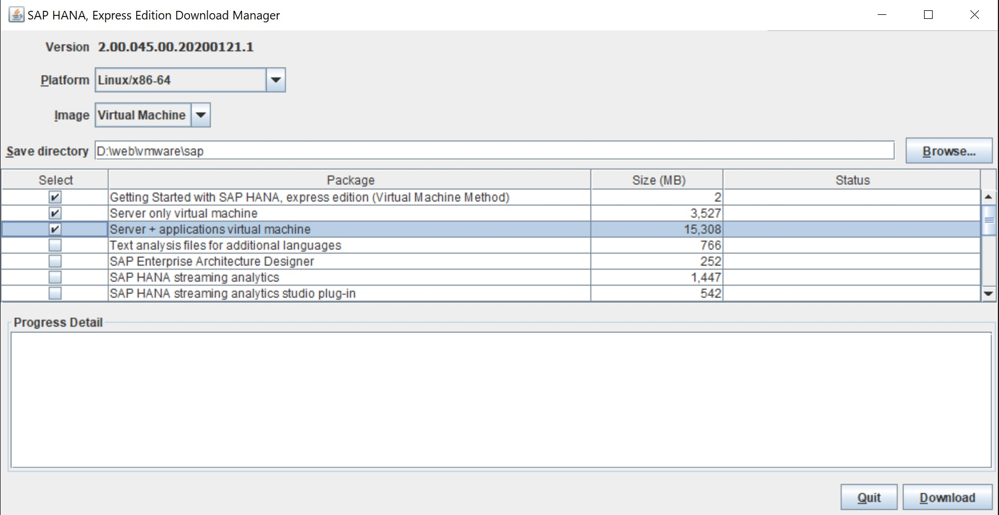
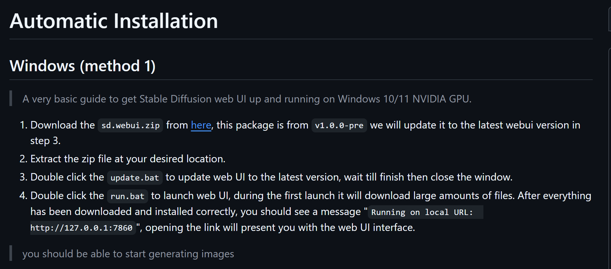
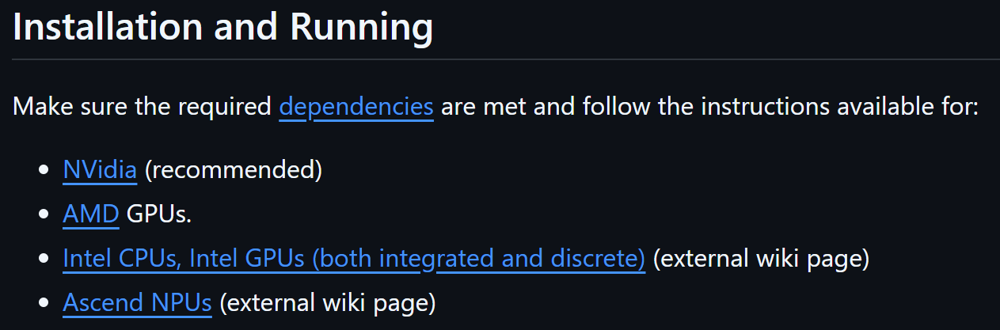

<!-----------------------------------------------------------
Author:  Craig Brown
Version: 1.0.2
Date:    May 13, 2025
Source:  https://github.com/saidake/simi-docs
------------------------------------------------------------->
# Table of Contents
[Back to Main Project README](../README.md)
- [Table of Contents](#table-of-contents)
- [Basic Env](#basic-env)
  - [Docker](#docker)
  - [Docker Compose](#docker-compose)
  - [Kubernetes](#kubernetes)
- [Database](#database)
  - [Oracle 23ai](#oracle-23ai)
  - [SAP Hana Database](#sap-hana-database)
  - [MYSQL](#mysql)
    - [Linux Installation](#linux-installation)
- [Server](#server)
  - [Temporal](#temporal)
  - [Jenkins](#jenkins)
  - [Spark](#spark)
- [AI](#ai)
  - [Stable Diffusion](#stable-diffusion)
# Basic Env
## Docker
<h3>Linux Installation (apt-get)</h3>

* Install using the apt repository
  https://docs.docker.com/engine/install/ubuntu/#install-using-the-repository
<h3>Linux Installation (yum)</h3>

1. Install docker with `yum` command.
    ```bash
    sudo yum install -y docker-ce
    ```
2. Start Docker service
    ```bash
    sudo systemctl start docker
    ```
3. Enable Docker to start on boot
    ```bash
    sudo systemctl enable docker
    ```
## Docker Compose
<h3>Linux Installation</h3>

1. Download Docker Compose
    ```bash
    sudo curl -L "https://github.com/docker/compose/releases/download/1.29.2/docker-compose-$(uname -s)-$(uname -m)" -o /usr/local/bin/docker-compose
    ```
    * This command fetches the latest stable release of Docker Compose from GitHub and installs it to `/usr/local/bin/docker-compose`.
2. Apply Executable Permissions
    ```bash
    sudo chmod +x /usr/local/bin/docker-compose
    ```
3. Verify Installation
    ```bash
    docker-compose --version
    ```
## Kubernetes
<h3>Linux Installation</h3>

* Install and Set Up kubectl on Linux
https://kubernetes.io/docs/tasks/tools/install-kubectl-linux/

# Database
## Oracle 23ai
Reference:  
  * https://www.oracle.com/cn/database/technologies/oracle-database-software-downloads.html

Installation:
1. Pull the Oracle 23ai Docker Image  
     Run the below command in terminal.
     ```text
     docker pull container-registry.oracle.com/database/free:23c
     ```
    "Oracle 23ai" is essentially the same database as "Oracle 23c" but with a name change to emphasize the significant focus on Artificial Intelligence (AI) features included in this release.
2. Run the Oracle 23ai Container
    ```text
    docker run -d --name oracle23c-ai \
    -p 1521:1521 -p 5500:5500 \
    -e ORACLE_PWD=<your-password>> \
    container-registry.oracle.com/database/free:23c
    ```
    `ORACLE_PWD` is an environment variable used to set the initial password for the default administrative users (SYS, SYSTEM, and other privileged accounts)
3. Open a terminal session inside the container
    ```text
    docker exec -it <container-name-or-id>  bash
    ```
## SAP Hana Database
References:
* Download SAP Hana Express  
  https://www.sap.com/products/technology-platform/hana/express-trial.html
* SAP Hana Express  
  http://www.datadisk.co.uk/html_docs/hana/hana_2.html  
* Download and Install the SAP HANA Client  
  https://help.sap.com/docs/hana-cloud/sap-hana-cloud-getting-started-guide/download-and-install-sap-hana-client
* SAP HANA 2.0 Express Edition, HANA Studio Full Installation with 1 Year Free Registration  
  https://www.youtube.com/watch?v=bgKRBDUpFDM&t=126s


Installation:
1. Start your tail from https://www.sap.com/products/technology-platform/hana/express-trial.html, then download the **HXE Download Manager**.
2. Install the Linux image into you VMware

<!-- 3.  -->
## MYSQL
### Linux Installation
1. Update your system
    ```bash
    sudo apt update
    sudo apt upgrade -y
    ```
2. Install MySQL Server
    ```bash
    sudo apt install mysql-server -y
    ```
    (Optional) Set MySQL to start on boot 
    ```
    sudo systemctl enable mysql
    ```
3. Secure the MySQL installation
    ```bash
    sudo mysql_secure_installation
    ```
    You’ll be guided through steps like:
    * Setting a root password
    * Removing anonymous users
    * Disabling remote root login
    * Removing test databases
    * Reloading privilege tables
4. Log in mysql terminal
    ```bash
    sudo mysql
    ```
    This logs you in as the root user using Unix socket authentication (default on Ubuntu).

5. Create a Remote-Accessible User
    ```sql
    CREATE USER 'youruser'@'%' IDENTIFIED BY 'yourpassword';

    GRANT ALL PRIVILEGES ON *.* TO 'youruser'@'%' WITH GRANT     OPTION;

    FLUSH PRIVILEGES;
    ```
6. Change the mysql default connection port and binding rule.
    ```bash
    sudo nano /etc/mysql/mysql.conf.d/mysqld.cnf
    ```
    Change port and binding address:
    ```
    port = 4406
    bind-address = 0.0.0.0
    ```
    Restart MySQL Service
    ```bash
    sudo systemctl restart mysql
    ```
7. Update the Firewall Rules

    If you modified the default port, make sure your firewall allows the new port
    ```
    sudo ufw allow 3306
    ```
    Note that if your are using cloud server, you should also update your firewall rule in the cooresponding cloud platform for the new port.
8. Connect from Client
   Or configure it in MySQL Workbench / DBeaver under "Port".
   ```
   mysql -h <server_ip> -P 4406 -u your_user -p
   ```


# Server
## Temporal
1. Prerequisites
    * Docker: Ensure Docker is installed and running.
    * Docker Compose: Make sure you have Docker Compose installed.
2. Download and Modify the Official Temporal Docker Compose File
    ```text
    git clone https://github.com/temporalio/docker-compose.git
    cd docker-compose
    ```
    Modify the docker-compose.yml file to adjust the temporal server port and avoid port conflicts:
    ```yaml
    temporal-ui:
    container_name: temporal-ui
    depends_on:
      - temporal
    environment:
      - TEMPORAL_ADDRESS=temporal:7233
      - TEMPORAL_CORS_ORIGINS=http://localhost:3000
    image: temporalio/ui:${TEMPORAL_UI_VERSION}
    networks:
      - temporal-network
    ports:
      - <ui-port>:8080
    ```
   Replace `<ui-port>` with your ui port.
3. Start the Temporal Server  
   Run the following command to start all required services:
   ```text
   docker-compose up
   ```
4. Access the Temporal Web UI  
   Once the server is running, access the Temporal Web UI in your browser:
   ```text
   http://localhost:<your-ui-port>
   ```
## Jenkins
<h3>Linux Installation (apt-get)</h3>


## Spark
1. Prerequisites
   * Docker: Ensure Docker is installed and running.
   * Docker Compose: Make sure you have Docker Compose installed.
2. Setup Spark Server using Docker Compose
   Create a docker-compose.yml file
   ```yaml 
   version: '3.8'
   services:
     spark-master:
       image: bitnami/spark:latest
       container_name: spark-master
       hostname: spark-master
       networks:
         - spark-network
       ports:
         - "<ui-port>:8080"
         - "7077:7077"
       command: bash -c "/opt/bitnami/scripts/spark/run.sh && /opt/bitnami/spark/bin/spark-class org.apache.spark.deploy.master.Master"

     spark-worker:
       image: bitnami/spark:latest
       depends_on:
         - spark-master
       networks:
         - spark-network
       environment:
         - SPARK_MASTER_URL=spark://spark-master:7077
       command: bash -c "/opt/bitnami/scripts/spark/run.sh && /opt/bitnami/spark/bin/spark-class org.apache.spark.deploy.worker.Worker spark://spark-master:7077"

   networks:
     spark-network:
       driver: bridge
   ```
   Replace `<ui-port>` with your ui port to avoid port conflicts.

   By default:
   - Spark master UI: http://localhost:8080  
   - Spark master server: http://localhost:7077
3. Navigate to the folder containing the docker-compose.yml file, then start the Spark cluster using the following command:
   
   ```bash
   docker-compose up -d
   ```
4. (Optional) Create a service file to manage the Spark service (start, stop, and restart) using `systemctl`.
    * Use the following commands to create the service file:
      ```bash
      cd /lib/systemd/system   
      # Go to this directory to create a service file
      # The system might block all ports except port 80. Use the firewall-cmd command to allow other ports.
      touch spark.service        
      # The service might not access system environment variables defined in /etc/profile.
      tail -f /var/log/messages 
      # View log files in real time.
      ```
      Content of the `spark.service` file:
      ```ini
      [Unit]
      Description=Spark Service
      After=network.target
      [Service]
      Type=forking
      # The location of the docker-compose.yml file
      WorkingDirectory=/root/env/spark
      ExecStart=docker-compose up -d
      ExecStop=docker-compose down
      ExecReload=docker-compose restart

      [Install]
      WantedBy=multi-user.target
      ```
    * Manage the Spark service: start, stop, and restart.
      ```bash
      systemctl start spark
      systemctl stop spark
      systemctl restart spark
      ```


<!-- ## Nginx
1. Update System Packages
  
    ```bash
    sudo apt update && sudo apt upgrade -y
    ```

2. Install Nginx

    ```bash
    sudo apt install nginx -y
    ``` -->


# AI
## Stable Diffusion
1. Visit the project repository
   https://github.com/AUTOMATIC1111/stable-diffusion-webui
2. Choose your GPU
   
3. Download the zip file and refer to the included instructions for installation.
   